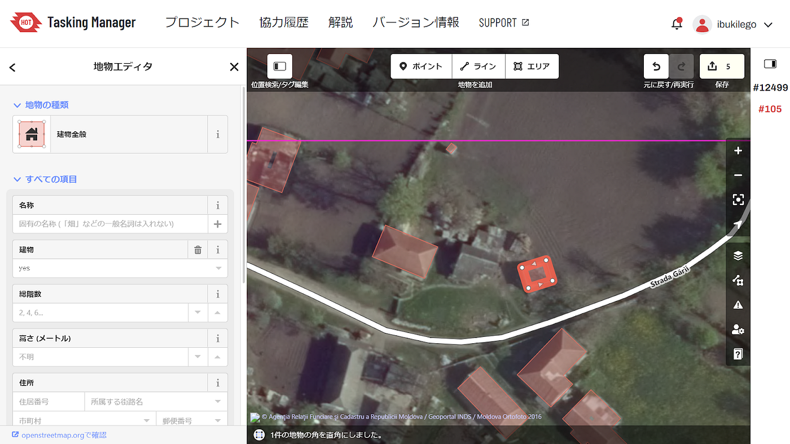
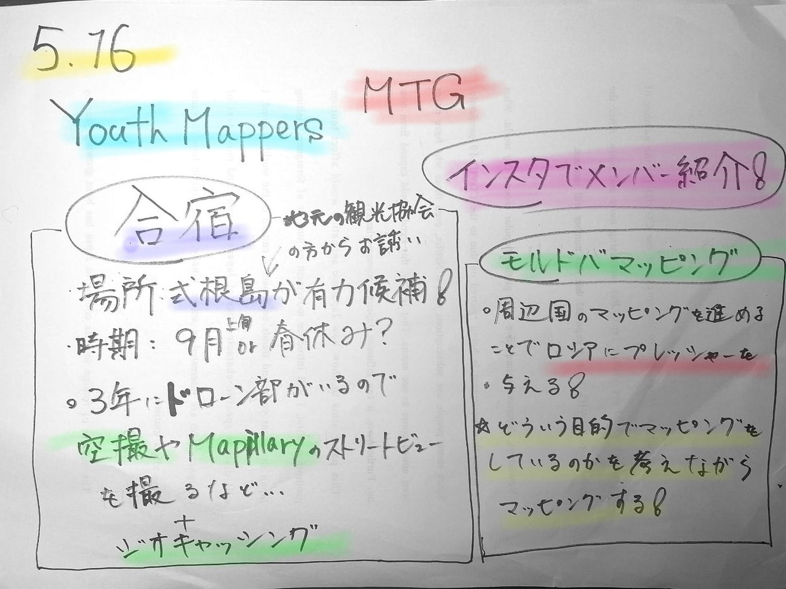

### YouthMappersAGU、今年の合宿は式根島か

5月16日ミーティング報告

5月16日に行われたYouthMappersAGUの定例ミーティングについて報告します。

### 先週の活動

Webサイトが未完成のまま放置されている状態なので作り直そうということで、先週Webサイトチームを結成しました。チームのメンバー同士で連絡を取り合い、新しい代に運営を継承できるように更新方法をレクチャーしていく予定です。

[Youth Mappers AGU
YouthMappersとは、世界中の若いマッパーで構成された国際団体です。大学単位でチームを構成し、それぞれがマッピングによる国際協力活動やその普及活動を行っています。共同でマッピングを行うMapathonというイベントなどを通して、国を…furuhashilab.github.io](https://furuhashilab.github.io/youthmappers4agu/#)

全体の課題としたモルドバマッピングにも、各自取り組みました。

### 今週の議題

毎年恒例の合宿について、行き先や時期を検討しました。小笠原諸島という案も出ていたのですが、行きやすさやみんなの日程から、**式根島**はどうかという話になりました。詳細は決まっていませんが、式根島を合宿先とする方針で進めていくことになりました。

SNSの投稿については、新年度が始まって新しいメンバーを加わったことから、改めてメンバー紹介の投稿をすることになりました。メンバーは自分の写真とプロフィールを準備し、順次インスタグラムにて公開します。

[https://www.instagram.com/p/Cd5by8IrxXY/?utm_source=ig_web_button_share_sheet](https://www.instagram.com/p/Cd5by8IrxXY/?utm_source=ig_web_button_share_sheet)

### 今週の活動

今週も各自マッピング作業を続けることが主な活動となります。

上記のメンバー紹介に使う素材を提出していないメンバーは、その提出も課題となります。

また、Webサイトチームはマッピング作業に加えWebサイトの構想を練ります。

### 今日のマッピングTips

ミーティングの最後に、リーダー柴山がマッピングのTipsを紹介してくれるのですが、今回は「直行化」についてでした。

自分がマッピングしたものだけ確認すれば良いだろうと思いがちですが、すでに登録されている建物でも直行化できていないことが多いです。皆さんもマッピングをする際にすでに登録されている建物があったら、直行化されているか確認してみてください。

グラレコ

