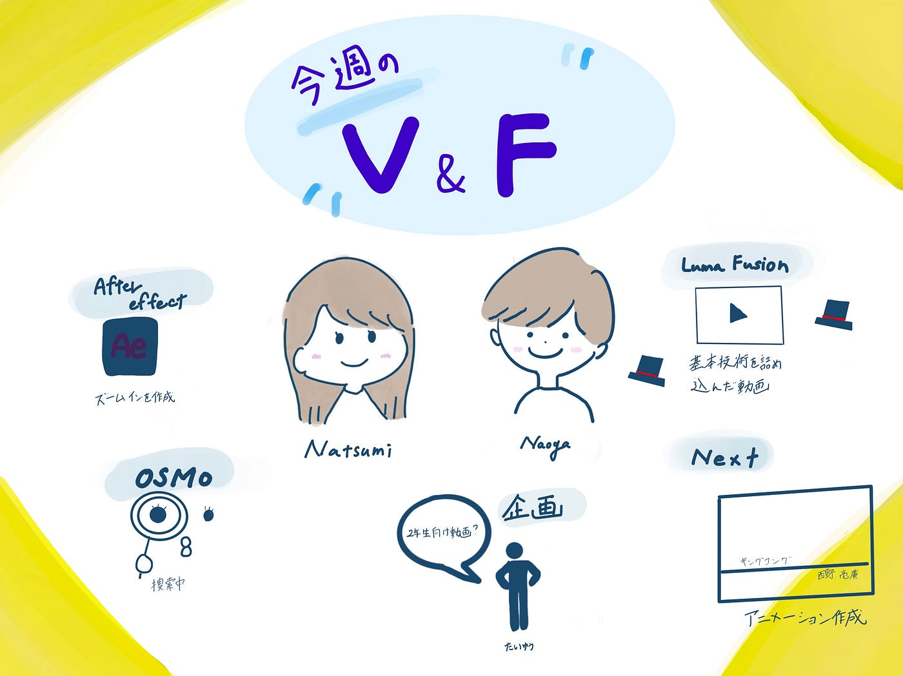

### V & F-週報5

こんにちは。3年植松です。

今週はたまたま学校で4年葉賀に遭遇したため、はじめて対面でミーティングを行いました。ミーティングの中でおすすめの編集動画や解説者を紹介しあうなど対面ミーティングならではの話題で盛り上がりました。

またゼミの3年生メンバーで2年生向けにゼミ紹介動画を作るかという話題がでました。今年はゼミ選択が早いらしいので早急に計画を立てようと思います。

その他の活動については先週に引き続き個人作業が続きました。

4年葉賀は奥行きアニメーション（ズームイン）の作製を下記の動画を参考に作りました。

植松はLuma Fusionの解説動画を見つつ、古橋先生が撮影したドローンの映像と近畿大学卒業式の際のキングコング西野のスピーチをお借りし、カットや字幕の挿入など、基本動作をふんだんに取り入れた動画を1つ作りました。

[植松練習.MOV
Edit descriptiondrive.google.com](https://drive.google.com/file/d/1JvUkaEf3bt0jepxmimWkrYQFF9ZmhrK9/view?usp=sharing)

動画のスピードや音量、色彩の調整など初心者の私にとって大変でしたがなんとか完成させることができました。編集作業を通してYouTubeで全ての会話に字幕が入っている動画を作る大変さを痛感しました。

次週は自分でかっこいいアニメーションを作ってみようと思います。

＜グラレコ＞

