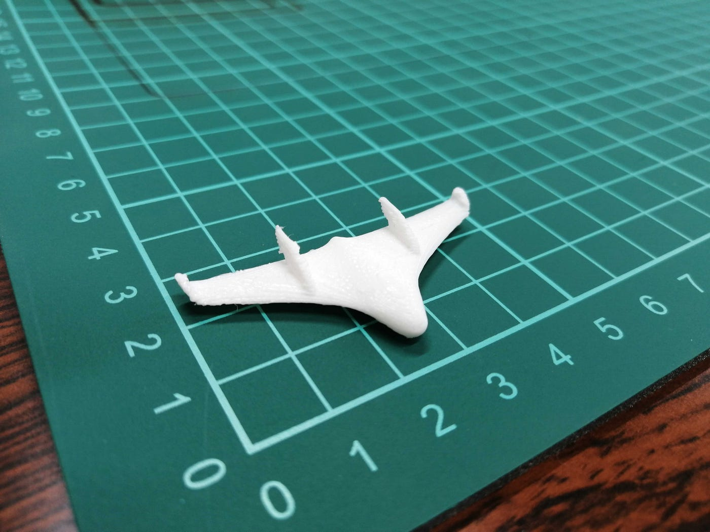
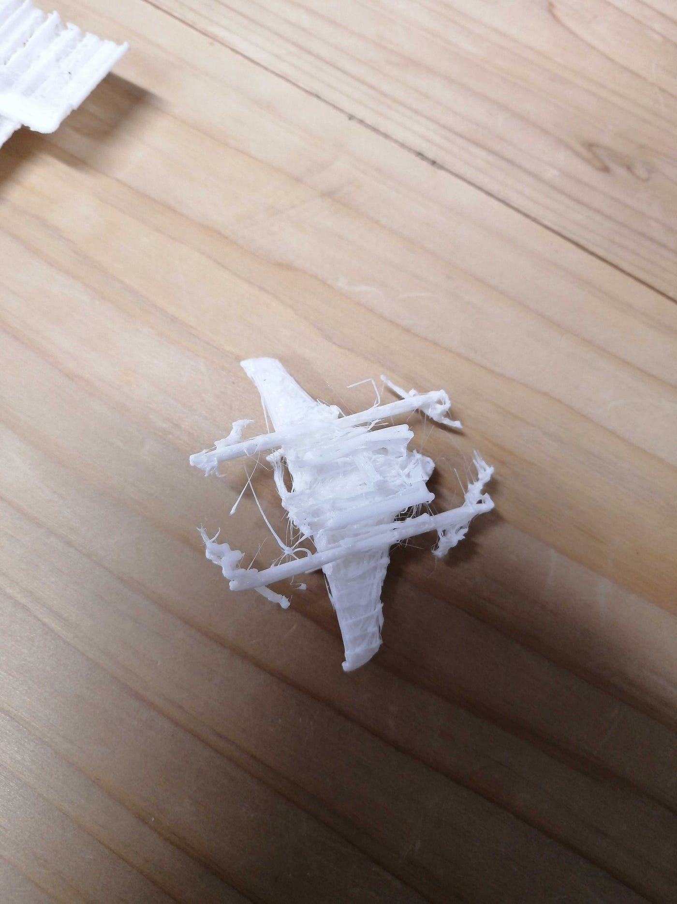
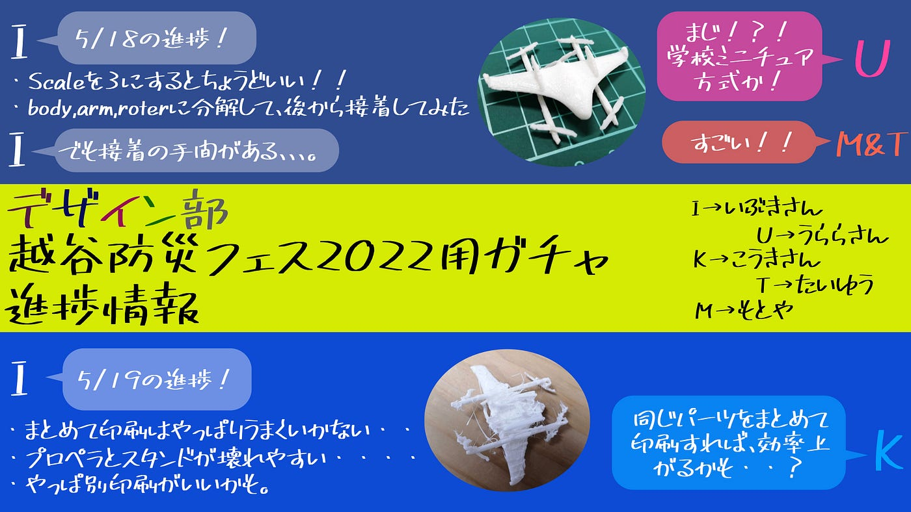

### ガチャ用エアロボ完成への道のり

こんにちは！

4年の菊池です。

今回は、越谷防災フェス2022に向けたガチャ用エアロボ制作の進捗にいついて報告します。まず、ガチャ用エアロボのプロトタイプが完成しました！

残念ながら、プロペラなしまで簡略化するとエアロボ感は失われますね。

プロペラを別で印刷し接着しました。ここまでするとかなり忠実に再現できていると思います！

プロペラありの状態で一緒に印刷してしまうと壊れやすいようです。

改善点としては、MARK 3のクオリティを維持しつつ大量生産可能にしたいと思います。一案として、本体パーツ・プロペラパーツをそれぞれ複数同時に印刷してみたいと考えています。

ガチャ用ミニブックに関して、活動とエアロボについての説明を記載しようと考えているのですが、その活動の主体は「古橋先生」「古橋ゼミ」「ドローンバード」のどれとして記載すべきかという問題も残りました。

別件で、5/24の3限（13:20~）は3年生向けGitHub講習会です！

ぜひ参加してください！
