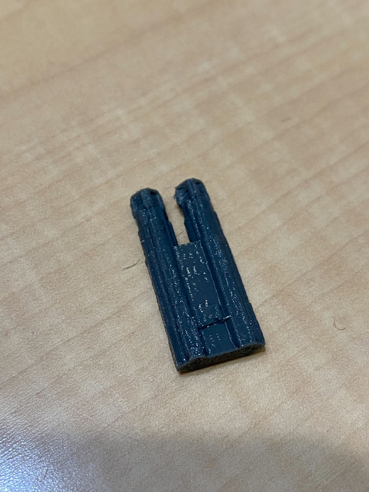
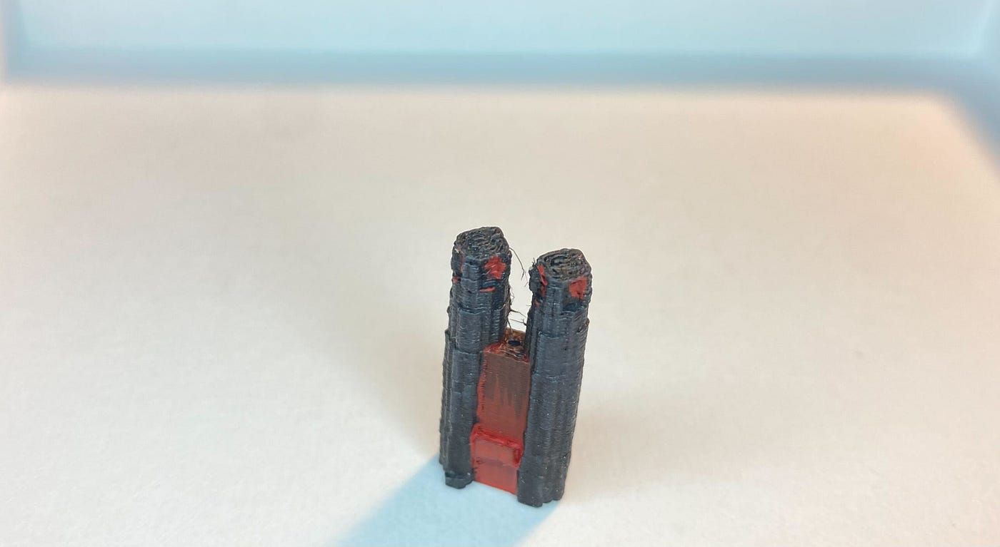
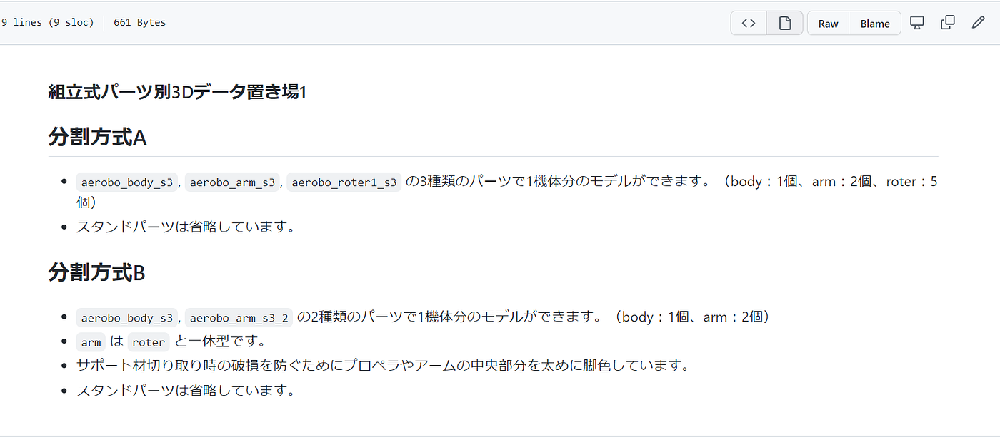
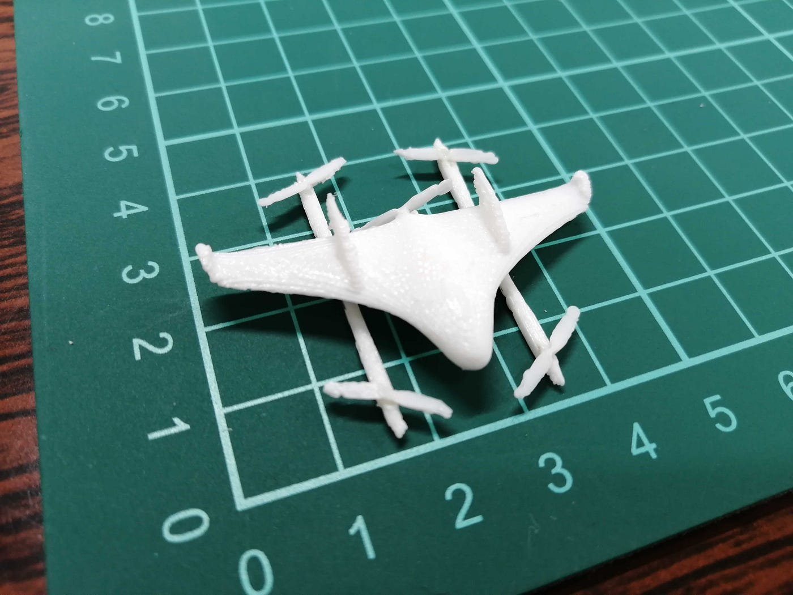
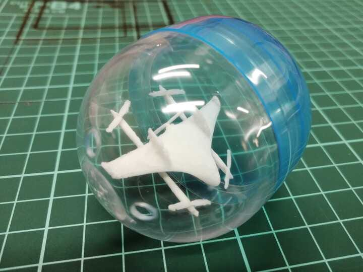
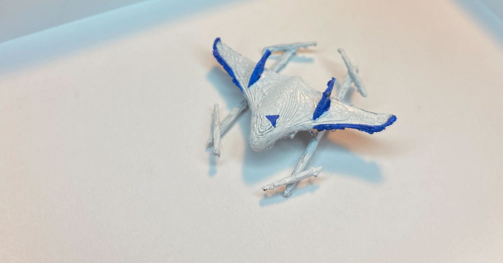
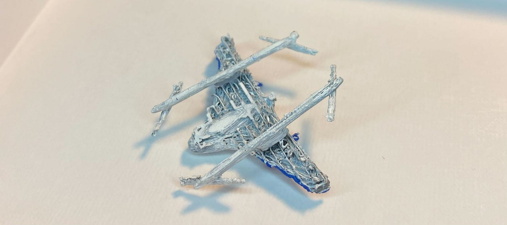
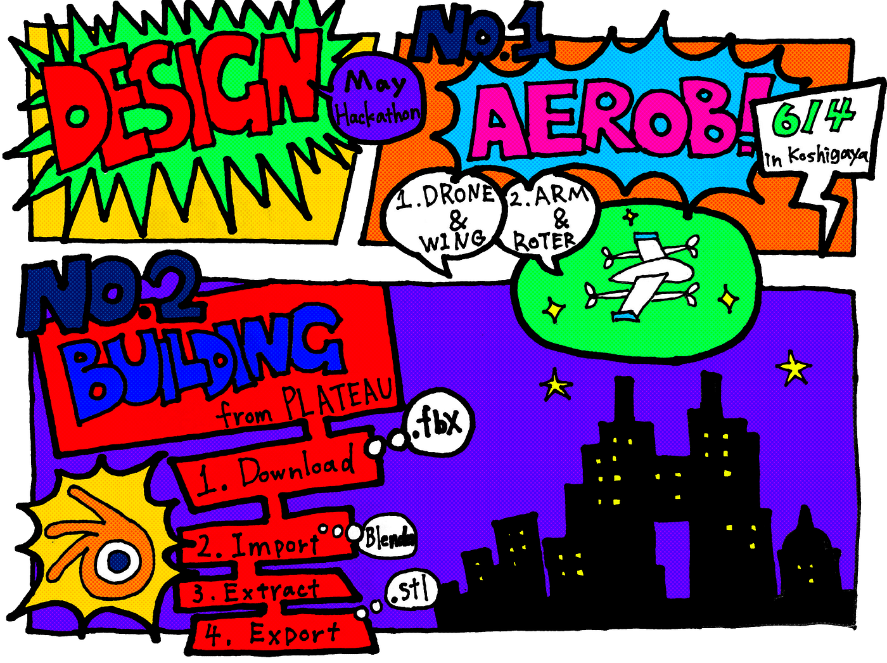

### デザイン部ガチャガチャハッカソン

こんにちは！うららです。

今回のガチャガチャハッカソン（**自由テーマ**）はうららとこうきで担当します。

当初、ドローンを作成しようと考えていましたが、ドローンの種類が被る可能性があることとデザイン部で「越谷防災フェス」用にエアロボウィングを作成したため今回は建物（古橋研究室に関連している）を作ることとなりました。

今回は国土交通省が主導している「Project PLATEAU」からオープンデータとして公開されている23区の３D都市モデルを使用させていただきました。

[PLATEAU [プラトー]
国土交通省が主導する、日本全国の3D都市モデルの整備・オープンデータ化プロジェクト「PLATEAU」。その作成・公開プロジェクトのミッションや概要、最新情報、ユースケース、3D都市モデルを体験できるアプリケーション等を紹介する。www.mlit.go.jp](https://www.mlit.go.jp/plateau/)

### ブレンダーへのインポート方法

公式ホームページより23区のデータが載っているページを開きます。

[https://www.geospatial.jp/ckan/dataset/plateau-tokyo23ku-fbx4-2020](https://www.geospatial.jp/ckan/dataset/plateau-tokyo23ku-fbx4-2020)

様々なファイル形式の３Dデータが公開されていますが、今回使用したのはFBXファイルです。

23区のどこの地域をインポートするかを決め「東京都23区構築範囲図」より番号を確認します。

[https://www.geospatial.jp/ckan/dataset/plateau-tokyo23ku-fbx4-2020/resource/b6f9b184-cd13-4b29-ae6d-90a2e14d745a](https://www.geospatial.jp/ckan/dataset/plateau-tokyo23ku-fbx4-2020/resource/b6f9b184-cd13-4b29-ae6d-90a2e14d745a)

確認後、使用したい区画番号のデータをダウンロードします。私は17分ほど要しました。

ブレンダーを開き、ダウンロードしたファイル、まずは「dem」をインポートします。これは1分かからずインポート可能でした。

そして「Lod2」をインポートします。私のPCが低スペックのため全部をインポートは不可能でした。そのためガチャガチャにしたい建造物がある区画のみ番号を参照してダウンロードしました。

東京アラートカラーの都庁です。

GitHubレポジトリ

[furuhashilab/design_gacha: デザイン部のガチャガチャプロジェクト用レポジトリ (github.com)](https://github.com/furuhashilab/design_gacha)

プロジェクト管理

[こうきうららガチャ (github.com)](https://github.com/furuhashilab/design_gacha/projects/2)

**課題テーマ**

- DRONEBIRDで主に使われているドローン

- 具体的には、Aerosense Aerobo Wing, SenseFly eBeeX, Parrot Anafi, Skydio 2, Sony Airpeak, DJI Phantom, DJI Mavic 3

こちらは越谷防災フェスに向けてデザイン部で挑戦し、

いぶきが最も印刷・接着効率の良いデータを作成してくれました。

これは分割方式Aの方で、部品は計8つです。

全ていぶきが接着してくれました。美しくできますが部品が多く、接着するのに非常に時間がかかります。

先生の仰っていた部品は子どもたちに取り付けてもらう案も考えましたが、最初からエアロボウィングができているものが理想かなと思い、分割方式１よりは効率的な分割方式２を採用しました。

こちらが分割方式Bで作ったエアロボウィングです。

パーツはプロペラが既についているアーム2つとボディの計３つです。

裏がケバケバしています。

私の家のプリンターとフィラメントではうまくいきませんでした。

木曜日に研究室のフィラメントで作ります。

GitHubレポジトリ

[furuhashilab/design_gacha: デザイン部のガチャガチャプロジェクト用レポジトリ (github.com)](https://github.com/furuhashilab/design_gacha)

スライド

[ガチャガチャハッカソン うららこうき — Google スライド](https://docs.google.com/presentation/d/12_bgq-hmIvn0xmU4_q6JpYxcXTyRRqvtZG8pG1Xk5HA/edit#slide=id.g112b3c390ad_0_250)

グラレコ こうき

