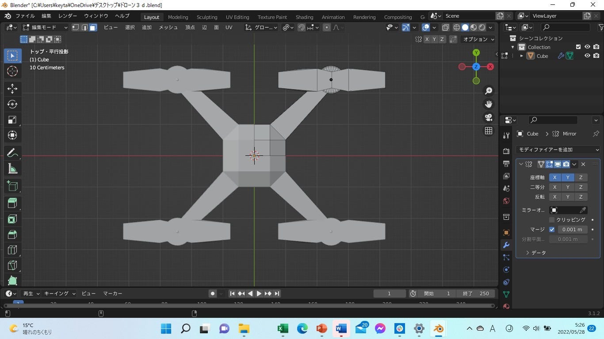
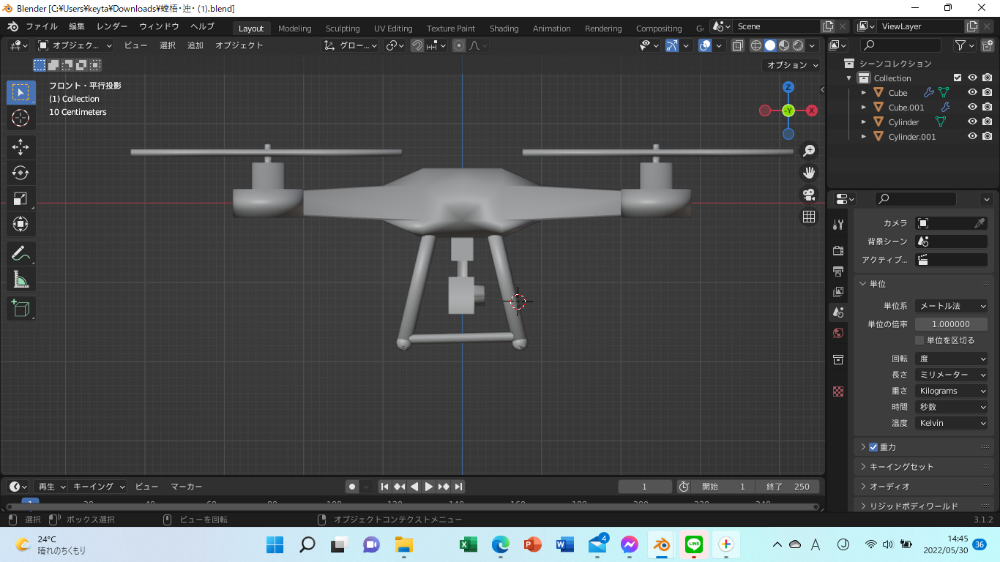
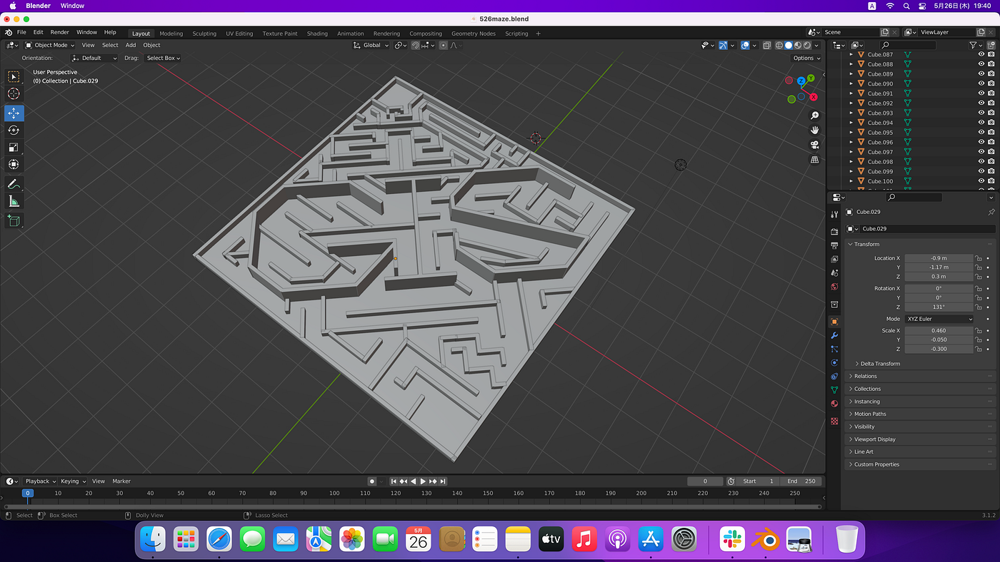
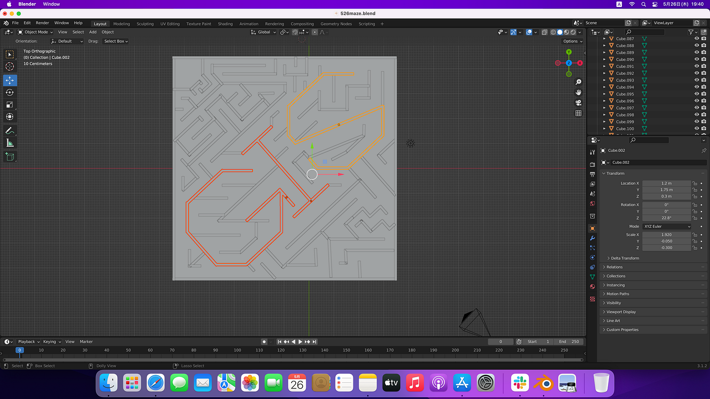
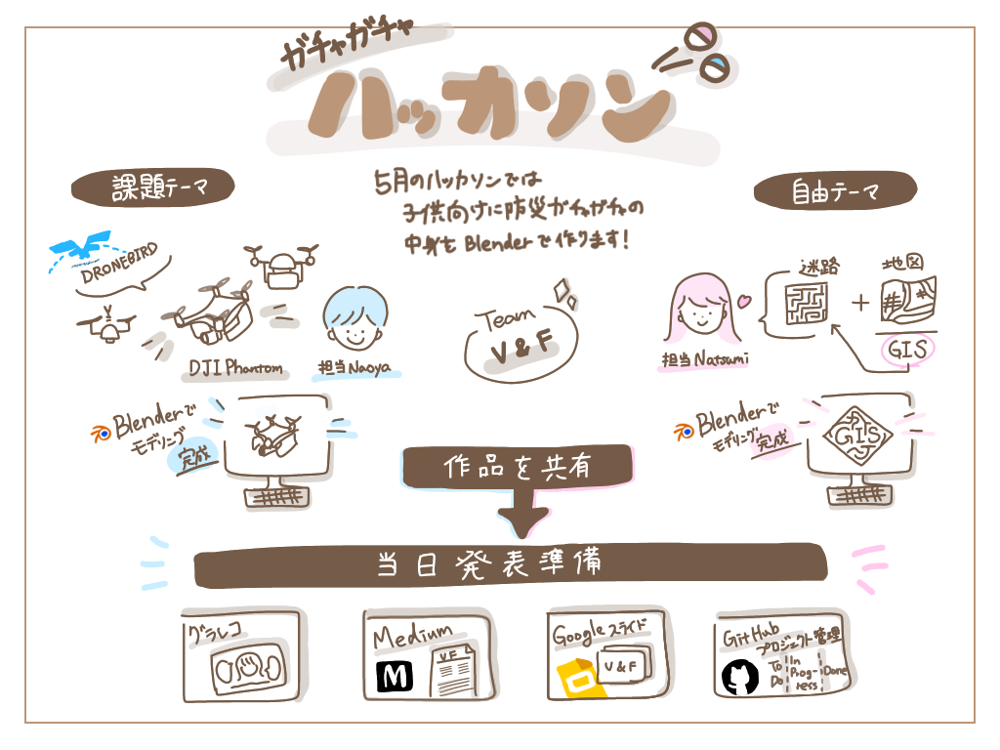

### **ガチャガチャハッカソンV&F**

こんにちは、4年葉賀です。

V&Fのハッカソンをレポートしていきたいと思います。

５月のハッカソンは[「ガチャガチャ」ハッカソン](https://github.com/furuhashilab/README/issues/33#issuecomment-1135300234)と題し、各チームが子供用の防災ガチャガチャの中身をBlenderで制作しました。

テーマは課題と自由の２種類があり、

課題テーマでは植松がDRONEBIRDで主に使われているドローンの中からDJI Phantom、自由テーマでは葉賀が迷路(以下:Maze)を作りました。

> **課題テーマ「DJl Phantom」**

作成担当は3年植松。Blenderを使うのは初めてですが頑張りました。

DRONEBIRDで使われている[DJI Phantom](https://www.dji.com/jp/phantom-4-pro)を、画像を参考にしてBlenderでモデリングしました。

完成までは約５時間かかりました。

DJI Phantom はシンメトリーなので、３Dモデルも左右対称に美しくなるようにミラー機能を使い制作しました。

また、今回はガチャガチャの中身を作るということで、サイズに注意しなければなりませんでした。具体的には48mm*48mm(ハッカソン概要を参照)ですが、モデル完成時は5700mm*2500mmとかなりオーバーしてしまいました。縦横高さの比率を変えずに、モデル全体を縮小することに苦労しました。

> **自由テーマ「Maze」**

自由テーマでは古橋研究室や地理空間情報学と関わるものを制作します。

葉賀が担当しました。普段趣味で書いている迷路(下写真)から着想を得て、地図っぽさも表せるものにしました。

ポイントとして迷路の仕切りの中にGISの文字を含ませました。横や斜めから見るとその部分だけ高さが異なるので浮き出てみることができます。

この作品を制作する上で、Blender内は特に複雑な作業はしておらず迷路の図案さえかければ、比較的簡単に作ることができます。今回は１種類のみを作成しましたが、今後複数作る場合にはシリーズ化しやすい利点もあります。

ハッカソンを通じて、３Dモデリングの難しさや面白さがわかりました。今回はモデリングまでの作業でしたが、色付けなどを加えると表現の幅が広がりそうです。

今後はBlenderの機能を十分に活用し、もっとクオリティーの高い作品制作に挑戦してみたいと思いました。

＜グラレコ＞

＜発表資料Google slides＞

＜GitHub リポジトリ＞

[GitHub - furuhashilab/Capsuletoyhackathon_2022_V-F: 5月「ガチャガチャ」ハッカソン-V&Fのリポジトリ
Capsuletoyhackathon_V-F ・5/31 11:00〜12:30 発表、 furuhashilab/README#33 (comment) ・葉賀なつみ ・植村尚哉 ・48mm カプセルに収まること。 ・原則…github.com](https://github.com/furuhashilab/Capsuletoyhackathon_2022_V-F)
