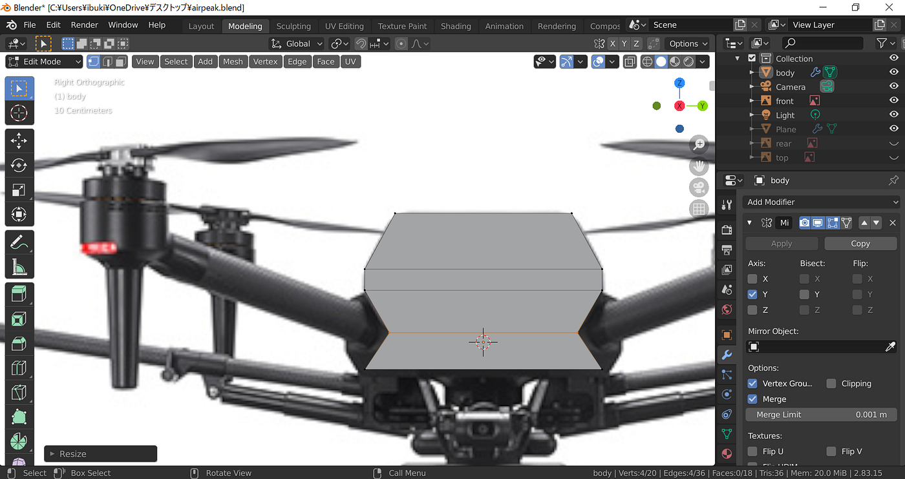
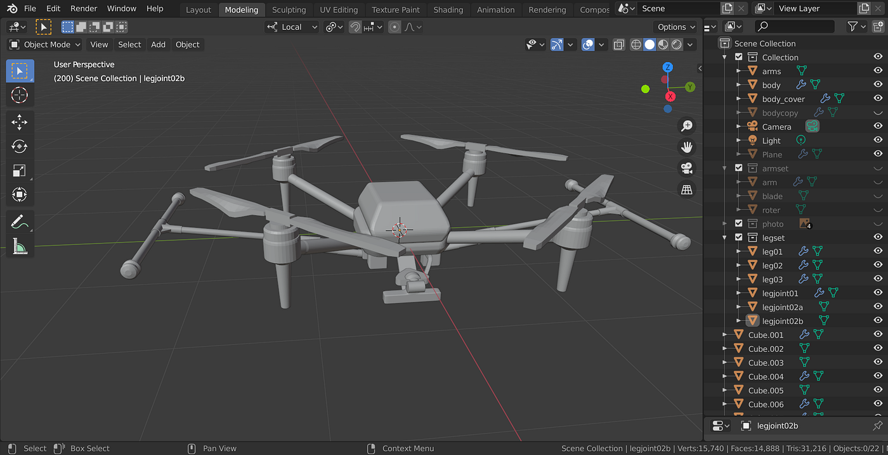
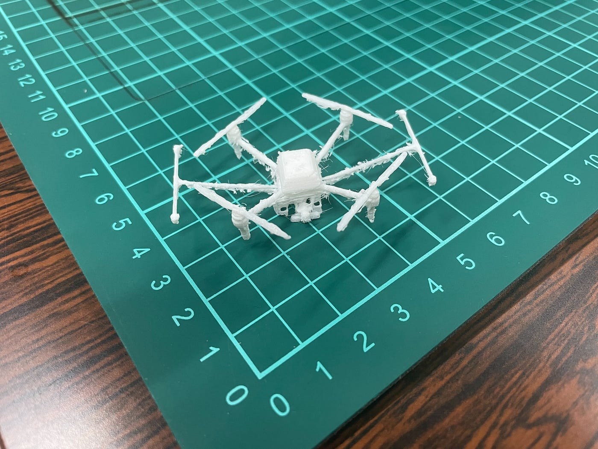
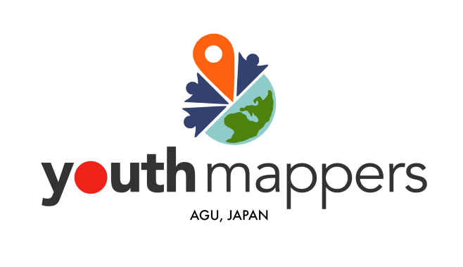
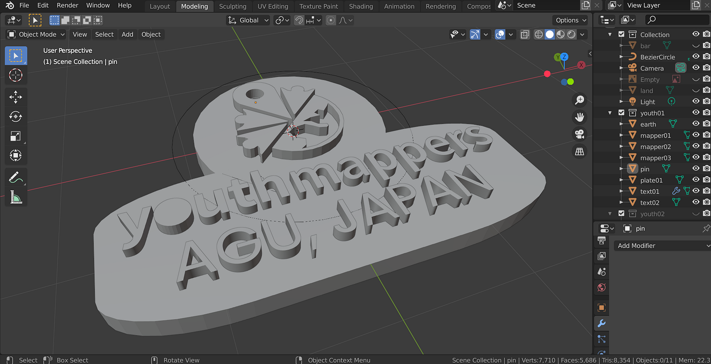
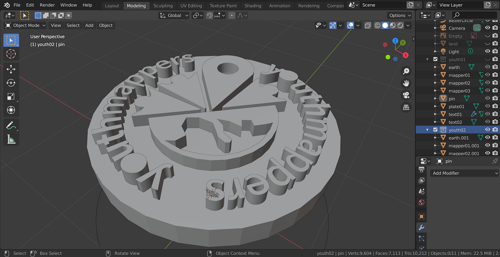
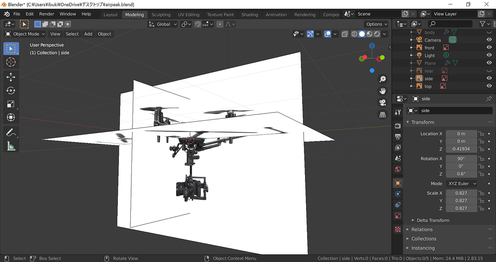
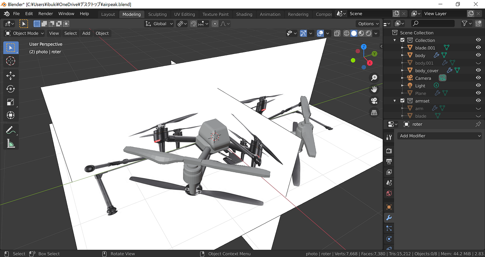
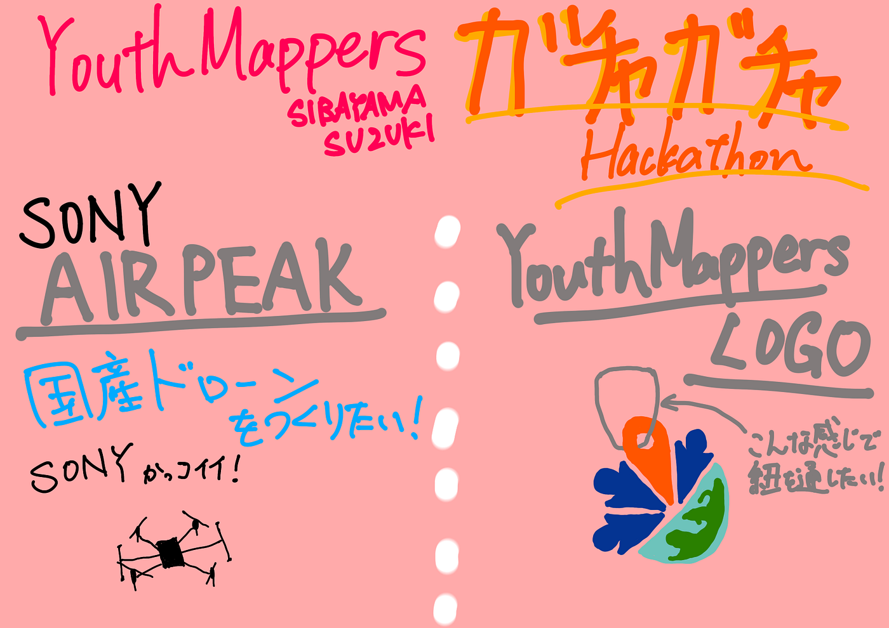

### ガチャガチャハッカソン 5/24–31

こんにちは、柴山・鈴木チームです。

5月のハッカソンについて記事にしていきます。

#### 課題テーマ

課題テーマではDRONEBIRDで主に使われているドローンをデザインするということで、我々はSONYのAirpeakを制作しました。以下がその制作途中と完成したときのスクリーンショットになります。

３枚目の写真は研究室の3Dプリンタで試しに作ってみたものになります。羽の部分など各種が細すぎて簡単に曲がったり、折れたりしてしまいました。また土台部分の切り取り作業が大変で時間がかかるため、ガチャガチャに実装するとなれば、各部位を太くし、切り取りが容易で、簡単な構造にする必要があると思います。実際、サイズもオーバーしていますし。笑

#### 自由テーマ

自由テーマでは我々ユースマッパーズのロゴを制作することにしました。車のバックミラーに吊り下げるようなキーホルダーを作ろうと考えていた時に、ユースのロゴにあるマップピンが紐を通すのにちょうど良いと思いつき、これに決定しました。

以下が完成形です。2種類用意しました。

#### 制作手順

手順としては、基本的にBlenderにて画像を表示させる機能を使用して、その画像をトレースしていくような形で行いました。我々ユースマッパーズが普段、空撮画像から建物をトレースしていくようで親しみのようなものを感じました。

> **完成版ファイル置き場**

[GitHub - furuhashilab/youthmappersagu_gacha: 2022/05ガチャガチャハッカソン制作物データ置き場です。
2022/05ガチャガチャハッカソン制作物データ置き場です。. Contribute to furuhashilab/youthmappersagu_gacha development by creating an account on…github.com](https://github.com/furuhashilab/youthmappersagu_gacha)

> **スライド**

> **グラレコ**

> **GitHub Project**

[ハッカソン2022/05 · furuhashilab/youthmappers4agu
You can't perform that action at this time. You signed in with another tab or window. You signed out in another tab or…github.com](https://github.com/furuhashilab/youthmappers4agu/projects/9)
