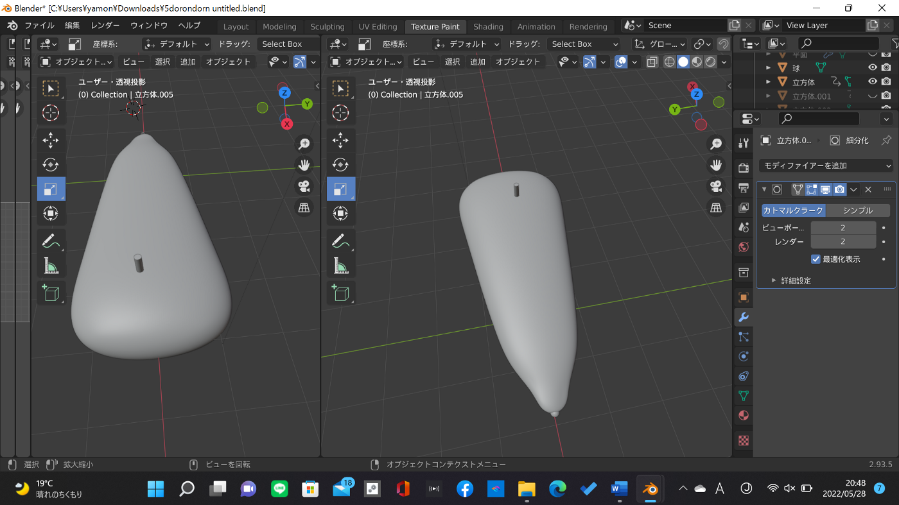
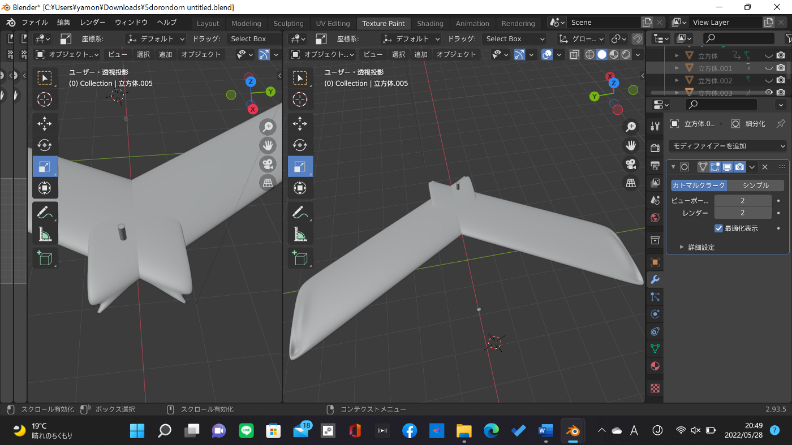
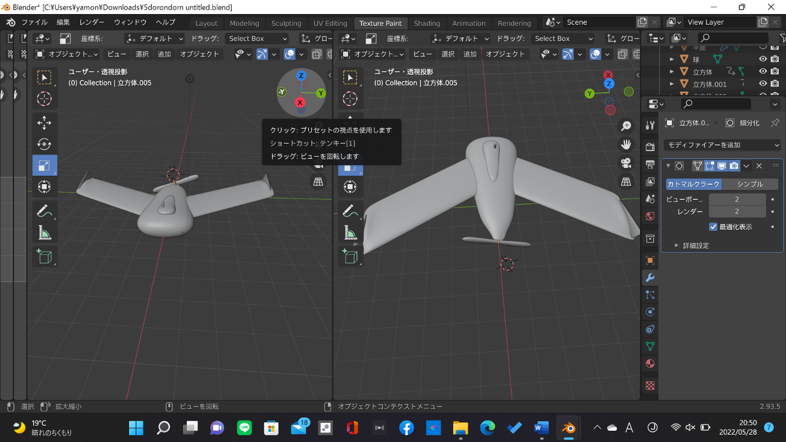
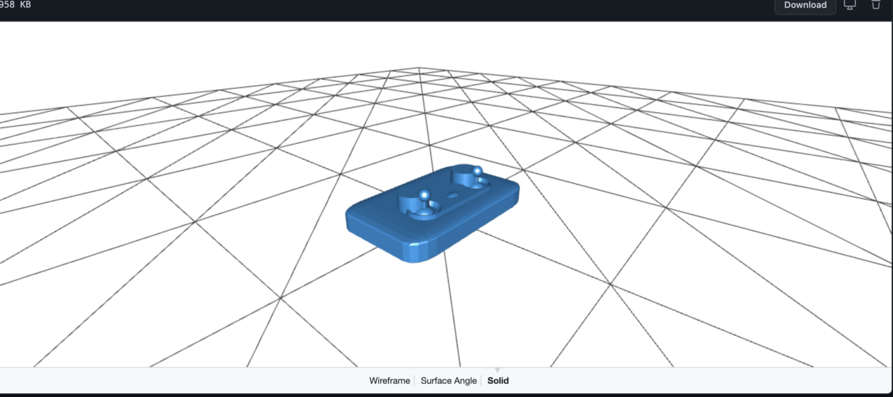
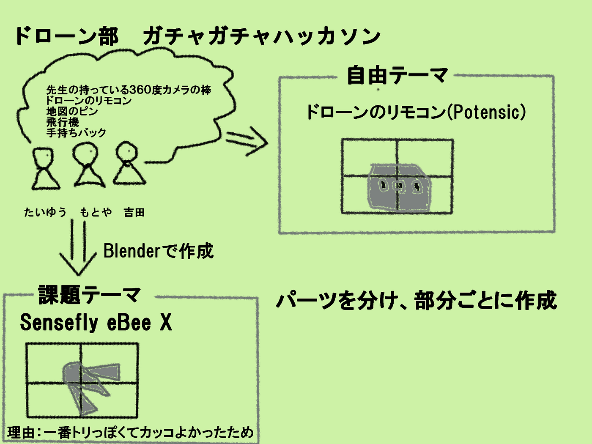

### 【ドローン部】ガチャガチャハッカソン

こんにちは、3年の小澤です🙋‍♂️

今回のガチャガチャハッカソンは、もとや、わたる、たいゆうが担当します。

課題テーマでは、「DRONEBIRDで主に使われているドローン」との事で、「Sensefly ebee x」を選択し、Blenderを使用してもとやが制作してくれました。

こうしてパーツごと作成し、最終的に

このような形になりました！

### 〜自由テーマ〜

自由テーマは
「地理空間情報 or 古橋研究室に関わるものであればなんでも良い」との事だったので、メンバーで以下のような様々な案を提案し、

・先生の持っている３６０度カメラの棒
・地図のピン
・飛行機
・手持ちバック

結果的にドローンのリモコンを選択しました。

もとやが選択したのは、一番リモコンっぽい自分（たいゆう）のリモコンでした。

ーーーーーーーーー

グラレコ

