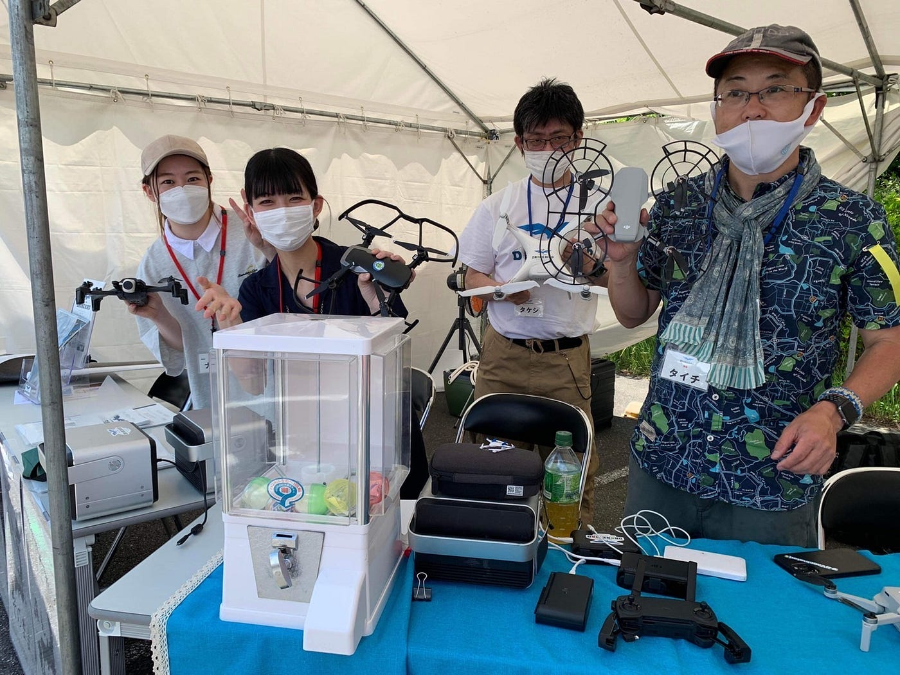
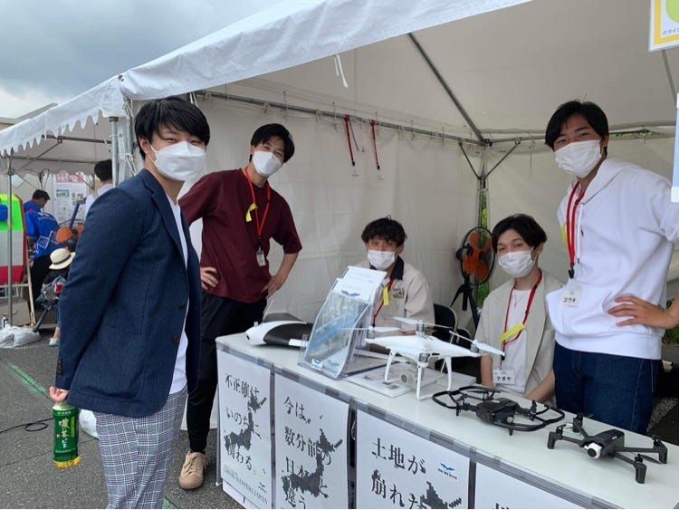
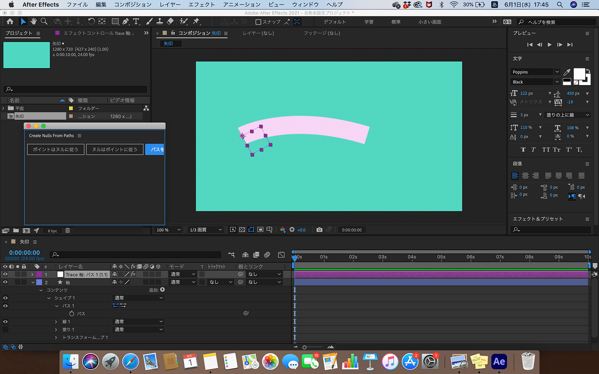
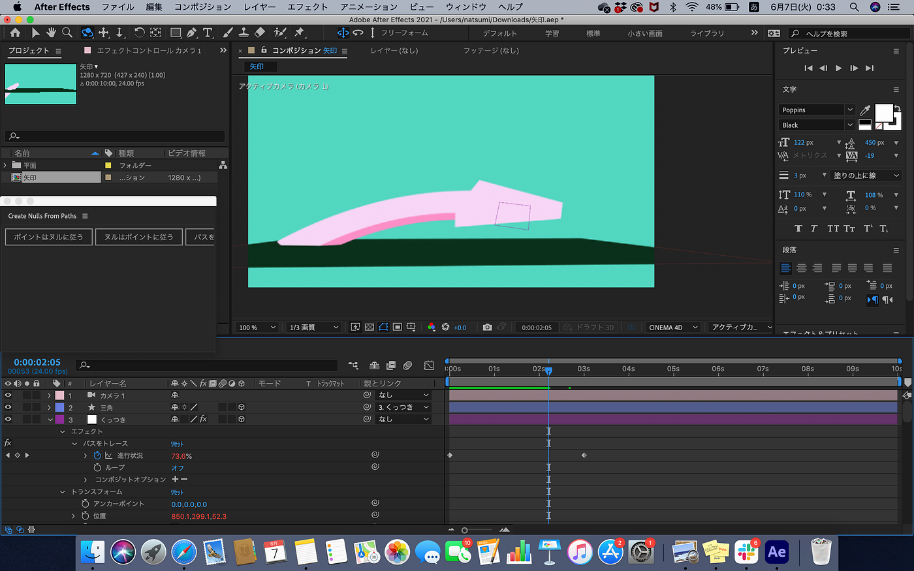
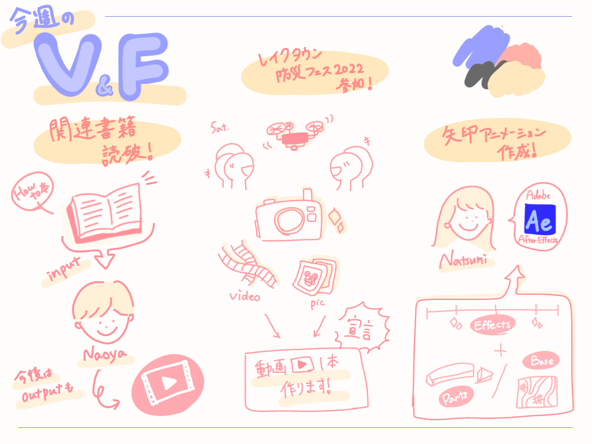

### V&F-週報6

こんにちは。

V&F今週の週報は4年葉賀が担当します。

まず、土曜日に埼玉越谷で防災フェスがあり、古橋ゼミメンバーがDRONEBIRDブースのボランティアとして参加しました。

その様子を色々撮影したので、素材が貯まりました。

V&Fとしてそろそろ動画を作りたいと考えていた私たちなので、来週と予告されているハッカソンなどと予定を調整しながら素材を使って動画を1本製作しようと思います。

日々の研鑽を十分に活かせるよう気合を入れて頑張ります。

> **葉賀**

毎週Adobe AfterEffectsで作っているアニメーションシリーズです。

今週はある地点から伸びる矢印や動く矢印作りに奮闘しました。

エフェクト操作など自体は比較的簡単だったのですが、作成中に立体的にオブジェクトを見る操作が上手くいかず、作業が思うように進みませんでした。

具体的には対象オブジェクト等を見る視点を変えることのできるカメラという機能を追加したのに、常にX軸の視点から動かせなかったということです。

最終的にはできたのですが、もう少しカメラ機能を使いこなせるようになりたいですね。

完成品は平面地図の上で移動経路を矢印で立体的に表します。

[https://drive.google.com/file/d/1D2EfB2IVSXiYCAQ9eB1RT8Yqf-VjQXxG/view?usp=sharing](https://drive.google.com/file/d/1D2EfB2IVSXiYCAQ9eB1RT8Yqf-VjQXxG/view?usp=sharing)

今回作ったものは地図と比べて大きく場所も関係ないですが練習を重ねて洗練させていけたらと思います。古橋ゼミとしては需要のあるアニメーションだと思うので習得したらどんどん使っていきます。

> **植松**

kindleのアンリミテッドに登録し、「YouTubeより早く稼げる動画編集基本術: ～40歳社畜サラリーマンが副業で動画編集始めたら1ヶ月で本業の収入を超えてしまった件～」を読破しました。

[https://www.amazon.co.jp/%E3%80%902022%E5%B9%B4%E6%94%B9%E8%A8%82%E7%89%88%E3%80%91YouTube%E3%82%88%E3%82%8A%E6%97%A9%E3%81%8F%E7%A8%BC%E3%81%92%E3%82%8B%E5%8B%95%E7%94%BB%E7%B7%A8%E9%9B%86%E5%9F%BA%E6%9C%AC%E8%A1%93-%E7%9F%B3%E5%B7%9D-%E9%81%BC-ebook/dp/B09YT4LP5C](https://www.amazon.co.jp/%E3%80%902022%E5%B9%B4%E6%94%B9%E8%A8%82%E7%89%88%E3%80%91YouTube%E3%82%88%E3%82%8A%E6%97%A9%E3%81%8F%E7%A8%BC%E3%81%92%E3%82%8B%E5%8B%95%E7%94%BB%E7%B7%A8%E9%9B%86%E5%9F%BA%E6%9C%AC%E8%A1%93-%E7%9F%B3%E5%B7%9D-%E9%81%BC-ebook/dp/B09YT4LP5C)

こちらは副業として動画編集を行なっていくための知識や実用的なスキルがいくつも紹介されています。

今回これらのスキルを吸収した植松の今後の活躍に”乞うご期待”ですね。

また、以前から希望していた研究室のオズモを借りることができたので、動画の素材撮影などにも力を入れて行きたいと思います。

<グラレコ>

