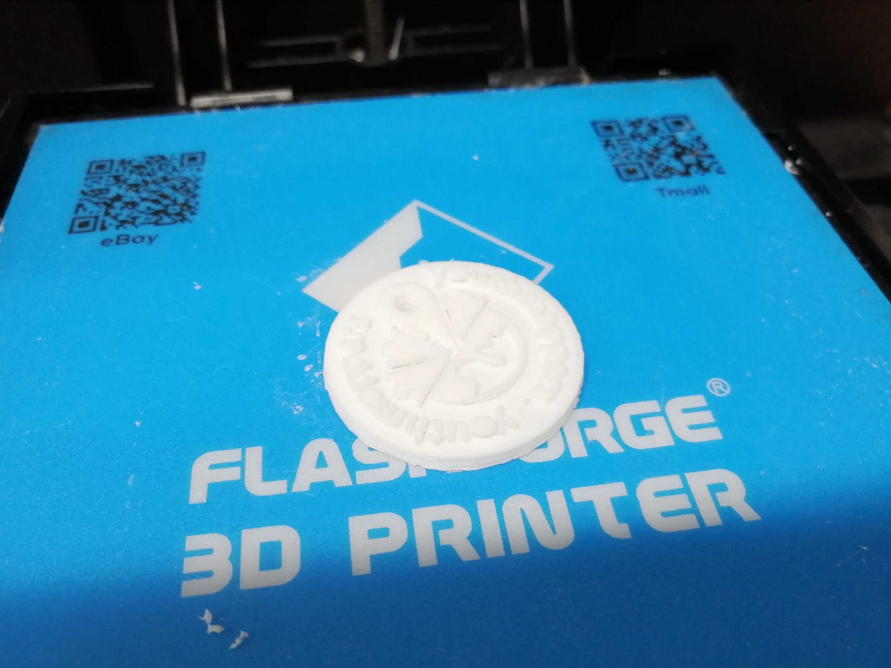
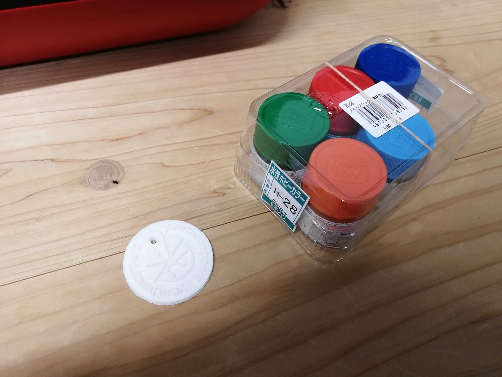
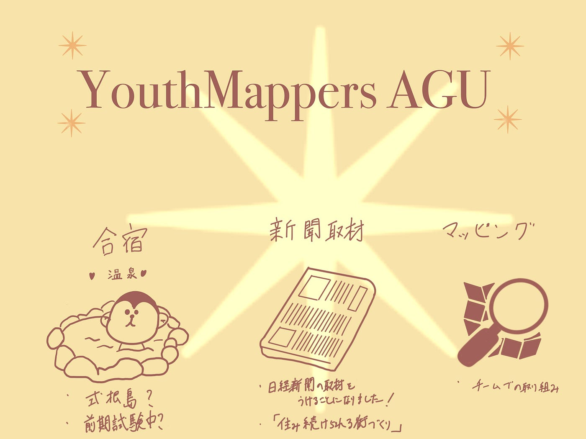

### － youthmapers週報

ハッカソンお疲れ様でした！！

ユースチームでは自由テーマとしてロゴアクセサリーを制作しました。早速プリントしてます！

ピンの部分や`o`が崩れてしまったのでまだ改良の余地がありそうです。。。

塗装するためにホビーショップ[TamTam淵野辺店](https://g.page/sagamiharatamtam?share)で水性アクリジョンの塗料を買ってみました！

先生からフィードバックをいただいたように、ユースの海外チームへの売り込みも検討中です。

今後もユースグッズ開発に乞うご期待！

> **5/23MTGのトピック**

1. **合宿先について。**

先週に引き続き合宿場所・日程決めを行いました。現在、有力候補は東京都、伊豆半島にある「式根島」です。温泉もあるそうで、なかなかいい場所だなと思います。日程は前期試験期間中を想定しています！

ただし、Snow Peak の住箱もあり！！という説も浮上してます笑

[Mobile House "JYUBAKO" 住箱 | スノーピーク ＊ snowpeak
Case.01 snow peak glamping京急観音崎 住箱で過ごすシーサイドグランピング Case.02 snow peak glampingスワンレイク五十嵐邸ガーデン スノーピーク初の和のグランピング Case.03…www.snowpeak.co.jp](https://www.snowpeak.co.jp/sp/jyubako/)

**２. 日経新聞の取材について。**

６月7日（火）に予定しています。ユースのメンバーがゼミ室に集まり、取材を受けようと思います。取材内容は目標11番の「住み続けられる街づくりを」についてです。

[「ＳＤＧｓ世代」のニュース一覧: 日本経済新聞
日本経済新聞の電子版。日経や日経ＢＰの提供する経済、企業、国際、政治、マーケット、情報・通信、社会など各分野のニュース。ビジネス、マネー、IT、スポーツ、住宅、キャリアなどの専門情報も満載。www.nikkei.com](https://www.nikkei.com/columns/wappen_77yz77yk77yn772T5LiW5Luj)

昼休み、3限の時間も活動風景の撮影があるので空いてるゼミ生はぜひ来てください！

**3. マッピングについて。**

メンバー各自の活動などを把握するために、[スプレッドシート](https://docs.google.com/spreadsheets/d/1Uzm_BF6JiJFQA_A6zjUnsoKggVPTSLpgSxQg7GPn3zM/edit?usp=sharing)にOSMの個人のIDを記入しました。また、活動の効率化を図るためにTasking Managerのチーム招待も行いました。

> **グラレコ**

