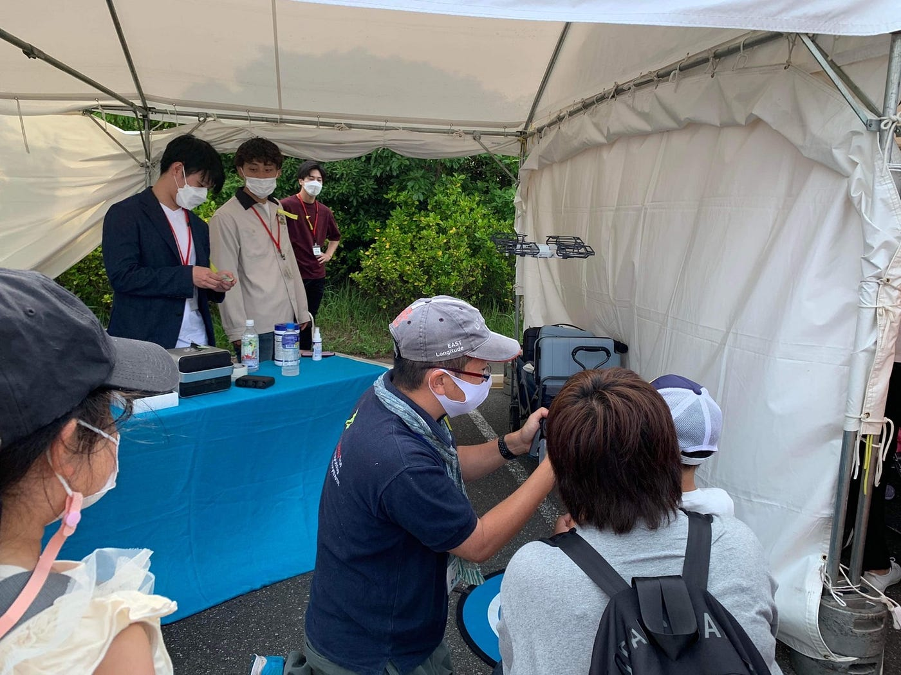
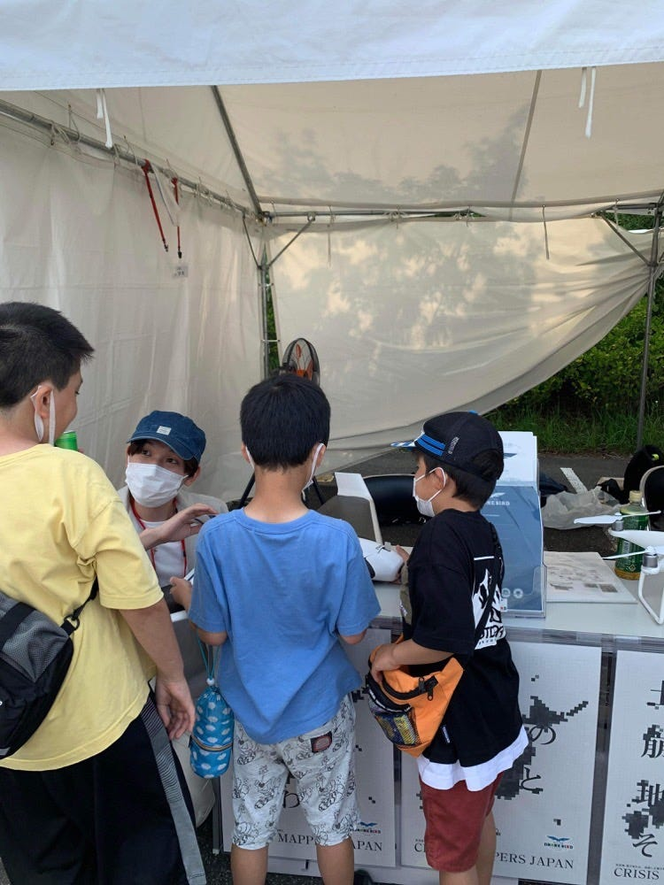
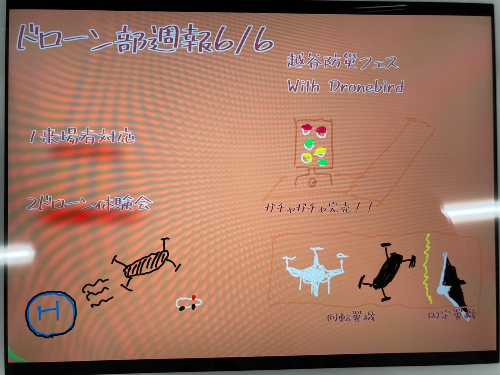

### ドローン部週報 6/5

### 越谷防災フェス２０２２

こんにちはドローン部です!本日の週報は6月4日・5日に行われた「越谷防災フェス2022」についてです。

当日、僕たちは

１、来場者の方々からの質問に答える。

２、ドローン体験会の補助

を行いました。それらについて学んだこと、感じたことを書いていきます。

１今回、ドローンの展示があったので、各ドローンの性能や違い（回転翼、固定翼、VTOL）についての質問が多かったです。その違いについて説明できるかが心配でしたが、森田さんやDronebirdの方々のサポートもあったので大丈夫でした。また、教える事で自分の中で整理することが出来たので良かったです。（ドローンの種類、性能の違いについては今後深堀していけたらいいと思っています！）

２参加した子供にドローン体験会を行いました（中には毎年来ている子もいるそうです、）。そこではドローンを操縦する上で起こりうる危険性や対処法についても学ぶことが出来ました。それは

１子供の近くでは身長より上に飛ばす。

２ドローンを緊急停止する時は機体を90度回す。

です。実際に大人二人が見守っていてもドローンが急に移動したり、モノに当たってしまったりと、予期せぬ出来事も起きてしまいました。今後、自分がドローンを飛ばす上で、気を付けなくてはいけない点を学ぶことが出来て良かったです。

グラレコ

