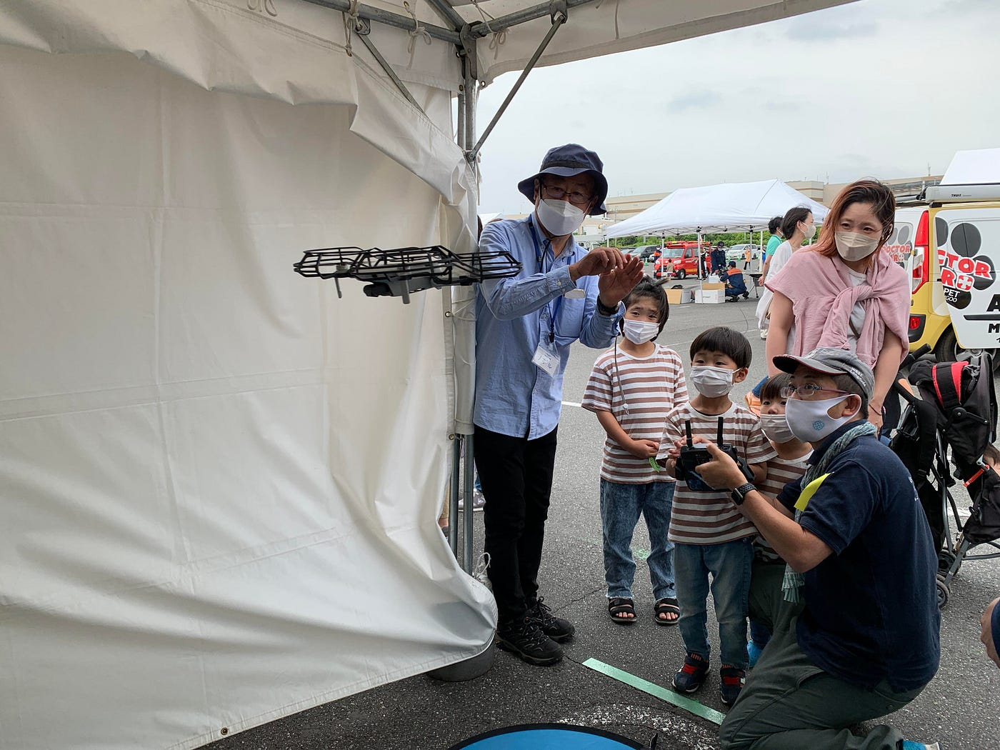
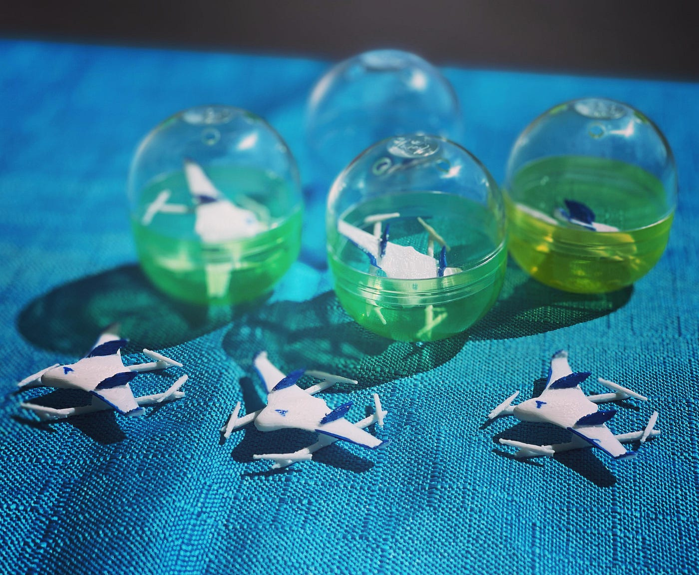
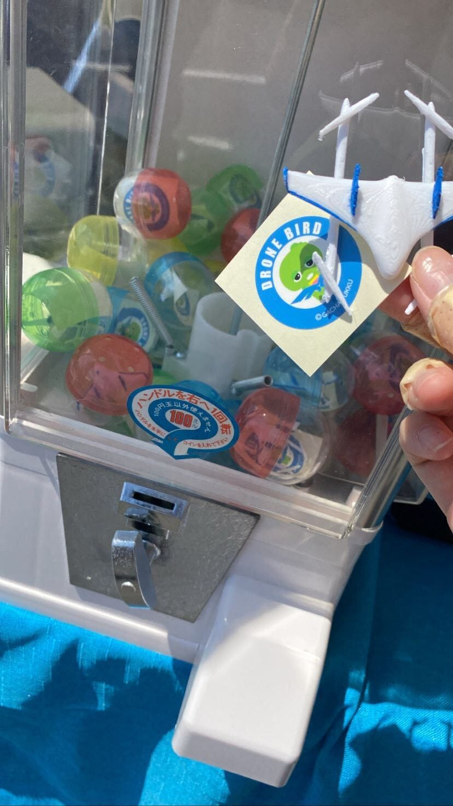
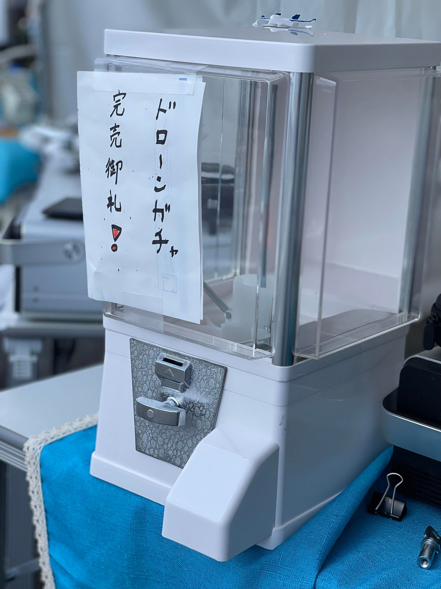
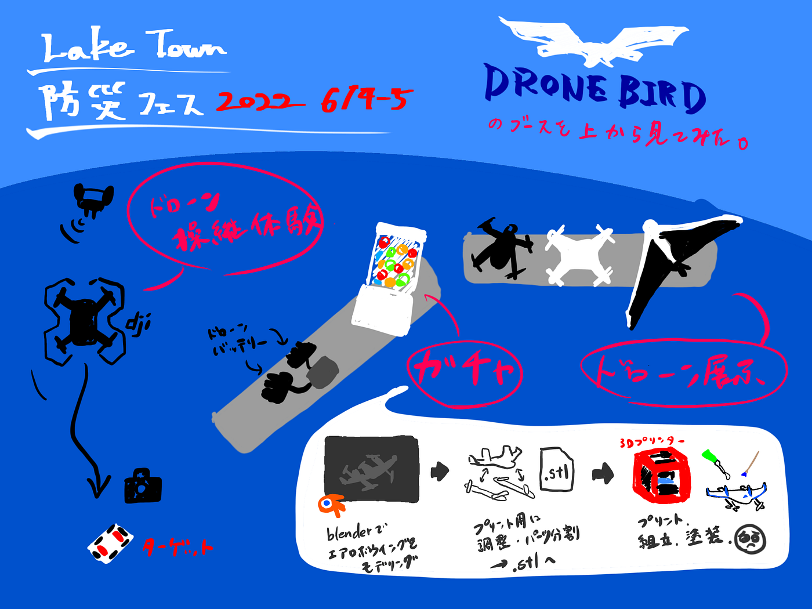

### 越谷防災フェス2022 レポート

こんにちは！

4年の菊池です。

デザイン部は本年度の目標として古橋ゼミガチャの開発を挙げていましたが、ついに6/4,5にガチャガチャを初実装することができました！

今回参加したのは、越谷防災フェス2022。レイクタウンの駐車場で開催されたこのイベントは今年で10回目を迎え、特殊車両など普段は見られないものが集まり大盛況でした。

ドローン体験会については[ドローン部週報](https://medium.com/furuhashilab/%E3%83%89%E3%83%AD%E3%83%BC%E3%83%B3%E9%83%A8%E9%80%B1%E5%A0%B1-6-5-63e768e9c38e)をご覧ください。

今回、デザイン部が用意したのはエアロボウィング。エアロセンスからお墨付きをいただいた公式グッズです。

あたり含め42個用意しましたが、2日間とも即完売。大好評でした！

実際にドローンを飛ばした子はもちろん、飛行体験に参加できなかった子供もガチャガチャを楽しんでくれました。

中には、インスタで初日に即完売したことを知り、オープンの時間を狙って来て下さった方までいらっしゃいました。

今回のイベントでガチャガチャとしての改善点も見つかりました。

・バリエーションを増やす

・カプセルトイマシン本体用のPOP作成

夏に開催されるイベントに向けさらに完成度の高い本格的なガチャガチャを目指していきたいと思います！

