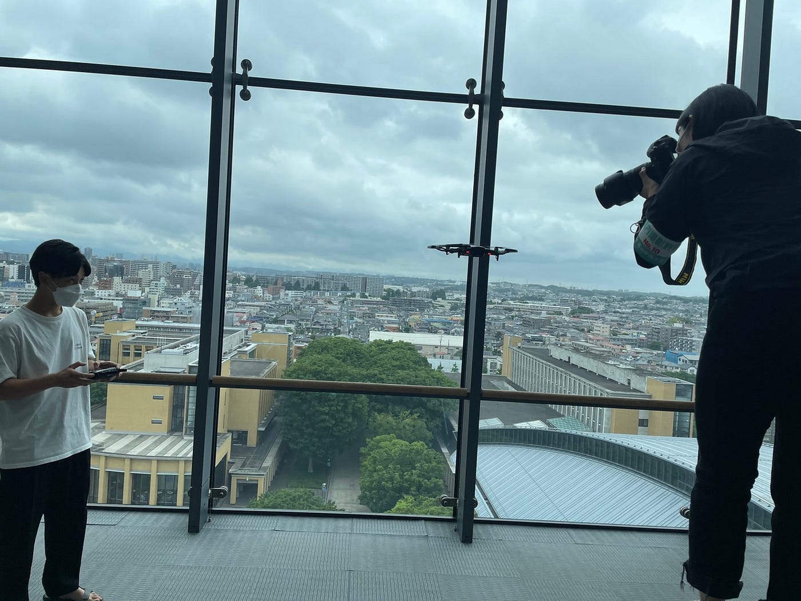
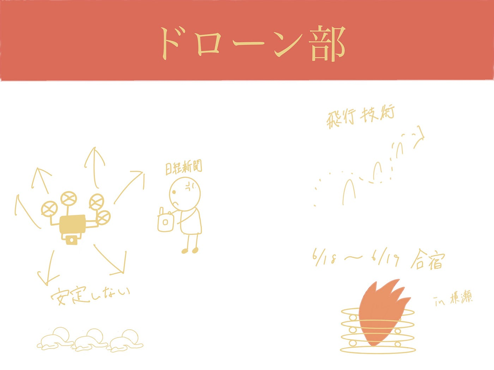

### ドローン部週報 6/14

こんにちは！ドローン部吉田です！

先週、息吹さんがYouth Mappersとして日経新聞さんから取材を受けており、その取材の流れで僕たちもドローンを飛ばしました！

今回はそれらから学んだこと・感想を書いていきます。

日経新聞の高橋さんの要望でいつも通り9階にてドローンを飛ばしました。

ドローン部は、トイドローンでの飛行訓練を毎週火曜3限の時間に設定しているのですが、まだまだ技術やドローンへの理解が足りず、取材といういざという時に相手の撮りたい写真を撮れなかったりとうまく飛ばすことができませんでした…

反省点としては

1. ドローンの飛行技術がまだまだ足りない

1. ドローンのメンテナンスができていない(ドローンへの理解が足りない)

この2つだと考えました。

毎週のドローン部で実施するSTM訓練で技術向上やドローンのメンテナンスを行うとともに、6/18,19のドローン部合宿で先生や専門の方のお話を聞いたり、本格的なSTM訓練でドローンの飛行技術を向上させていきたいと思います！

また、いつも飛ばしているトイドローンではない本格的なドローンを飛ばせる貴重な機会でもあるので、積極的に飛ばして多くの経験を積んでいきたいです！

また、ドローンの取材の中で息吹さんがMavic Miniを飛ばしていました！

やはりトイドローンと違って、安定感が抜群だなと改めて感じました。しかし、操作や立ち上げが複雑で難しそうだったのでまずはトイドローンの操縦を完璧にしていきたいと思います！慣れてきたら本格的なドローンも使いこなして行きたいです！

グラレコ

