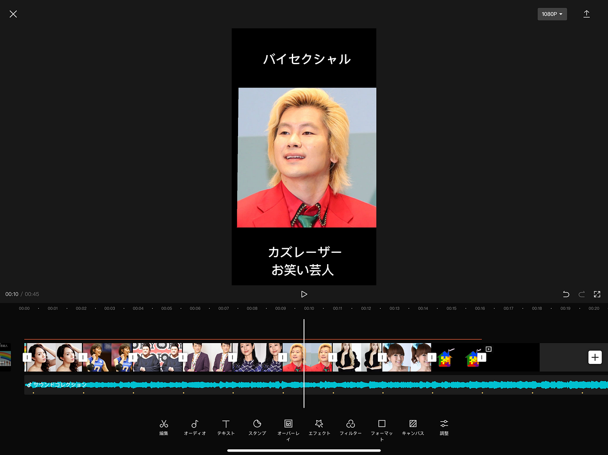

### V&F 週報7

こんにちは

3年植松です。今週のV&Fは久しぶりの共同作業でした。

以前からV&Fがstudent teamの一員として関わらせていただいているFamieeプロジェクトに3年植松が本格的に参加することになりました。

> 活動内容

TikTokを利用し、Famieeプロジェクトの認知を広める

TikTokの裁量権はこちらに一任されているということなので2人で話し合い、今週はFamieeとはどんなプロジェクトなのかの説明動画に加え、LGBTであることを公表している芸能人のまとめ動画を作成しました。

今回はTikTokの動画作りということで一般的にTikTokで使われているCapCutというアプリを使用しました。初めて使用したのですがCapCutの中にはTikTok動画に使いやすいアニメーションや効果音が多くあり、とても動画編集初心者に使いやすい印象を受けました。

植松的に一番重宝した機能は音楽のリズムに合わせて印を打ってくれるマッチカットという機能です。このマッチカットを利用することで簡単に画像を挿入すべきタイミングを知ることができます。

動画制作の工夫点として出来るだけ難しい言葉を使わず短く、わかりやすくを意識しまた。Famieeの説明動画は長くなってしまいましたがこれからの動画は15秒前後で作っていこうと考えています。またBGMやハッシュタグも再生数に関わってくるので相談しあいながらこれからの活動を進めていこうと思います。

> 成果物

Famieeとは

[FullSizeRender.MOV
Edit descriptiondrive.google.com](https://drive.google.com/file/d/1fFP1ODTQDqMamnkP2JnZYlyIFwVC04Sj/view?usp=sharing)

LGBTを公表している芸能人

[IMG_0407.MOV
Edit descriptiondrive.google.com](https://drive.google.com/file/d/1mxgTJR4X1oC4h5taYx1ab7o5HdanHDQ-/view?usp=sharing)

＜グラレコ＞

