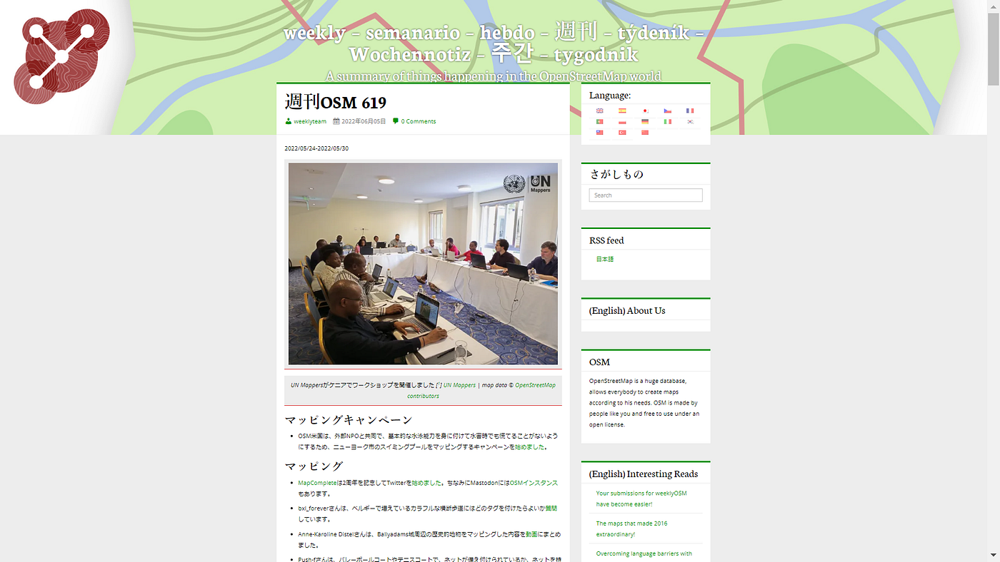
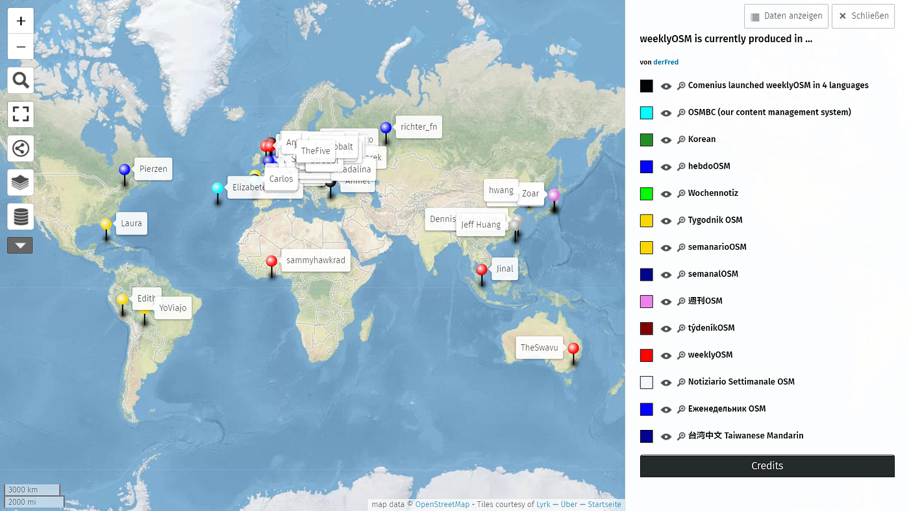
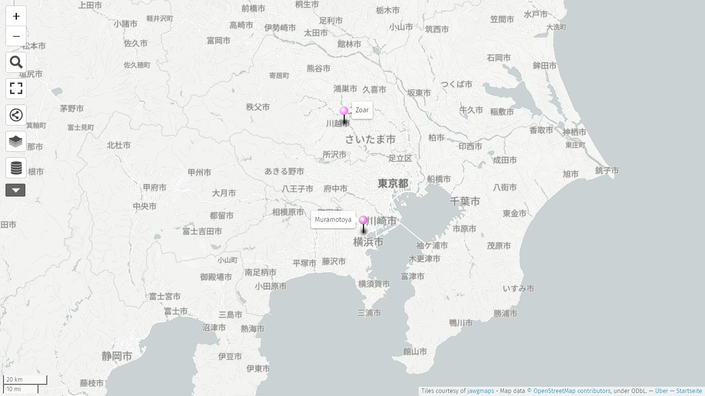
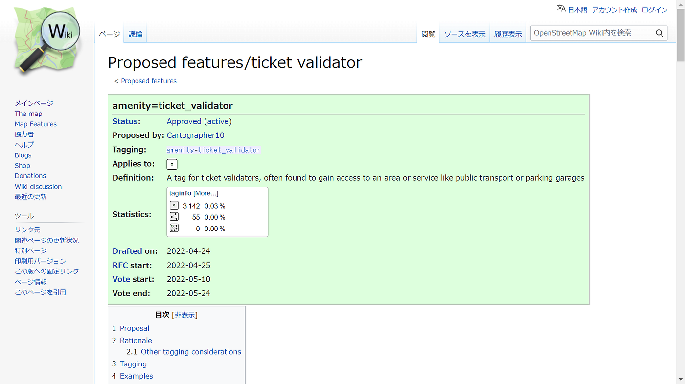
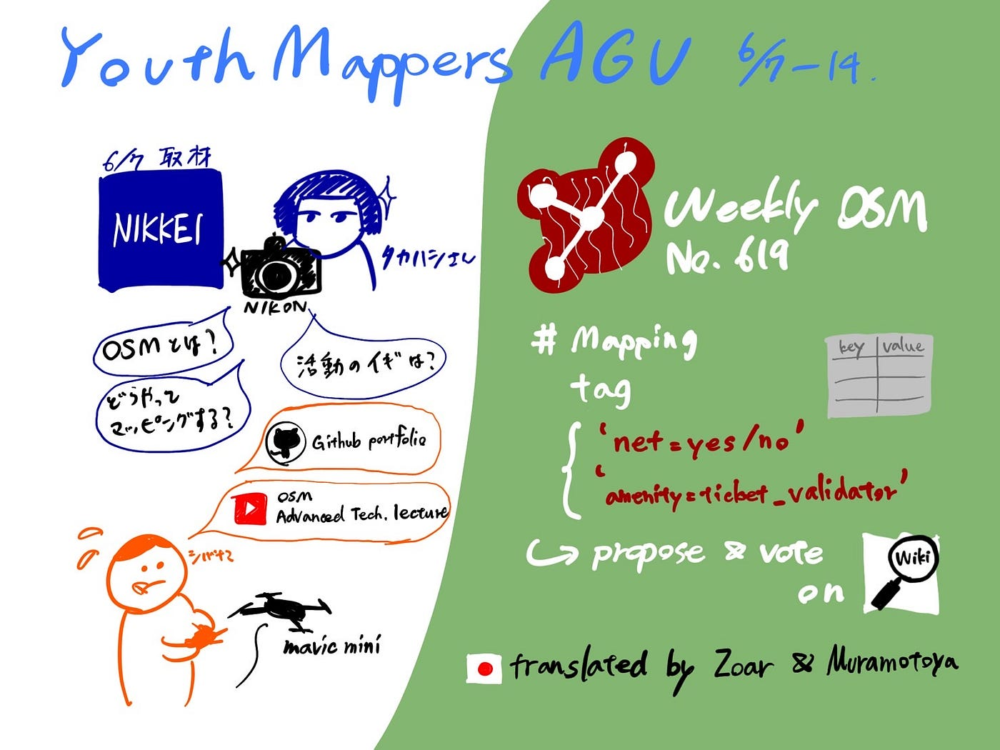

### Weekly YouthMappers AGU

2022/06/13 ユース週報

こんにちは。4年柴山です！

今回は先週の日経新聞の取材の振り返りとWeekly OSMについてお伝えしていきます。

> 取材振り返り

先週の6/7、日本経済新聞社写真映像グループの高橋様から取材を受けました。「SDGs世代」というコラム記事のための取材で、YouthMappers AGU での活動や古橋ゼミ内での研究について質問を受け、活動風景も撮影していただきました！

[「ＳＤＧｓ世代」のニュース一覧: 日本経済新聞
日本経済新聞の電子版。日経や日経ＢＰの提供する経済、企業、国際、政治、マーケット、情報・通信、社会など各分野のニュース。ビジネス、マネー、IT、スポーツ、住宅、キャリアなどの専門情報も満載。www.nikkei.com](https://www.nikkei.com/columns/wappen_77yz77yk77yn772T5LiW5Luj)

事前の打ち合わせや当日の取材を取材を通して感じたのは、自分たちの活動を分かりやすく説明することの難しさでした。

就活の面接でも”ガクチカ”として説明してきましたが、今回は取材のプロだったので今まで以上に深掘りされました。OSMとは何か、どのようにマッピングするのか、という技術的な質問から、始めた理由、活動や研究の意義など自分の考えを問われるものもありました。

そんな中でしたが、GitHubのポートフォリオ (README.md) を資料として共有したおかげでより分かりやすく伝わったと感じています。昨年古橋先生からアドバイスをいただいて以来こつこつと作ってきたものがここで役立ちました！

[ibuki76 - Overview
ibuki76 has 10 repositories available. Follow their code on GitHub.github.com](https://github.com/ibuki76)

また、昨年の [OSM Advanced Tech. lecture 2021](https://www.youtube.com/channel/UC7ibSx7RwsxQPGjHX0ab5TQ/search?query=advanced%20tech%20lecture) の動画を事前に見ていて助かったと感じた質問もありました笑

取材は無事終わりましたが、今後もいざという時の質問に答えられるように勉強を続けていきたいです。

撮影にはドローン部の3年生にも協力してもらいました！ありがとうございました！

記事は7~8月ごろ掲載予定とのことです！

> Weekly OSM

翻訳活動の参加に向けて、[Weekly OSM](https://weeklyosm.eu/ja/) がどういったものなのか見てみました！

週報という形式で、OSMに関連するニュースをカテゴリー別で簡単に説明し、その文章の中に埋め込まれたリンクで詳細情報を閲覧できるようなウェブサイトでした。

世界各地域の言語で翻訳されていて、日本語訳は Zoar さんと Muramotoya さんという方が行っているようです。

[Weekly OSM 619](https://weeklyosm.eu/ja/archives/15627) で気になったのは、マッピングカテゴリーの中のタグ提案の話題でした。

テニスコートにおける[備え付けネットの有無](https://wiki.openstreetmap.org/wiki/Proposed_features/net)や、[駐車場での発券機](https://wiki.openstreetmap.org/wiki/Proposed_features/ticket_validator)のタグについて、提案したり投票したりしたという内容でした。提案・投票は主に [OSM Wiki](https://wiki.openstreetmap.org/wiki/Main_Page) で行われているそうです。

市民で地図を作っていく以上、詳細な部分についても議論や投票を行っていく必要があることを知ることができました。

来週以降も Weekly OSM のトピック紹介をしていく予定です！お楽しみに！

> グラレコ

