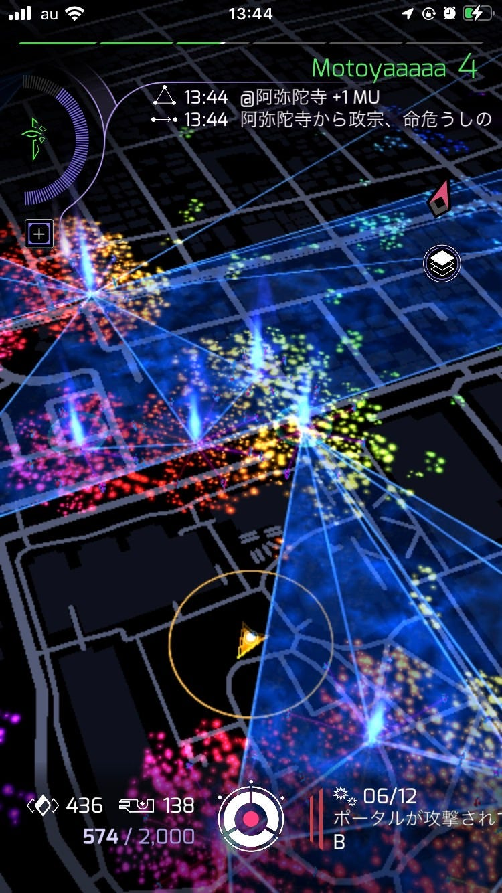
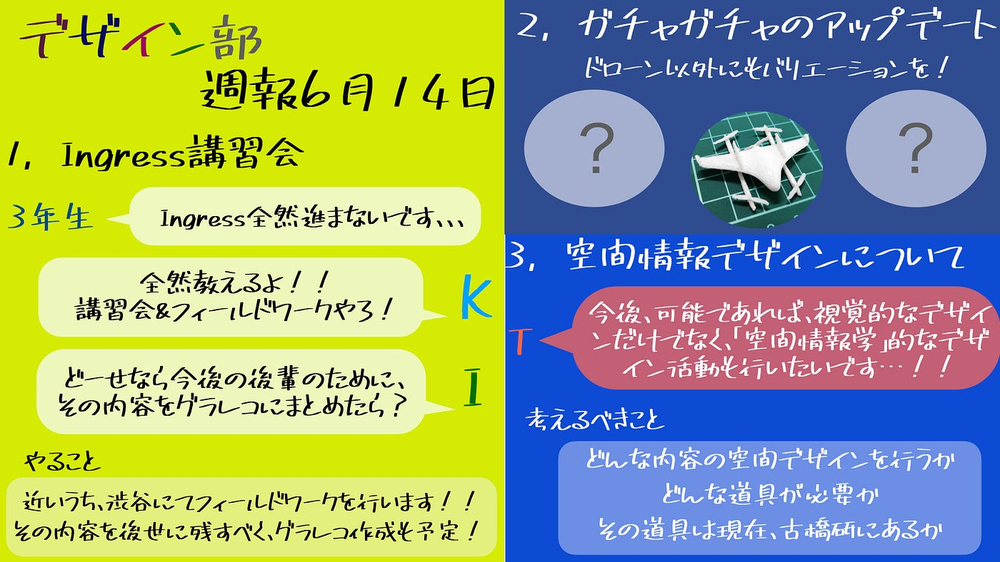

### デザイン部週報

デザイン部週報

こんにちはデザイン部です。

５月のガチャガチャハッカソンも終わったので、デザイン部の今後の方針について話し合いました。

内容としては

１，Ingress講習会

２，ガチャガチャのアップデート

３，空間情報デザインについて

です。

・まず、３年生のためのIngress講習会を開こうと思います。３年生の中でも、「Pokémon GOはやり方分かるけどIngressはわからない」という声が上がっています。なので、今週・来週の二週間で基本的なやり方、また渋谷（場所は確定はしてません。）に行きフィールドワークを行います。

（渋谷を選んだ理由は、ポータルの数も多く、レベル上げに適していると考えたからです。もし、他におすすめの場所があれば教えて頂きたいです！）

・ガチャガチャに関しては、ドローンだけではなく様々な種類（古橋研にかかわるもの）を増やし、バージョンアップしていこうと思っています！

・「空間情報デザイン」のようなこともしたい！という声も上がりました。しかし、まだ空間情報デザインについての知識が無く、これに関しては、今週のミーティングでは具体的な活動を決める事は出来ませんでした。

グラレコ

