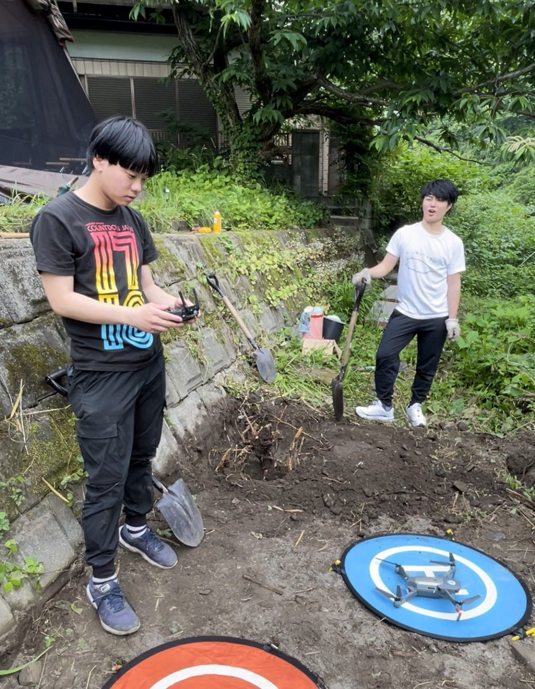
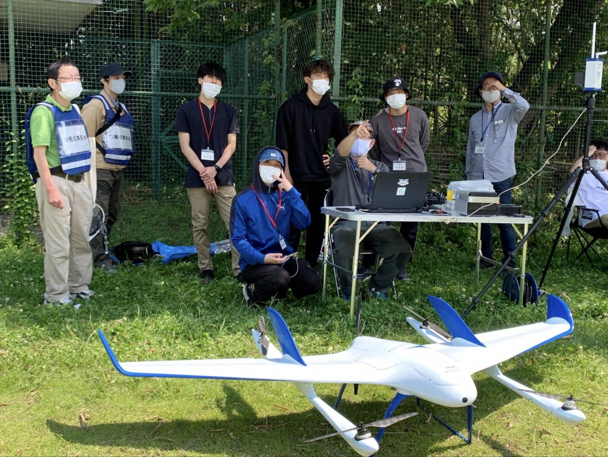
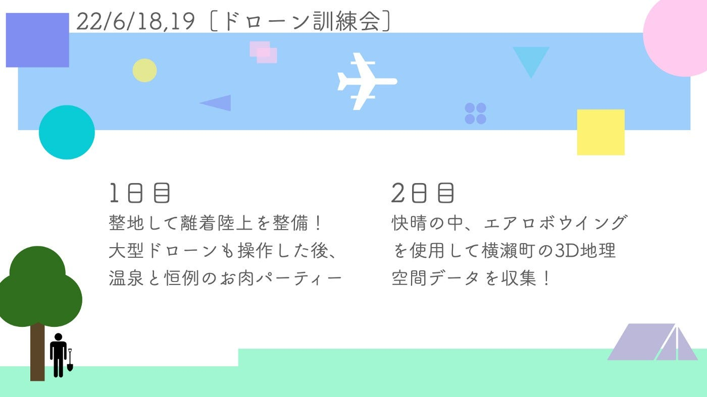

### 6/18,19横瀬町災害時初動訓練（ドローン訓練会）

こんにちは、ドローン部3年の小澤です🙋‍♂️

今回は、先日行われた横瀬町災害時初動訓練、兼ドローン訓練会についての説明をします！

### 1日目

一日目は、まず木を引っこ抜きながら整地をしてドローンの離着陸上を作り、その後に本格的なドローン講習会を受けました。

古田さんのファントムも操縦させて頂き、トイドローン以外の操縦が初めてだった自分は手がブルブルでした。
しかし、数回練習した後だと落ち着いて操縦できるようになり、最終的にはかなり安定して操縦・離着陸できるようになりました！

### 2日目

二日目は横瀬町災害時初動訓練に同伴し、エアロボウイングの組み立てと離着陸補助を行いました。

この日は、横瀬町の特定地域の3D地理空間データを収集しました。組み立て手順から飛ばすまでの過程が非常に複雑でしたが、現場の空間というものを肌で感じることができました。実際にドローンが情報収集し、それを今後に生かすということに初めて立ち会うことで、ドローンや地理空間に対しての理解度、そして何よりも興味が本当に上がりました。
ただ座学やネットを見ているだけでなく、実際に動いて体感してみることの重要性を、人生で一番実感した日でした。

次のドローン訓練会までに知識を深め、より実りのある訓練にできるようにします！

（グラレコでは、整地で大活躍だったもとやをMVPとして左側に組み込みました☺️）
