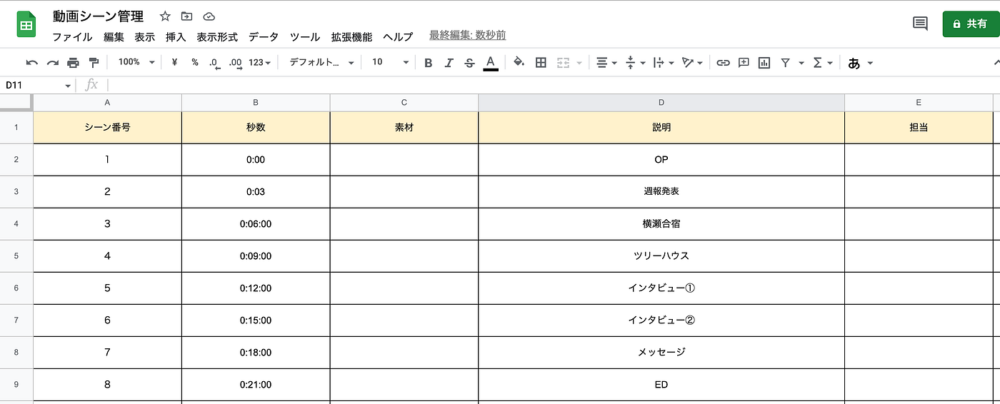

### V&F 週報8

こんにちは。

今週のV&F週報は４年葉賀が担当します。

６月のハッカソンが近づいてきました。３年生メインで動画を作るということで、今週のV&Fは我々流動画作りの流れや基礎をまとめてみました。歴史の浅いV&Fですが培ってきたものを精一杯ご紹介するので、お役に立てると幸いです。

**動画を作る手順**

> ①動画の内容・条件確認

> ②構成・脚本

> ③動画撮影(今回はあらかじめ撮ってある動画を使うので割愛します)

> ④動画編集

１つずつ詳しく見ていきましょう。

> **①動画の内容・条件の確認**

・目的 ＝何動画なのか ex)チュートリアル、体験レポート、Vlog

・ターゲット

・動画の長さ = 30sec~2min

・動画を映す媒体 =SNSで縦画面 or PC等で横画面、スクリーン？とか

(・５W1H =依頼を受けたとき)

_＋色味、雰囲気(pop・しっとりとか)_

> **②構成、脚本**

・大まかな流れをイメージしてから構成を考える

ex)OPー週報発表ー横瀬合宿ーツリーハウスーメッセージーED

・イメージを書き出す

_＋言葉で端的にシーン説明を書くと分かりやすい_

(後々テロップとかにもなる)

まずは１シーン３～５秒程度に一定で考えて後で長さや入れ方を調整する。

・詳しく決める(映像・文章・シーンの意味・繋がり)

_＋細かく決まってきたらエクセルを使うと分業しやすい_

> **④動画編集**

・基礎

トリミング(カット)、トランジション(画面の切り替え)、エフェクト(色、効果、演出)

これはアプリごとにやり方が違うので調べましょう。

・素材

音楽・ナレーション、テロップ、アニメーション

_＋音楽を最初に決めてそのリズムに合わせてもいい_

・OP、ED、タイトル、サムネを作る

EDとかにはゼミのロゴとかを正しく入れる。

そこからアクセスしてもらえるからSNSと紐付け。

_＋動画の顔となる部分。大事だけど凝りすぎると時間かかって本体がおろそかになるので注意。_

> **注意事項**

・素材動画や音楽のライセンスを確認する。

・正しい情報を入れる。

・書き出し形式 ex)mp４

・分業するときは各自のアプリやバージョン等の違いで動画に差ができないように気をつける。

以上、V&F流動画編集のノウハウを簡単にまとめてみました。ぜひ動画制作をするときは参考にしてみてください。

> **素材集め**

３年植松は18日から19日に横瀬町で開かれたドローン部の飛行訓練に参加しました。

そこで、AeroboWingの組み立て方法を動画で説明できるようにするための動画素材を撮影しました。

いざ撮影をしてみると動画の構成を考えてかったために、古橋先生から指摘を受けるまでは淡々と作業風景を撮ることしかしていませんでした。この撮影を通し、素材集めの前段階で動画の構成を考える必要性を感じました。

また、合宿にOsmoを持って行ったのですが使い方を理解していなかったことから、使用することができませんでした。来週はカメラワークとOsmoの使い方を中心に学んでこうと思います。

＜グラレコ＞

