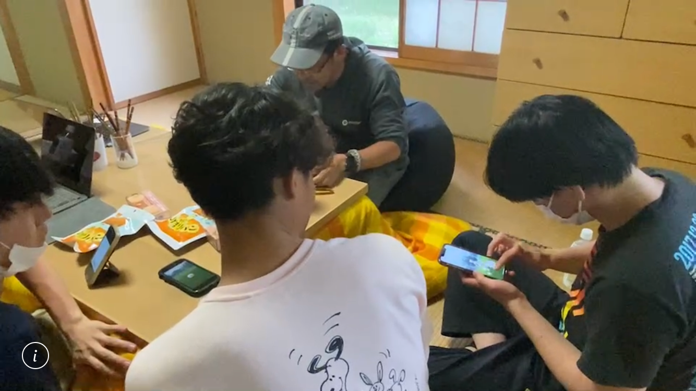
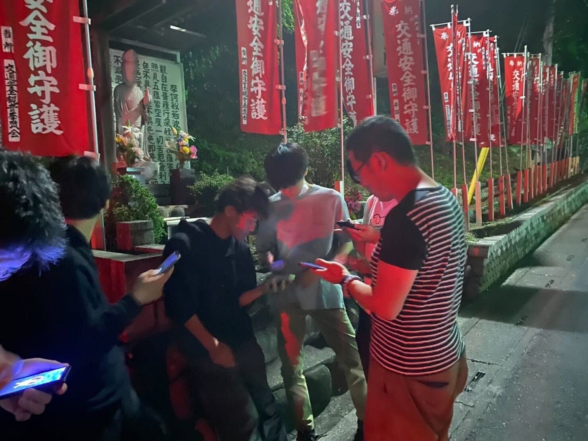

### デザイン部？ 週報

こんにちは！

4年の菊池です。

今週は3年生がハッカソンに追われているため、デザイン部としての活動はありませんでした。それぞれで取り組んだことを共有させていただきます。

今週はドローン部が横瀬での飛行訓練を行いました。その中で、空き時間にポケモンGOをしたそうです。

夜もみんなでポケモンを捕まえています😂

ちなみに、Ingressフィールドワークはハッカソンも落ち着いた７月ごろを予定しています。

続いて僕がMapboxのインターンで取り組んだことについて共有します！

5月にいぶきとわたるにも手伝ってもらい、MARVELキャラクターイメージマップを作成しました。3人で９キャラ分作成し、Twitterで公開したところ、多くの反響をいただきました。キャラクターイメージマップの極意を記事にし、Mapboxの公式ブログから公開しております。ぜひ読んでみて下さい！

[「MARVEL風マップ」を作成して見えたキャラクター風マップデザインの極意｜ブログ｜Mapbox Japan
こんにちは。インターンの菊池です。 今回は、5月に開催した「MARVEL風マップ」企画について紹介させていただきます。当企画は、 Mapbox Studio…www.mapbox.jp](https://www.mapbox.jp/blog/marvel-inspired-map)
