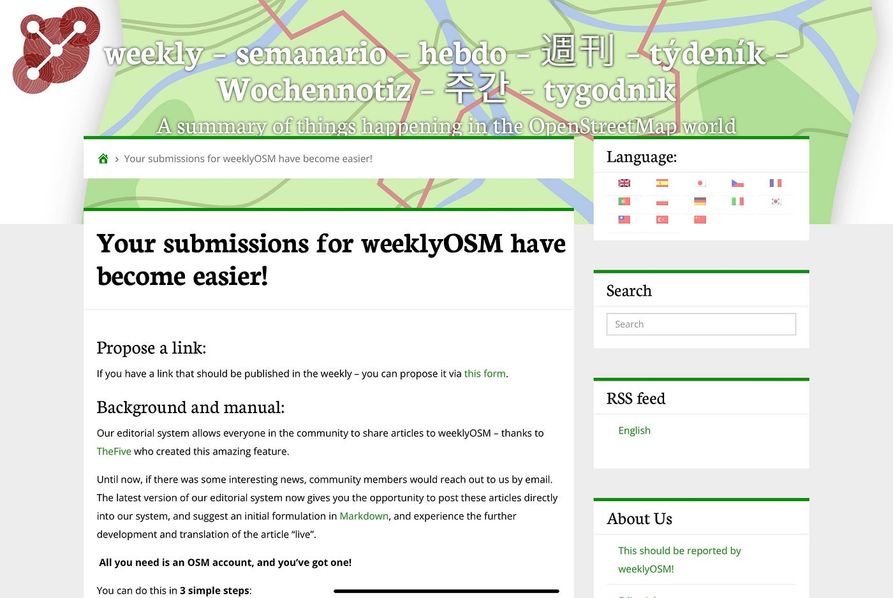
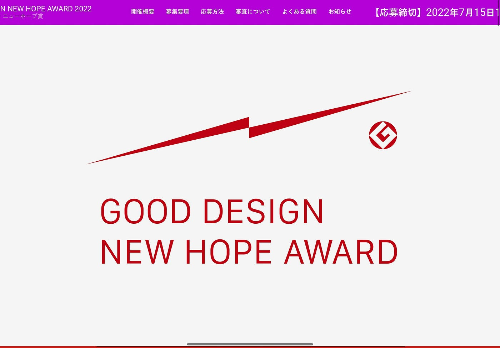
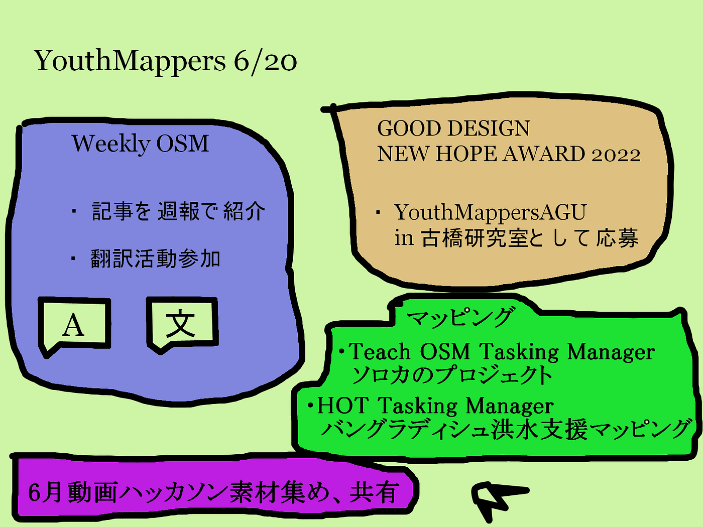

### 今週のYouthMappersAGU

> **合宿先**

合宿先は式根島で大方決定したのですが日程を決めるのに難航しています。

7月16〜7月18を考えたのですが大事な授業があるメンバーいることに加え、3年川野の留学時期が早まったことも考慮し、9月に実地する方向で考えています。

> **WeeklyOSM**

今週はWeeklyOSMの投稿方法変更についての記事を取り上げます。今までは投稿したいトピックがあった場合、コミュニティメンバーと電子メールでやりとりをしなければならなかったそうですがシステムの更新に伴い、最新版では記事を直接編集システムに投稿し、マークダウンで記事の内容を提案したり翻訳をすることができるようになったそうです。つまりOSMコミュニティメンバーなら誰でもWeeklyOSMに投稿する記事を提案できるようになりました。今後YouthMappersAGUから投稿をできたらと良いと考えています。

[https://weeklyosm.eu/this-news-should-be-in-weeklyosmhttps://weeklyosm.eu/this-news-should-be-in-weeklyosm](https://weeklyosm.eu/ja/this-news-should-be-in-weeklyosm)

> **[デザイン賞**](https://newhope.g-mark.org/)

ゼミの中でのYouthMappersAGUのあり方を情報、仕組みのデザインカテゴリーで応募しようと考えています。４年生中心で進めていく方向ですが積極的に３年生も関わっていこうと考えています。

**[＜応募概要＞**](https://newhope.g-mark.org/)

7/15 13:00 応募〆切

応募カテゴリー・作品タイトル（50文字以内）

完成年月日・応募作品区分・指導教官名・他の受賞歴など・応募作品の概要（160文字以内）

デザインが生まれた理由 / 背景（400文字以内）

デザインを実現した経緯（400文字以内）

デザインの改良、類似デザインとの差異、実績など（400文字以内）

自由記入欄（400文字以内）

> グラレコ

