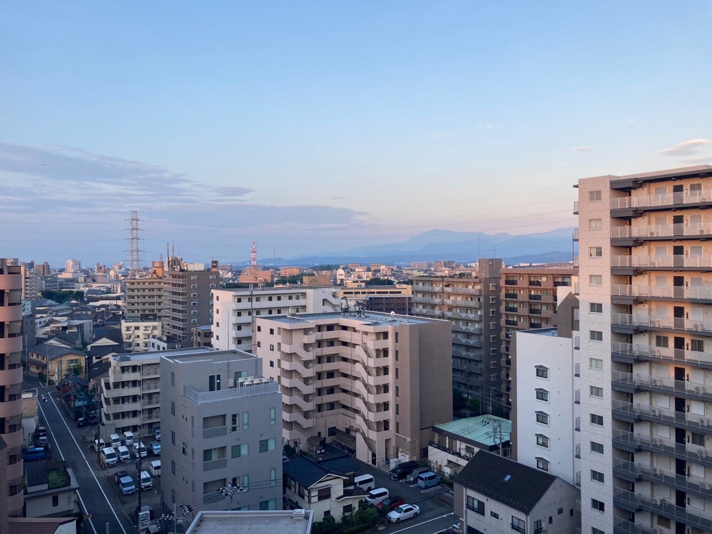
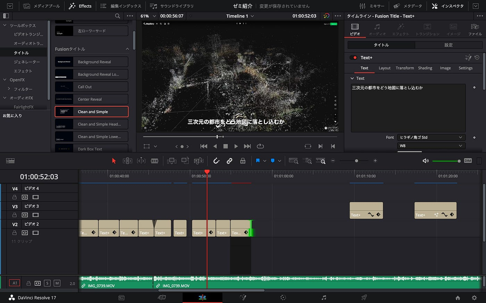
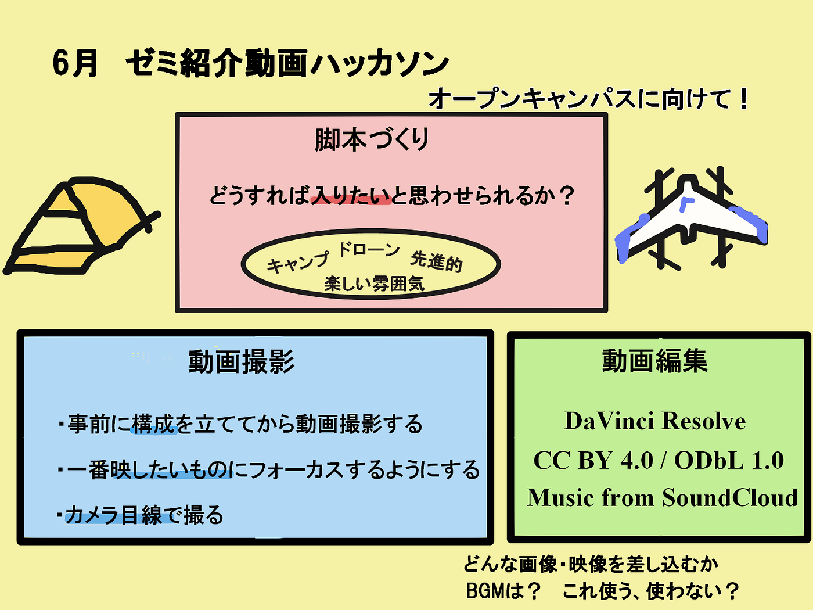

### 6月ゼミ紹介動画ハッカソン

こんにちは！ 3年の吉田です。🙋‍♂️

今月のハッカソンは7月10日に行われるオープンキャンパスで来てくれた人向けに使用するゼミ紹介動画製作でした。今回は3年生で動画撮影と編集を行いました！

撮影は吉田・川野が、編集は植松・小澤がそれぞれ担当しました！

（気づいたら朝でした！！）

今回、動画編集にはDaVinci ResolveとCapCutを用いました。

ライセンスは CC BY 4.0 / ODbL 1.0 とし、バックミュージックはSoundCloudからCCライセンスのものをチョイスしました。

> _**動画撮影_**

動画の素材は先生や先輩方が送ってくださった動画や6月のドローン部合宿で撮影したものを主に使用しました。

合宿での先生のアドバイスや先週のなつみさんのMediumを参考にして、

1. 事前に構成を立ててから動画撮影する

1. 一番映したいものにフォーカスするようにする

1. カメラ目線で撮る

1. このゼミに入りたいと思わせるような動画をとる

ことを意識しました。

動画の流れとしては

オープニング（興味を引き立てたい）

↓ （要所要所に魅力を詰め込む）

ゼミの活動概要（少し具体的な活動内容・ゼミ内サークルごとに）

↓

エンディング（古橋ゼミの魅力を最大限詰め込む）

このような感じになりました。

画角や撮影場所、背景作りなども整理したり装飾したりして古橋研究室らしさをより出せるよう工夫しました。

> _**動画編集_**

まず編集をする上で見てる相手が飽きないような動画を作りを意識しました。そのため初めにインパクトのあるドローンの映像を持ってきたり、インビューの途中に別の動画を差し込むようにしました。

作成の裏話としてお肉を焼いているシーンや火を起こしのシーンの音声はは映像の音声と別のものを使用しました。（雑音が多かったため）

BGMやフォント選びにも大変多くの時間を要してしまいました。

全員が初めての本格的な動画作成ということで試行錯誤して取り組みました。先生からのFBを受け、オープンキャンパスまでにはより洗練された動画を作り上げます。

撮影に協力してくださった古橋先生並びに先輩方、動画作成の指導をしてくださった葉賀さん本当にありがとうございました。

> _**完成動画_**

高画素版

[https://drive.google.com/file/d/1r09ShDs7A-OATBvl2ZT15R2iTyyeQLrg/view?usp=sharing](https://drive.google.com/file/d/1r09ShDs7A-OATBvl2ZT15R2iTyyeQLrg/view?usp=sharing)

通序盤

[https://drive.google.com/file/d/1dk0Yq3PVHCCD7GK5s7kxsOuy05S3KUBi/view?usp=sharing](https://drive.google.com/file/d/1dk0Yq3PVHCCD7GK5s7kxsOuy05S3KUBi/view?usp=sharing)

Googleスライド

グラレコ

