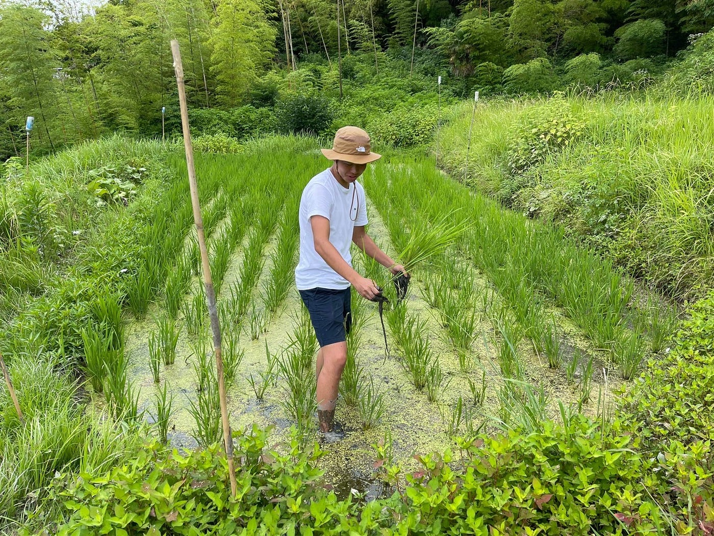
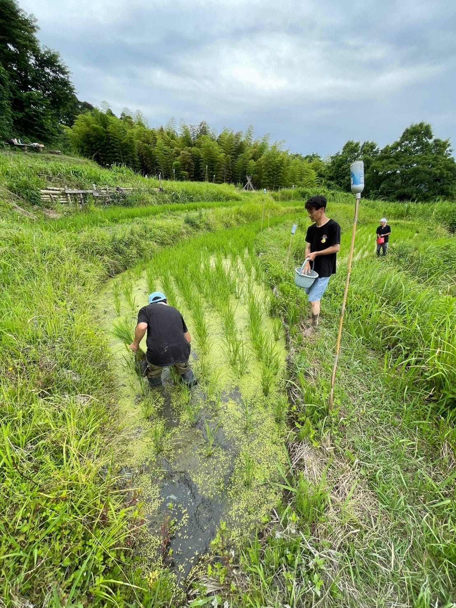
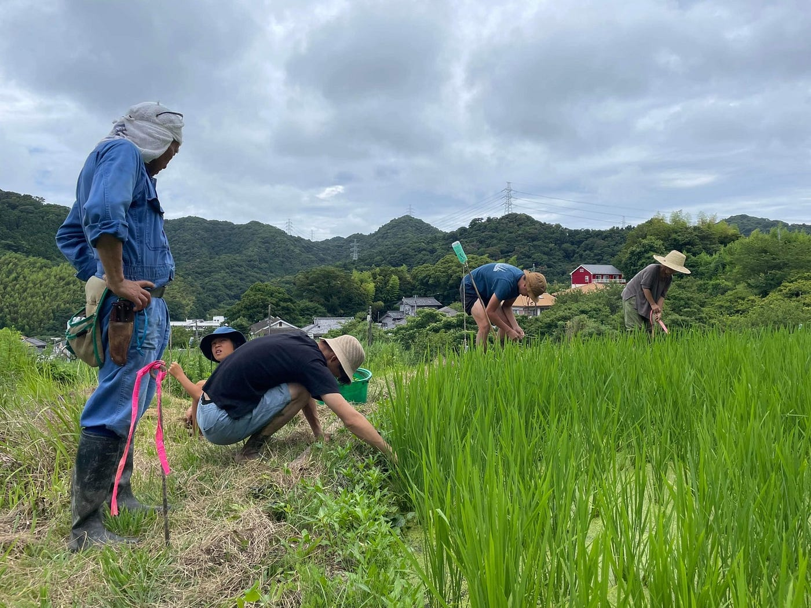
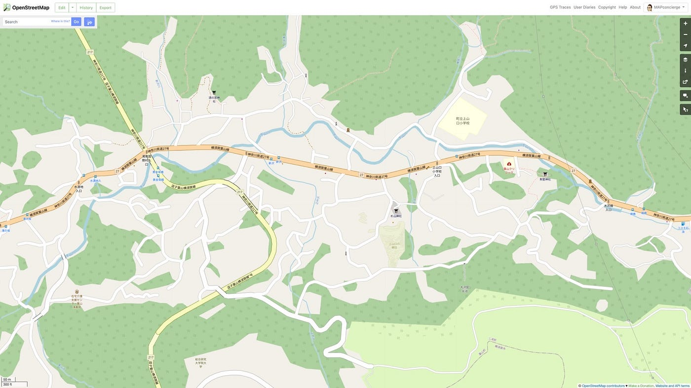
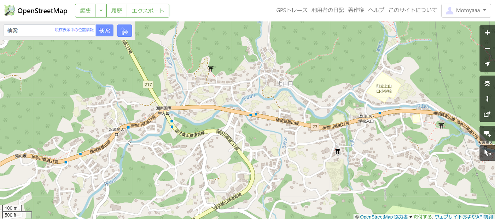
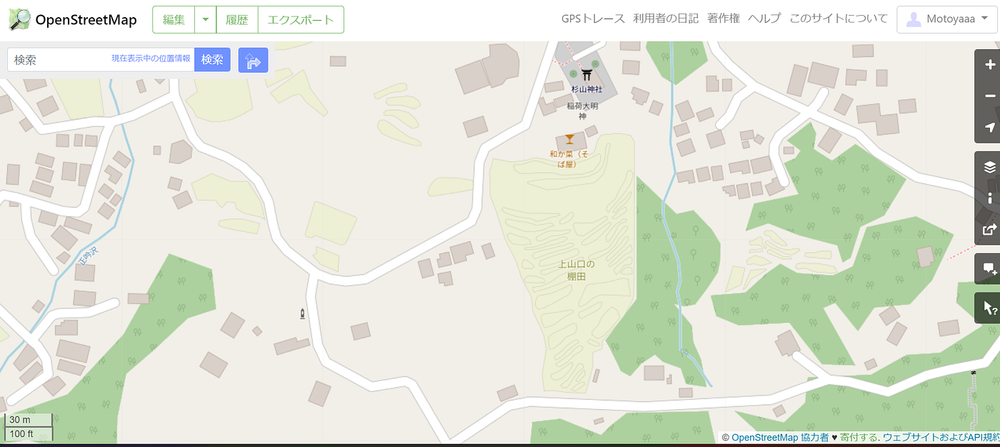
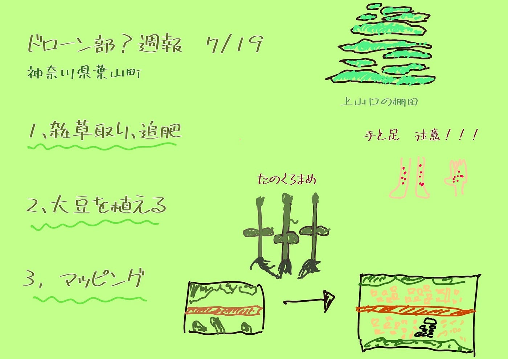

### ドローン部？週報（棚田）

こんにちは、モトヤです。あと２週間ちょいで出国なので、ドキドキしてます（笑）

週報としては、7月2日と9日にかけて神奈川県葉山町にある「上山口の棚田」のお手伝いをしたので、その報告をしようと思います！

作業内容としては

１、水田の雑草取り・追肥

２、畦の周りに大豆を植える

３、マッピング

です。

１つ目は夏の時期生え続ける水田の雑草を取るという作業を行いました。この地域はあまり農薬を使わないので、雑草を定期的に取らなければいけないそうです。

次に追肥を行いました。基本的に追肥は田植えが終わった後に土壌の肥料切れが起こらないようにするそうです。

ここで僕たちは大きなミスを犯してしまいました。それは長靴や手袋などを一切しなかったのです。その結果、手や足にに無数のぶつぶつが出来てしまいました。なので行ってみたい方は皮膚を晒さないように長靴などを持っていきましょう！

２つ目は大豆（畦豆）を畦の周りに植える作業を行いました。使用した豆は「たのくろまめ」という品種で、上山口で90年以上繋がれている在来種だそうです。

なぜ大豆を植えるのか、それは使っていない土地の活用をしたいということらしいです。また、大豆が育つと「根粒菌」と呼ばれる菌が空気中の窒素を取り込むそうです。そしてそれが田んぼに流れる事で稲の肥料にもなるといいます。

その豆を使って味噌を作っているというお話も聞きました。

やり方はピンク色の紐がついているドリルのようなもので穴を40センチ間隔であけていきます。そこに大豆の苗を入れていきます。

3つ目はマッピングです。山口さんと先生とミーティングした際に、棚田の管理を楽にするためにマッピングをすることになりました。

マッピング前

マッピング後

グラレコ

