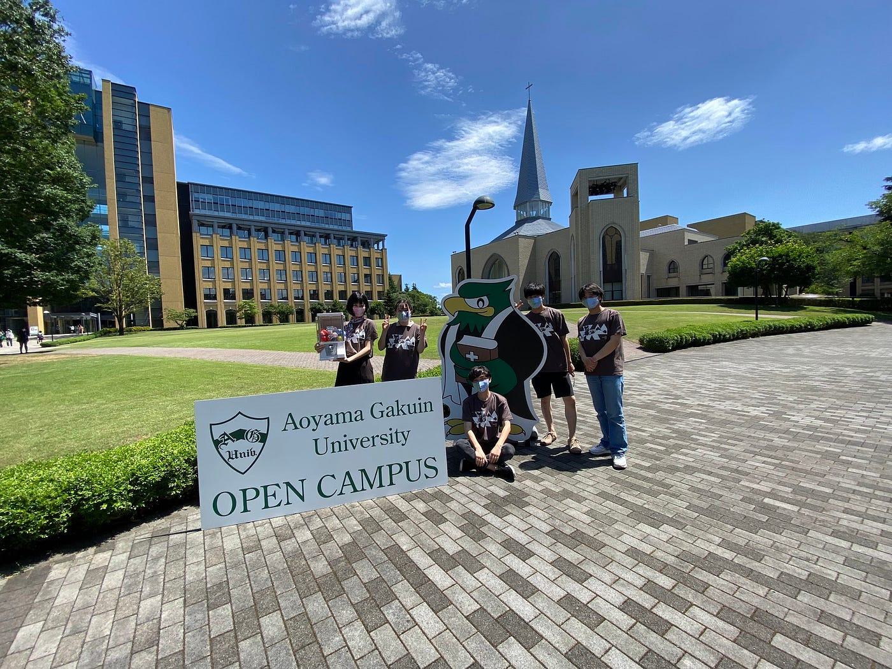
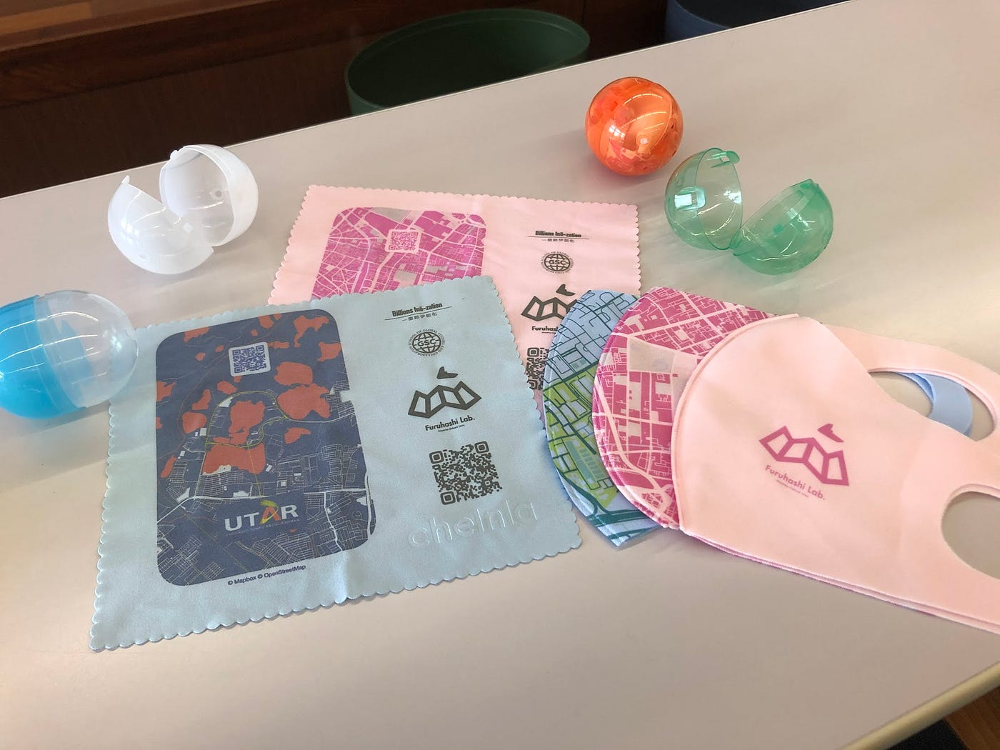
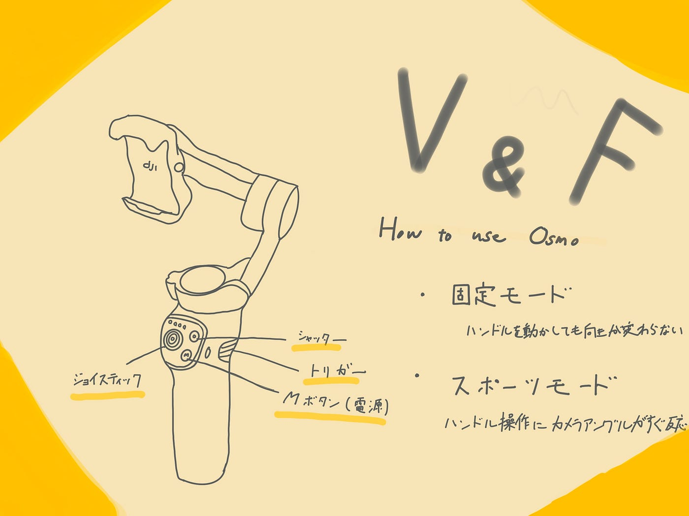

### V & F 週報

こんにちは 3年植松です。

7月10日（日）に青山学院大学相模原キャンパスのオープンキャンパスが開催されました。多くの高校生や親御さんが訪れるのを見てコロナ前の生活を思い出し、なんだか少し嬉しくなりました。

（また流行り始めてますが、、、）

古橋ゼミとしてゼミナール紹介も行いました。その中で3年生が作った動画が流れたり、4年生が作ったデザインのマスクやトートバックが配られたりなど自分達が行ってきた活動が多くの人に見てもらうことが出来ました。また来年の動画作りのための素材用に４年葉賀とたくさん動画を撮りました。

動画格納場所

[https://drive.google.com/drive/u/0/folders/1ukn5G4uzVWO4Ufl5YET4fLdxIrwrCmm3](https://drive.google.com/drive/u/0/folders/1ukn5G4uzVWO4Ufl5YET4fLdxIrwrCmm3)

今回はOsmo Mobile 3を撮影に使いました。研究室のOsmoには取り扱い説明書がないのでここに簡単にまとめておきます。

（グラレコ見ながらだとわかりやすいです）

Osmoとはスマホのカメラで映像を撮る際に、揺れやブレを抑え、カンタンに自撮りができるジンバル機器です。まずやることはDJI Mimoのダウンロードです。アプリなしでも使えますがアプリと連携させることで使える機能の幅が広がります。

電源ボタンを長押しでジンバルが起動します。同時にスマホが回転し、縦位置撮影のモードになります。Mボタンを2回押すと、くるっと横向きモードへ移行します。

前面左にあるジョイスティックでは、左右と上下へスマホの向きを操作可能です。

ジョイスティック操作でスマホが正面以外を向いている状態でも、背面トリガーを2回プッシュする事で、スマホを正面の初期位置へ回復させる操作が可能となっています。

> 撮影のモード紹介

**固定モード(トリガー長押し)**

ハンドルのコントローラー類とは反対側にトリガーがあります。こちらを押している間は固定モードとなります。固定モードでは、ハンドルを動かしてもスマートフォンの向きが変わらずに固定されます。但し、上下のハンドル操作には限界があり、あまりにも上下角度が大きいと、固定されずに傾いてしまうので注意が必要です。

**スポーツモード(トリガー1回押し＋長押し)**

ハンドルのコントローラー類と反対側にあるトリガーを1回押した後に、もう一度長押しするとスポーツモードとなります。こちらは、ハンドル操作にカメラアングルが素早く反応します。

**正面へ戻る(トリガー2回押し)**

スマートフォンの向きが思ったところに行かない事があります。そんなときに、トリガーを2回押すとハンドルの握り手に向かって正面へ戻ります。

**自撮りモード(トリガー3回押し)**

トリガーを3回押すと、カメラが自身を撮るために180度回転します。自撮り撮影をしたい時に便利です。

