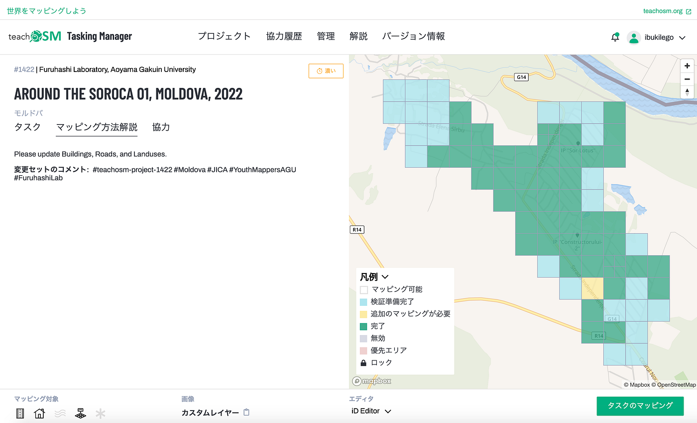
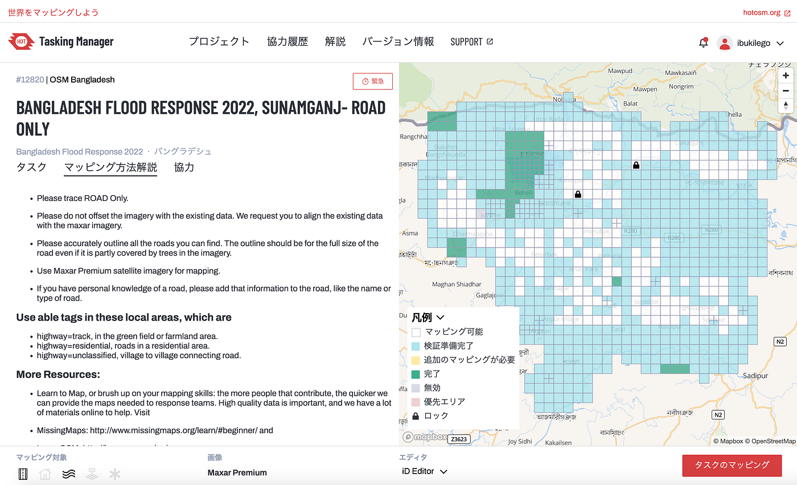
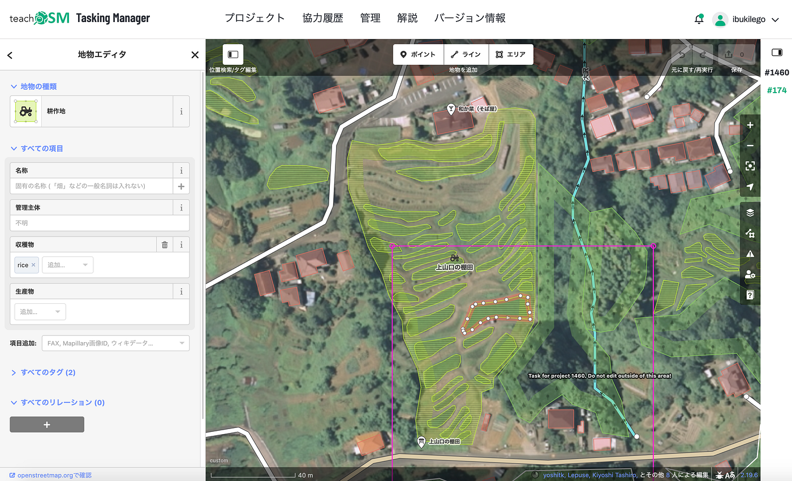
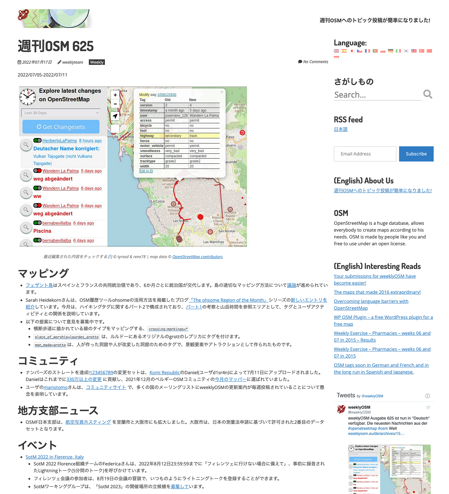
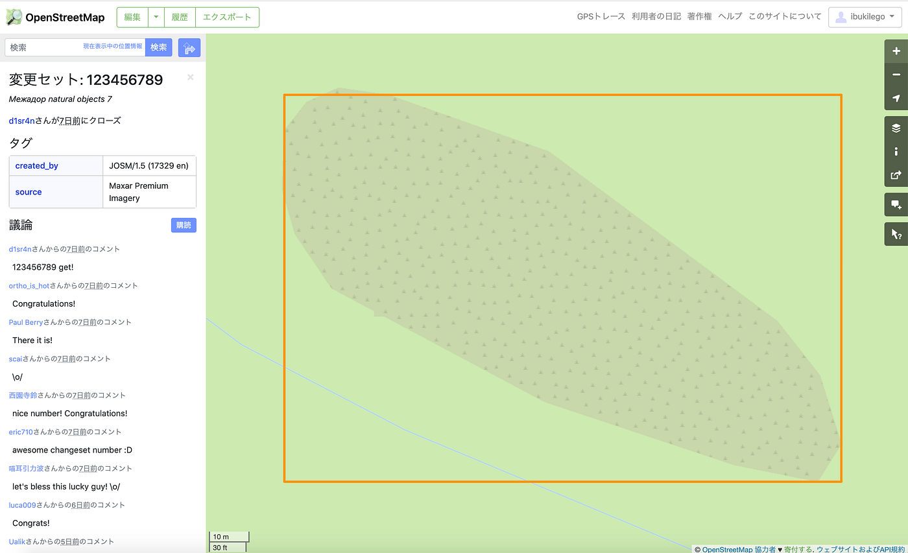
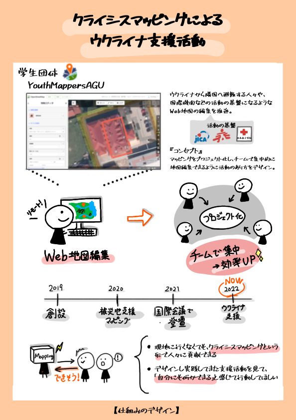

### ユース週報 2022/7/19

YouthMappers AGU

こんにちは。4年の柴山です！

今週の週報は、マッピングレポート、Weekly OSM トピック紹介、GOOD DESIGN NEW HOPE AWARD 2022への応募についてお伝えしていきます。

> マッピングレポート

現在YouthMappers AGUは、ウクライナ支援（モルドバ）、バングラデシュ洪水支援、葉山の棚田のプロジェクトを各自でマッピングしている状況です。

1. **モルドバ**

[TeachOSM Tasking Manager
Tasking Manager is a the tool for coordination of volunteers and organization of groups to map on OpenStreetMap.tasks.teachosm.org](https://tasks.teachosm.org/projects/1422)

6月に始まったモルドバ、ソロカのプロジェクトは現在ほとんどの地域が `完了` に分類されています。残りの検証段階のメッシュを片付けていくとともに、次のプロジェクトも考えていく必要があります。今後も古橋先生とご相談しながら決めていきたいです。

2.** バングラデシュ**

[HOT Tasking Manager
Tasking Manager is a the tool for coordination of volunteers and organization of groups to map on OpenStreetMap.tasks.hotosm.org](https://tasks.hotosm.org/projects/12820)

先月、バングラデシュでの洪水を受けてYouthMappersの Regional ambassador の Sawan Shariar さんからメールで協力依頼が発信されました。かなり広大なエリアですが、こちらのプロジェクトは道路編集のみなので概ねサクサクと進められそうです。マッピング方法解説の指示に沿って編集していくことに注意です。

3.** 葉山**

[TeachOSM Tasking Manager
Tasking Manager is a the tool for coordination of volunteers and organization of groups to map on OpenStreetMap.tasks.teachosm.org](https://tasks.teachosm.org/projects/1460/)

葉山町の棚田プロジェクトに参加中の [motoyaaa](None) から、棚田マッピングのプロジェクトを共有してもらいました。棚田は一般的な田んぼよりもさらに不規則な形状になっているため、頂点数を増やしてトレースするように心がけたいです。

> [Weekly OSM 625](https://weeklyosm.eu/ja/)

ページのデザインがリニューアルされたようです。よりシンプルで、Markdownっぽい印象になりました。今回はコミュニティカテゴリーで少し面白いニュースがあったのでピックアップします。

OSMの記念すべき**`[123456789](https://www.openstreetmap.org/changeset/123456789)`**の変更セットの編集について紹介されていました。7月11日、Danielさん（id: d1sr4n）によって編集されたロシア、シクティフカルの地域の「自然の地物：低木」(natural=scrub) のエリア変更セットが123456789のナンバーズを獲得しました。

議論の欄には、本人の ”123456789 get!” のコメントがあり、このナンバーズを狙っていたと思われます。他のメンバーからの祝福コメントもありました！

OSMでもいわゆるキリ番があることを知ったと同時に、変更セットをテーマにした企画が何かできるかもしれないと思いました。ちなみにDanielさんはこれまでに330万以上の変更を行なってきたそうです。。。

> GOOD DESIGN NEW HOPE AWARD 2022

7月15日 13:00 締め切りだった [GOOD DESIGN NEW HOPE AWARD 2022](https://newhope.g-mark.org/) への応募は無事完了しました！「仕組みのデザイン」として、クライシスマッピングによるウクライナ支援活動を紹介したものを提出しました。

タイトルや説明のテキストの執筆を通して、どういった流れで活動してきたか、なぜマッピング支援が必要なのか、人々に何を伝えたいか、など様々なことを考え直すことができました。今回の説明テキストでは「支援活動の仕組みのデザイン」としてアピールしましたが、他の場面で活動自体の紹介をする際にも利用できそうです。

[その他テキスト · Issue #96 · furuhashilab/youthmappers4agu
You can't perform that action at this time. You signed in with another tab or window. You signed out in another tab or…github.com](https://github.com/furuhashilab/youthmappers4agu/issues/96)

また、Mediumでの支援活動レポートをリーディングリストにまとめているので共有します。

[Help Ukraine
YouthMappers AGUによるウクライナマッピング支援レポートmedium.com](https://medium.com/@ibukilego/list/5df8969f8532)

> グラレコ

