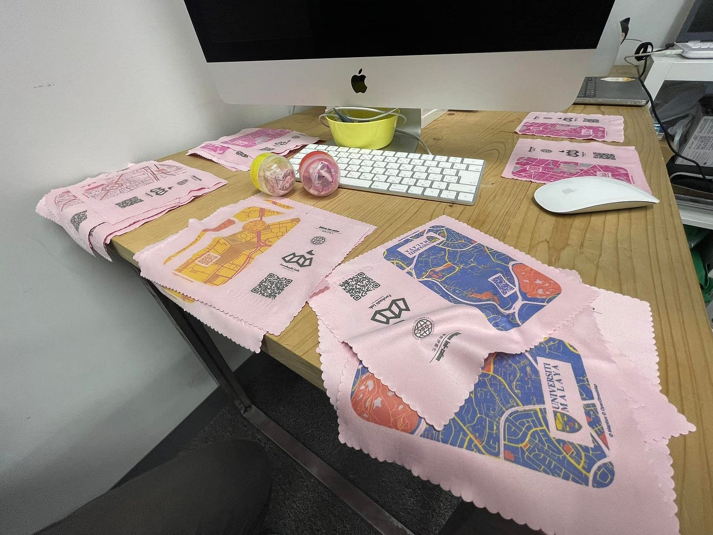
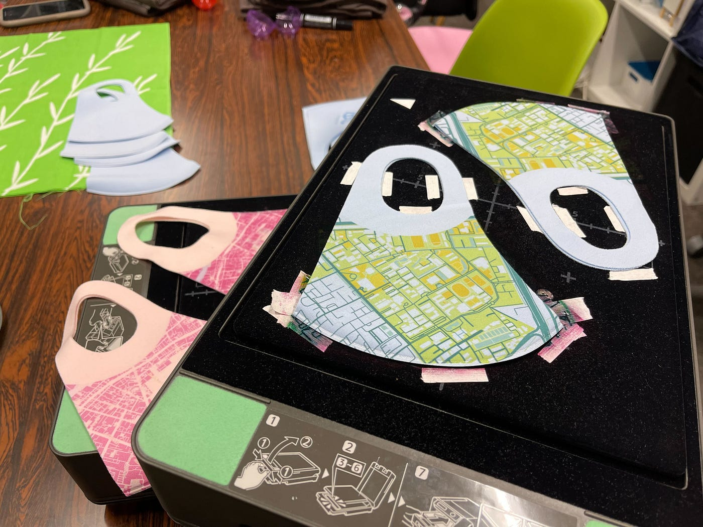
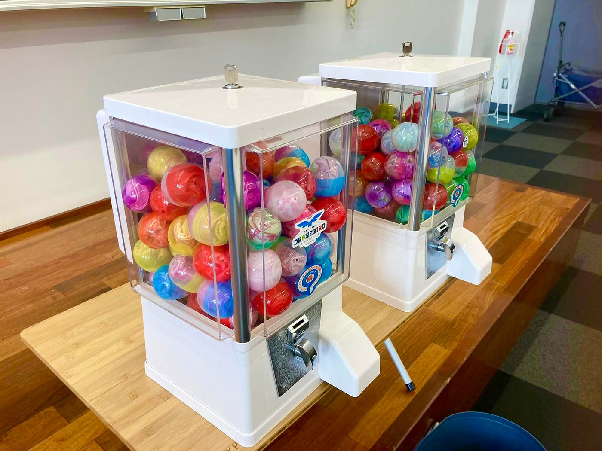
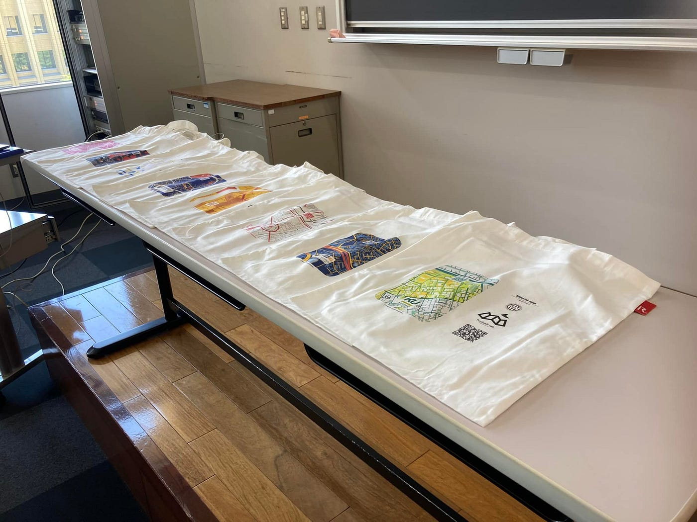
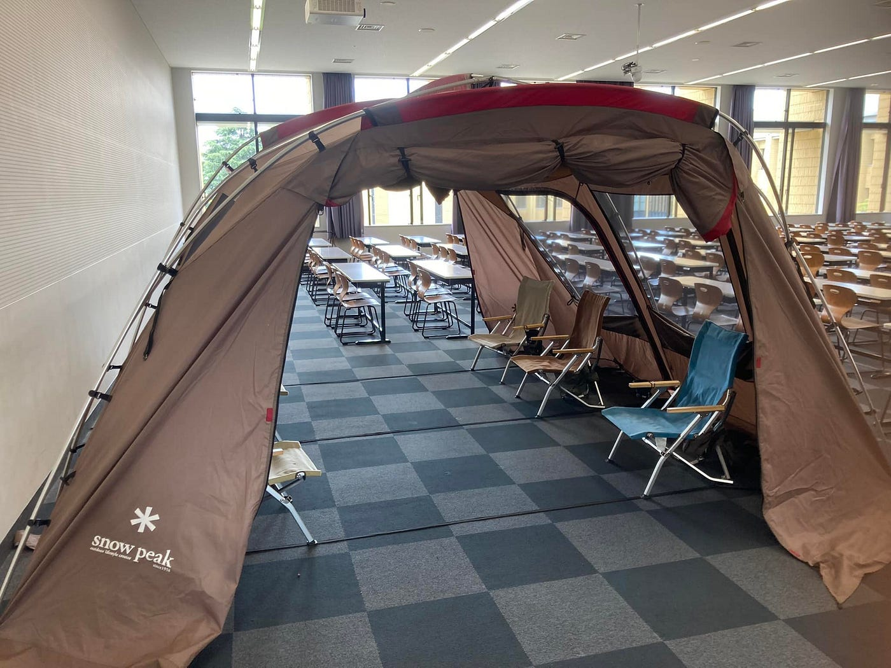
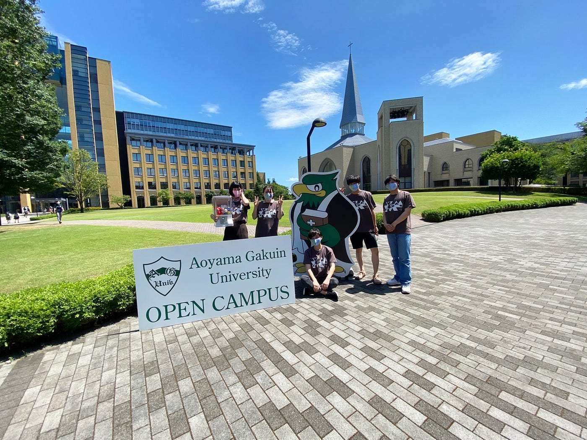
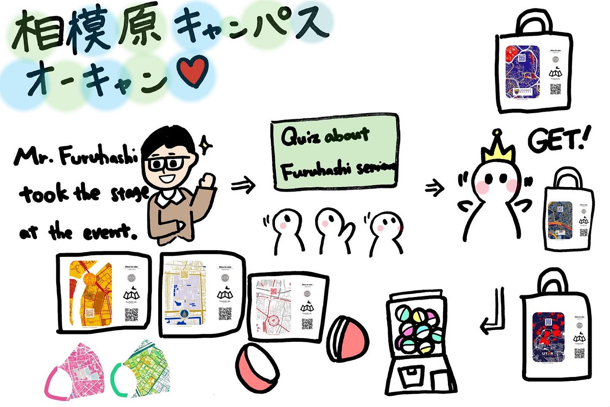

### オープンキャンパス 2022 レポート

こんにちは！ 4年の菊池です。

デザイン部の週報ではありますが、今回は7月10日に行われたオープンキャンパスについて書いていきます。

当イベントでは、古橋先生からゼミについてのレクチャーを行なった後、クイズを実施。最も正解した高校生にトートバックのプレゼントをしました。古橋ゼミイベントでは恒例となっているガチャガチャ（×2）も導入し、色々詰め込んだ一日となりました！

ガチャガチャの中身は、タイ・マレーシアの提携の大学をマップにして印刷。QRコード付きで、しっかりゼミをアピールしています！

これらをカプセルにギュッと詰め込みます。やはりたくさんあるとガチャ感が増していいですね！

当日はテントも設営し、いよいよ古橋ゼミ全開の雰囲気です！

他のゼミと比較してもかなりインパクトはあったのではないでしょうか。

今後もイベントはある予定なので、古橋ゼミの活動を世にアピールしていきたいと思います！

デザイン部としても、ガチャを始め色々と改善点が見えてきたところなので、さらにアップデートしていきたいと思います。

