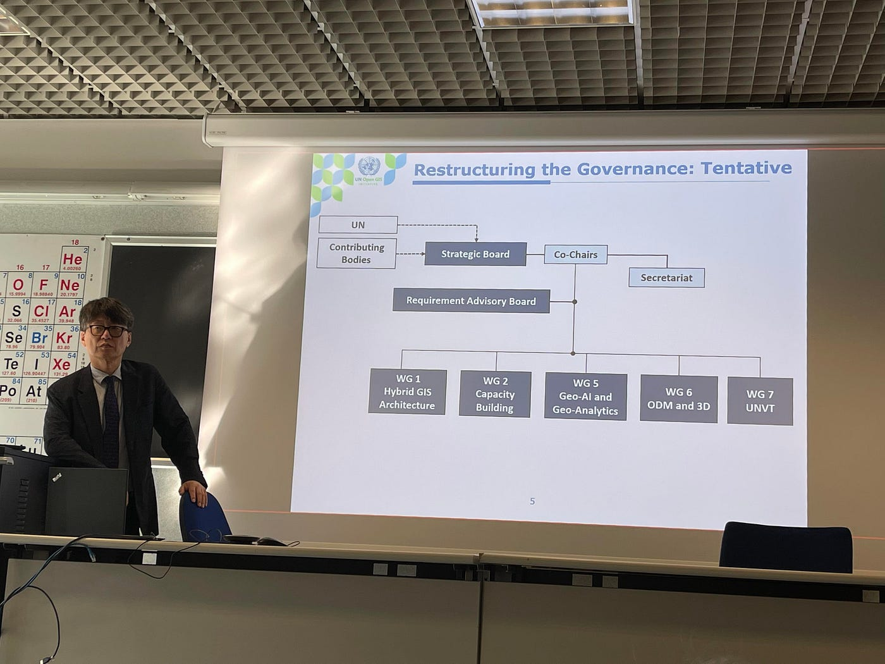
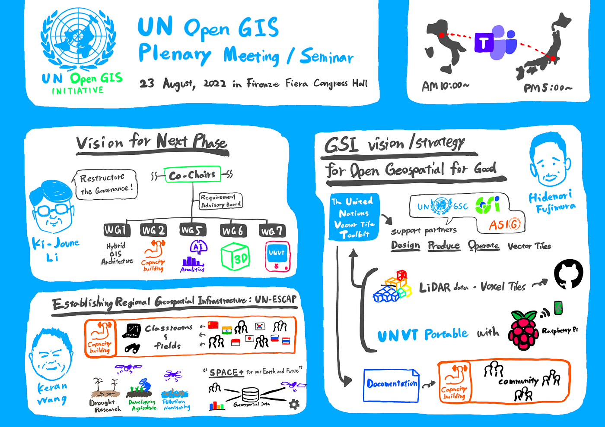

### International Conference Report — **UN Open GIS Initiative Seminar, Tech Forum & Meetings in conjunction with FOSS4G 2022**

23 August, 2022 at [Università degli Studi di Firenze](https://www.unifi.it/)/Microsoft Teams

Hello, I’m [Ibuki Shibayama](https://github.com/ibuki76).

On August 23, 2022, I attended an international conference organized by the United Nations Open GIS Initiative, a United Nations-wide framework to promote and implement open source geospatial information technology in the work of the UN. [Aoyama Gakuin University School of Global Study and Collaboration has been a Community Partner of the UN OpenGIS Initiative since 2022, and has been providing business and technical support using digital maps with the UN in various ways.](https://www.aoyama.ac.jp/faculty112/news_20200226)

[国連OpenGIS InitiativeのCommunity Partnerとして地球社会共生学部が加わりました！ | 青山学院大学
国連の業務要件を満たしているオープンソースGISツール開発を目的としたOpenGIS InitiativeのCommunity Partnerとして地球社会共生学部が加わりました。 具体的にはOpenGIS…www.aoyama.ac.jp](https://www.aoyama.ac.jp/faculty112/news_20200226)

This event was held in a hybrid meetings style, with participants able to attend on-site at the **[University of Florence (Università degli Studi di Firenze)**](https://www.unifi.it/) or online via Microsoft Teams. I participated online and watched the local time morning program talks live.

I attended the event as a member of the **[Furuhashi Lab](https://github.com/furuhashilab)/[YouthMappers AGU**](https://github.com/furuhashilab/youthmappers4agu), which has been participating in the** [UNVT Hackathon**](https://medium.com/furuhashilab/unvt-hackathon-meetup-2022-youthmappers-agu-51abe32f1844) and running **[workshops**](https://github.com/unvt/hackathonmeetup202112/issues/2) since last year.

Below is a report on three interesting talks from the morning program.

> _**UN Open GIS — Vision for Next Phase (Ki-Joune Li)_**

Mr. **[Ki-Joune Li**](http://lik.pusan.ac.kr/), one of the co-chairs of the UN Open GIS Initiative, spoke about UN Open GIS to date and what the future holds.

After citing the many changes that have taken place since the 2016 UNGSC meeting, including the replacement of modules used and the participation of new cooperating communities, a new organizational chart was proposed as the structure that should exist in the future.

In addition to the establishment of a Requirement Advisory Board under the co-chairs, the composition of the working groups was also reformed in this proposal. In particular, a new section, **WG7, dedicated to UNVT**, was established, which reminded me that UNVT is attracting worldwide attention.

> _**GSI vision (or strategy) for Open Geospatial for Good (Hidenori Fujimura)_**

I also watched a lecture by Mr. **[Hidenori Fujimura**](https://github.com/hfu/profile/blob/master/profile_ja.md), Chief of UNVT.

In reporting on UNVT applications with partners such as UNGSC, GSI, and ASIG, the report also introduced the maintenance of 3D data using a combination of LiDAR data and Voxel Tile, and **UNVT Portable **combined with Raspberry Pi.

The second half of the presentation explained how capacity building can be used to promote the use of UNVT. I learned that strategies and regulations were defined after focusing on each community that should take advantage of UNVT.

> _**Establishing Regional Geospatial Infrastructure: UN-ESCAP (Keran Wang)_**

Mr. **[Keran Wang**,](https://www.itu.int/en/ITU-D/Regional-Presence/AsiaPacific/SiteAssets/Pages/Events/2018/rdf2018/home/Session%206_Wang-UNESCAP.pdf) Chief of Space Applications Section, ICT and Disaster Risk Reduction Division, **[ESCAP**](https://www.unescap.org/), introduced Capacity Building in the Asia-Pacific region and the **“Space+ for our Earth and future”**, model of eco-systems centered on spatial information data.

They are using spatial information to survey droughts, monitor environmental pollution, and improve agricultural efficiency, and are aiming to achieve the SDGs through a system of real-time synchronization of diverse information into a single GIS platform.

He is also focused on involving students and other younger generations in Capacity Building and **“Space+ for our Earth and future”**. I felt that collaboration with YouthMappers AGU could be possible in the future.

This was my first time to participate in an official UN event, and while I gained a better understanding of the history and structure of the UN Open GIS Initiatives, and even had a few “huh” moments when words I knew came up, there were still many technical aspects that I did not yet understand.

I would like to participate in more international events like this in the future to further deepen my thoughts.

> _**Graphic Record_**

