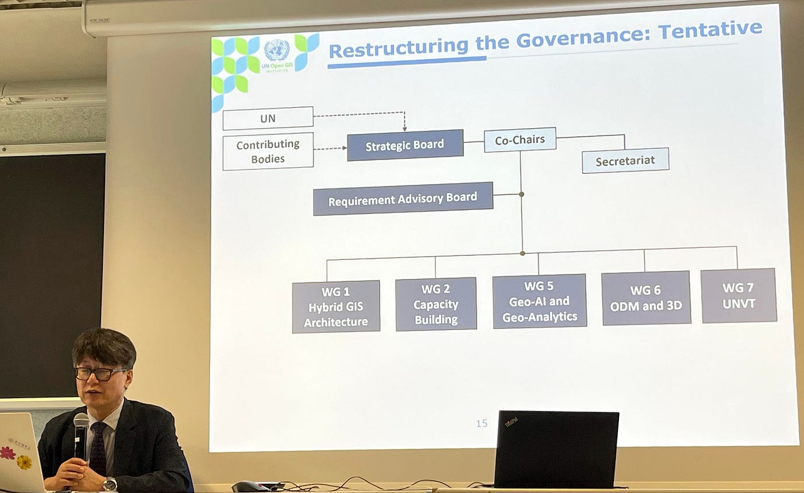
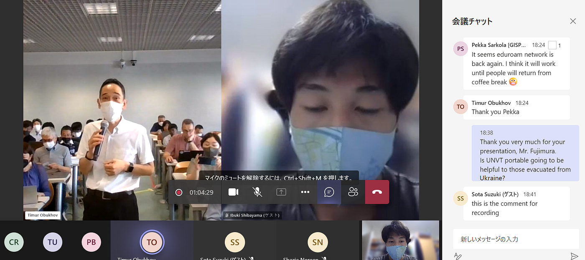

### **国連オフィシャルイベントに潜入してきました。2022/8/23**

**UN Open GIS Initiative Seminar, Tech Forum & Meetings in conjunction with FOSS4G 2022 参加レポート**

こんにちは！4年の柴山です。

2022年8月23日、オープンソースの地理空間情報技術を国連の業務で普及・実践していく国連全体の枠組み **[国連 Open GIS Initiative](http://unopengis.org/unopengis/main/main.php) 主催の国際会議**に参加しました。[青山学院大学地球社会共生学部は2022年より国連OpenGIS Initiative の Community Partner として、様々な形で国連とのデジタル地図を活用した業務支援や技術支援を行ってきました](https://www.aoyama.ac.jp/faculty112/news_20200226)。

[国連OpenGIS InitiativeのCommunity Partnerとして地球社会共生学部が加わりました！ | 青山学院大学
国連の業務要件を満たしているオープンソースGISツール開発を目的としたOpenGIS InitiativeのCommunity Partnerとして地球社会共生学部が加わりました。 具体的にはOpenGIS…www.aoyama.ac.jp](https://www.aoyama.ac.jp/faculty112/news_20200226)

今回のイベントは、フィレンツェの **[フィレンツェ大学**(Università degli Studi di Firenze) ](https://www.unifi.it/)で現地参加するか、Teamsでオンライン参加することができるハイブリッド形式で行われました。私はオンラインで参加し、現地時間の午前のプログラムの講演をリアルタイムで視聴しました。

昨年度より**[UNVTハッカソンへの参加**](https://medium.com/furuhashilab/unvt-hackathon-meetup-2022-youthmappers-agu-51abe32f1844)や**[ワークショップ運営**](https://github.com/unvt/hackathonmeetup202112/issues/2)を行ってきた古橋研究室/YouthMappers AGU のメンバーとして参加しましたが、様々な分野で活躍されている国連関係者が集まる中だったため少し緊張しました。。笑

以下、午前プログラムの中で印象に残った3つの講演をレポートしていきます。

> **UN Open GIS — Vision for Next Phase (Ki-Joune Li)**

序盤には UN Open GIS Initiative の共同議長の一人、**[Ki-Joune Li**](http://lik.pusan.ac.kr/) 氏が、これまでの UN Open GIS と今後のあり方について講演されていました。

2016年のUNGSCの会議以来、使用モジュールの切り替えや新しい協力コミュニティの参加など、様々な変化があったことを挙げた上で、これからあるべき体制として新しい組織図が提案されました。

この案では共同議長直属の諮問委員会の設置の他、作業グループの構成も変革されていました。特に**UNVT専門のWG7**という部門が新設されていて、UNVTが世界的に注目されていることを改めて実感できました。

> **GSI vision (or strategy) for Open Geospatial for Good (Hidenori Fujimura)**

UNVT 共同主任の**[藤村英範**](https://github.com/hfu/profile/blob/master/profile_ja.md)氏による講演も視聴しました。

UNGSC、国土地理院、ASIGといったパートナーとの UNVT の活用事例をレポートする中で、LiDAR データや Voxel Tile を組み合わせて利用した3次元データの整備や Raspberry Pi と組み合わせた UNVT Portable についても 紹介されていました。

講演後半部分では UNVT の利用の普及のためにキャパシティ・ビルディングをいかに行うかが説明されました。UNVTを活用すべき各コミュニティに注目した上で戦略や規定が定められていることがわかりました。

講演終盤には藤村さんへ「UNVTを使ってどのようなウクライナ支援ができるか。」という質問をさせていただきました。しかし肝心の返答部分の音声が回線の問題で飛び飛びになってしまってよく聞き取れませんでした。。。

後で録画を共有していただき確認する予定です！

> **Establishing Regional Geospatial Infrastructure: UN-ESCAP (Keran Wang)**

[ESCAP](https://www.unescap.org/) の Space Applications Section, ICT and Disaster Risk Reduction Division 主任の **[Keran Wang](https://www.itu.int/en/ITU-D/Regional-Presence/AsiaPacific/SiteAssets/Pages/Events/2018/rdf2018/home/Session%206_Wang-UNESCAP.pdf) **氏によって、アジア・太平洋エリアでの Capacity Building や空間情報データを中心としたエコシステムのモデル “Space+ for our Earth and future” が紹介されていました。

空間情報を利用して干ばつの調査や環境汚染のモニタリング、農業の効率化などに取り組んでいて、多様な情報を一つのGISプラットフォームへリアルタイムで同期していくという体制で SDGs の達成を目指しているそうです。

Keran氏は、学生など若い世代を Capacity Building や “Space+ for our Earth and future” へ巻き込んでいくことにも注力されています。我々YouthMappers AGUとのコラボレーションもできるのではないかと感じました。

今回は初めて国連のオフィシャルイベントに参加しました。UN Open GIS Initiatives のこれまでの歩みや体制について理解が深まったほか、知っているワードが出てきて「へえー」と感じることも多少あった一方、まだまだ分からない専門的な部分も多かったです。今後もこのような国際イベントへ参加してさらに考えを深めていきたいです。

> グラレコ

**<[English Ver.](https://medium.com/furuhashilab/international-conference-report-un-open-gis-initiative-seminar-tech-forum-meetings-in-8042b98fd320)>**
