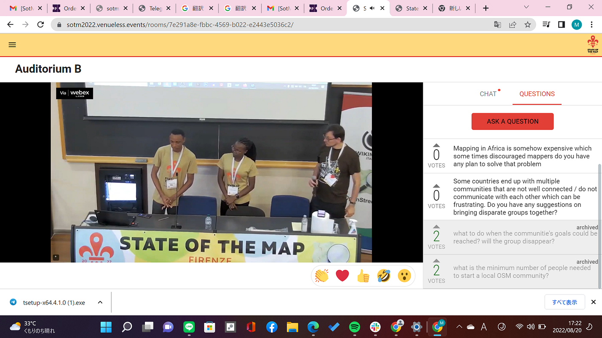
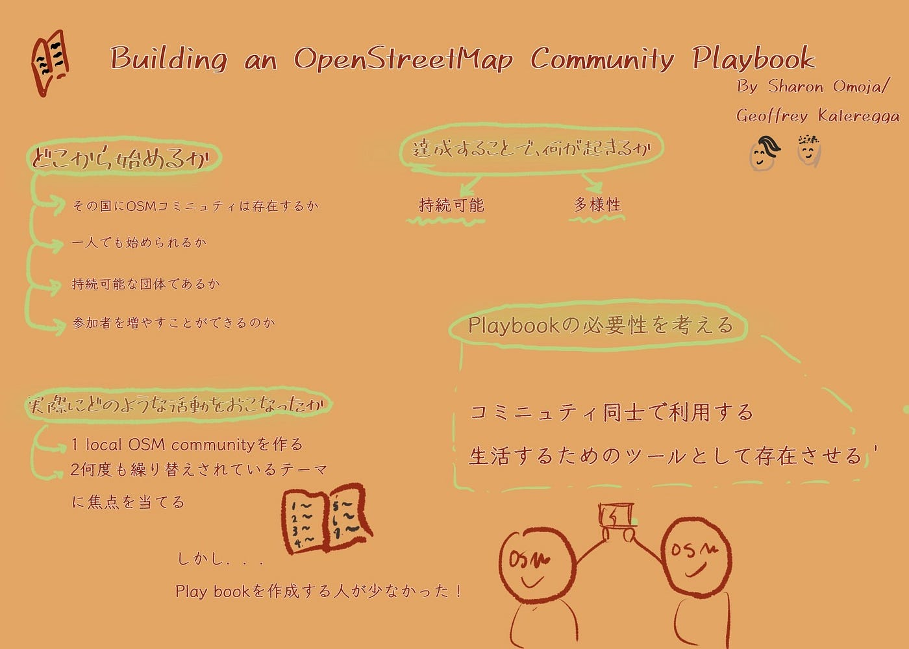
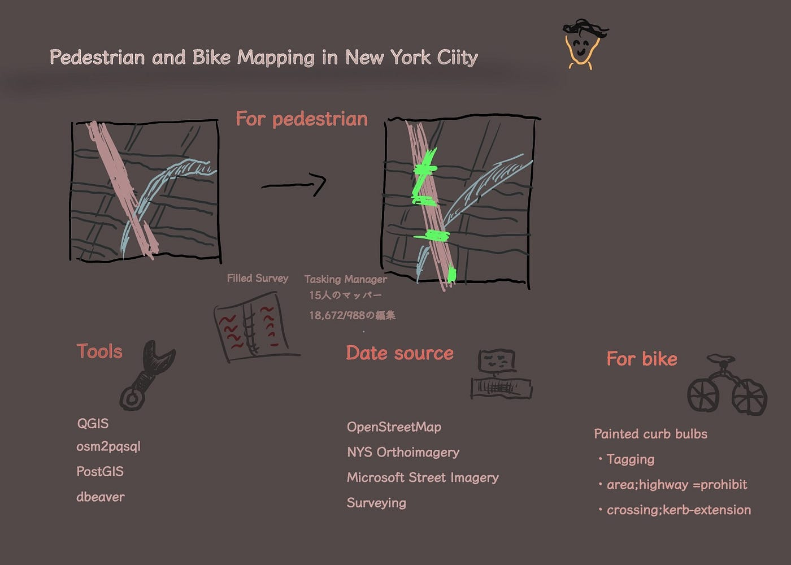
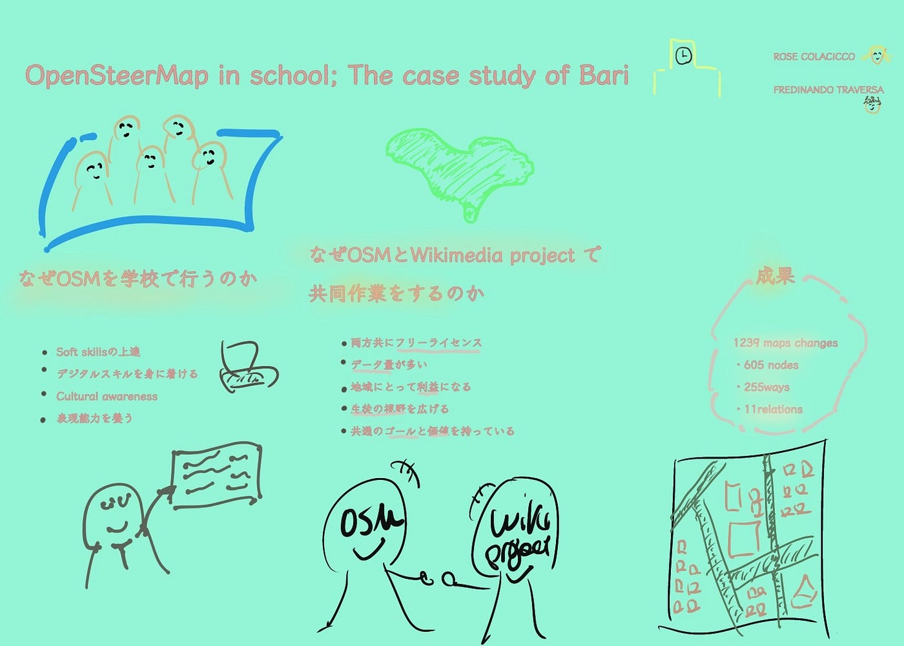

### State of the Map 2022に参加 8/19–21

こんにちは、モトヤです。State of the Map 2022はオンラインでも参加が可能だという事で、タイから参加しました！！

さて、僕が視聴した中で印象的であった３つをあげていこうと思います。まず一つ目はsharon omoja さんとGeoffray Katereggaさんによる「Building an OpeStreetMap Community Playbook」です。内容は「OpenStreetMap Community を作るために必要な事とそのplaybookの必要性」についてでした。

実際にOSM communityを作るうえで、その目的は、誰のために行い、その上で持続可能な団体であり続けることが出来るのか。これはOSMコミュニティだけに限らず、個人ではなく団体としてあり続けるのはどうしたらいいのか、を考え直すきっかけにもなりました。

playbook について。その資料を作成する人間があまりいなかったことなどが課題点として挙げられていました。

そしてplaybookを使う上で大事なことが二つあげられていました。それは「情報の共有」と「生活を行う上で必要なツールであり続ける事」です。

また、今回「OSM communityが掲げる目標に達した際にそのcommunityはどうなるのか」について直接質問をチャットから投げかけました。

すると、「問題は常日頃起きており、今も地図のアップデートは必要である、そうした課題を見つけていくことが大切である。なので終わることはない」と仰っておりました。

次に「Pedestrian and Bike Mapping in new York City」という発表です。こちらは重なってしまった部分の道路を可視化させて、歩行者のための地図を作製したようです。「重なってしまった部分の道路」というものは例えば、橋の上の下の道路や線路下の交差点などの、衛星画像上で隠されてしまっている道路の事です。衛星画像上では真上からの情報しかなく、見落としてしまう情報が存在してしまっていることがあると思います。そうした中で、実際にフィールドワークを行う事で見落とした部分を自分の目で確かめにいったり、Tasking Manager で呼びかける事で地図の修正を行っているそうです。

個人的に、ニューヨークほどの大都会においても地図がすべて完成していないことや、課題点などがまだまだあることに驚きました。

三つめは「OpenStreetMap in schools; The case study of Bari」という発表です。これは「YouthMappers@UniBA」といわれるグループが、バリの高校生（23校）にマッピングを教える活動を行った報告会でした。

そこでは教育の一環でマッピングを勧める理由をあげていました。それはデジタルスキルの上達、コンピューターの使い方、そして文化を知りその国の問題などに気づくことを目的としているそうです。

そして「Wikimedia project」と共同作業を行っています。その理由としてデータの信頼性や充実を図っているためです。そして、お互いに

１，フリーライセンスである事、２，データが豊富３，町や地域の利益となる４，生徒の視野を広げること５，互いのゴールや価値観が同じである事があげられていました。

