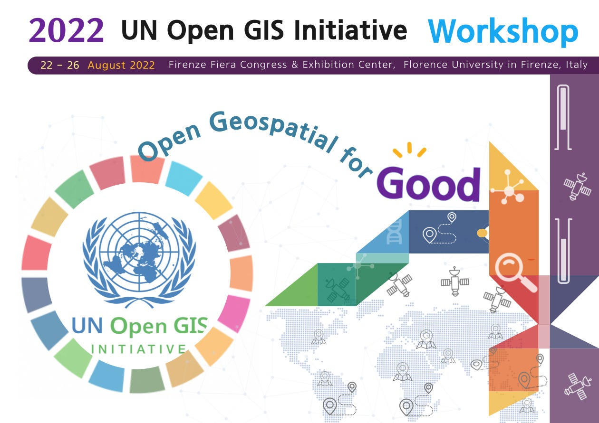
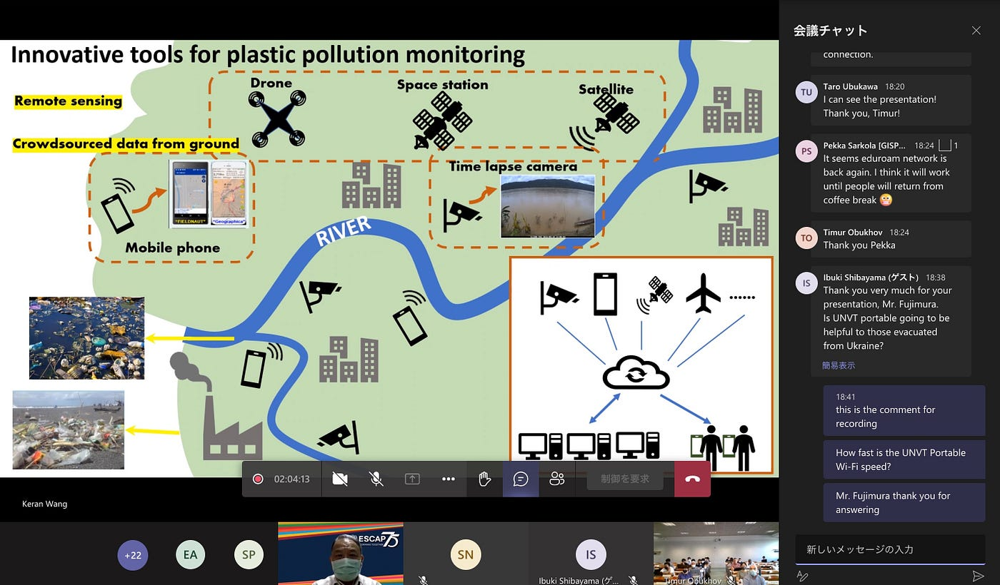
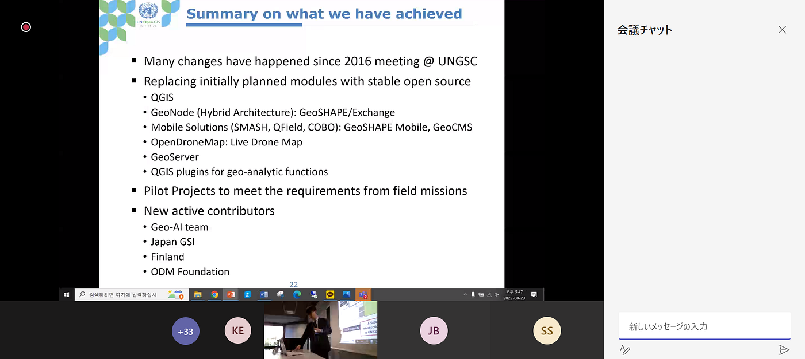
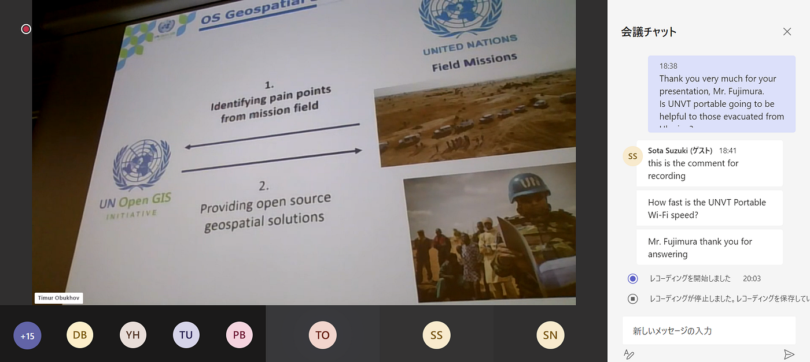
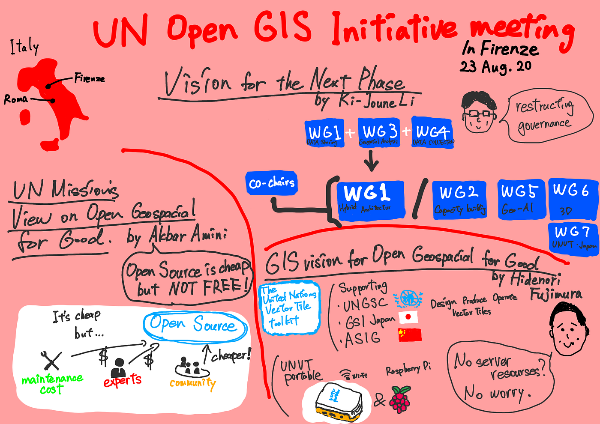

### UN Open GIS Initiative Seminar, Tech Forum & Meetings in conjunction with FOSS4G 2022に参加しました。

こんにちは、ご無沙汰しております。鈴木です。この度2022年8月23日にイタリアのフィレンツェにて開催された[UN Open GIS Initiative](http://unopengis.org/unopengis/main/main.php)会議に古橋研究室より先生を含め3人が現地参加し、私ともう1名はMicrosoft Teamsを通してオンラインで参加させていただきました。会場は[フィレンツェ大学](https://www.unifi.it/)で途中ネットワークトラブルなどありましたが、有意義に時間を過ごすことができました。

以下に午前の部のいくつかの興味深い発表を共有させていただきます。

> _**藤村英範氏の講演_**

UNVT主任である[藤村氏](https://github.com/hfu/profile/blob/master/profile_ja.md)は[UNGSC](https://www.ungsc.org/)、[GSI](https://www.gsi.go.jp/)、[ASIG](https://jp.linkedin.com/company/asig)などの組織とのUNVTを用いた活動の報告では、LiDARデータとVoxel Tileの組み合わせによる3Dデータの整備や、[Raspberry Pi](https://ja.wikipedia.org/wiki/Raspberry_Pi#top-page)と組み合わせたUNVT Portableも紹介されました。

また、UNVTの利用を促進するためのキャパシティ・ビルディングについて説明されました。UNVTを活用すべき地域ごとに焦点を当て、戦略や規制を定めていることを知りました。

藤村氏の講演の最後に「Raspberry Piを組み合わせたUNVT Portableのネットワーク速度はどれくらいのものなのか」と質問させていただきました。しかし、冒頭にも記載したように会場のネットワークトラブルにより会場内の音声が非常に聞きづらくなっていたため、せっかくの回答をうまく聞き取ることができませんでした。後に公開されると思われる記録動画を確認したいと思います。

UNVTの詳細については[Youth Mappers AGU](https://github.com/furuhashilab/youthmappers4agu)のメンバーである[高橋氏](https://medium.com/@mijinkosprinter.yhka22)がとても[わかりやすく解説した記事](https://medium.com/furuhashilab/%E5%9B%BD%E9%80%A3%E3%83%99%E3%82%AF%E3%83%88%E3%83%AB%E3%82%BF%E3%82%A4%E3%83%AB%E3%83%84%E3%83%BC%E3%83%AB%E3%82%AD%E3%83%83%E3%83%88-unvt-%E3%81%A3%E3%81%A6%E7%B5%90%E5%B1%80%E3%81%AA%E3%82%93%E3%81%AA%E3%81%AE-d8817bcec105)がありますので、ご参考ください。

> _**Ki-Joune Li氏の講演_**

[Ki-Joune Li氏](http://lik.pusan.ac.kr/)はUN Open GIS Initiativeの共同議長の一人で今日までのUN Open GISの振り返りと今後それのあるべき姿についての内容でした。2016年のUNGSC会議以来、使用するモジュールの切り替えやJapan GISなどの新たな協力者の獲得などがあったことを述べていました。

> _**Akbar Amini氏の講演_**

[Akbar Amini氏](https://sd.linkedin.com/in/akbar-amini-6604a358)は国連GIS事務員の一人で、彼は国連の地理空間に関するミッションについての見解を発表されていました。[OSM](https://openstreetmap.jp/#zoom=5&lat=38.06539&lon=139.04297&layers=000B)のようなオープンソースは安価ではあるものの、データ更新などのメンテナンスや、専門家による確認など決して無料ではないということを指摘し、一つの組織のみでことを進めるのではなく、若い世代や、新たなコミュニティを巻き込んで活動していくことがこのUN Open GISの運用と持続可能な能力の向上が必要だと述べていた。

> _**最後に_**

今回は[青学](https://www.aoyama.ac.jp/)、[古橋研究室](https://github.com/furuhashilab)のメンバーとしてUN Open GIS Initiativeに参加できたこと、とても光栄に思います。知らない専門的な内容がたくさんあり、自身の無知さを実感する場面が多くありましたが、この会議に参加されていた方々のこの分野に対する発展の気持ちが一致しており、私もそのうちの一人としてまた機会このようながあれば参加したいと強く思いました。

> _**グラレコ_**

