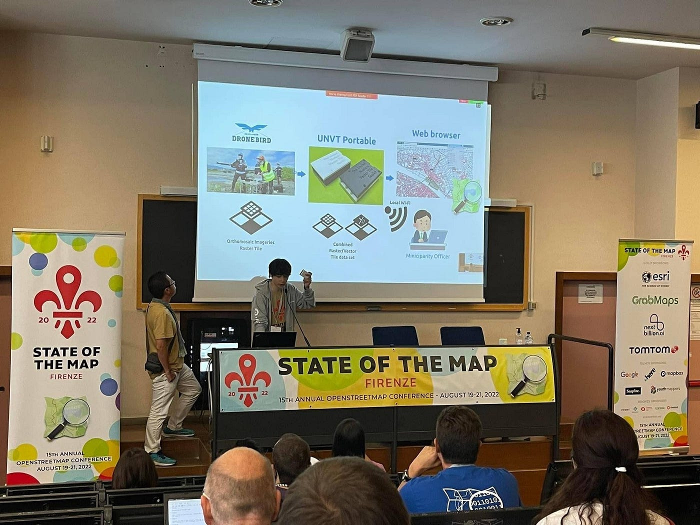
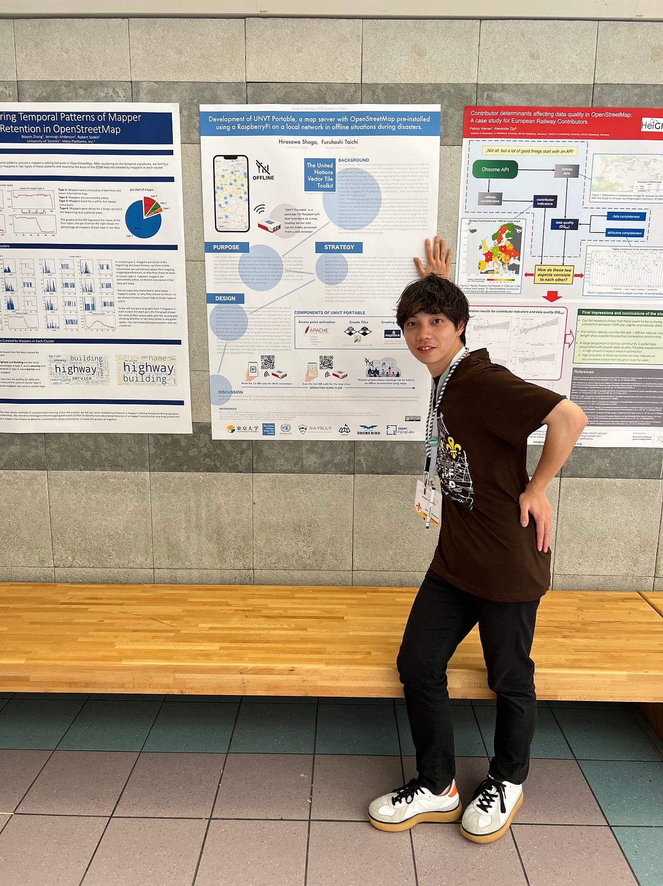
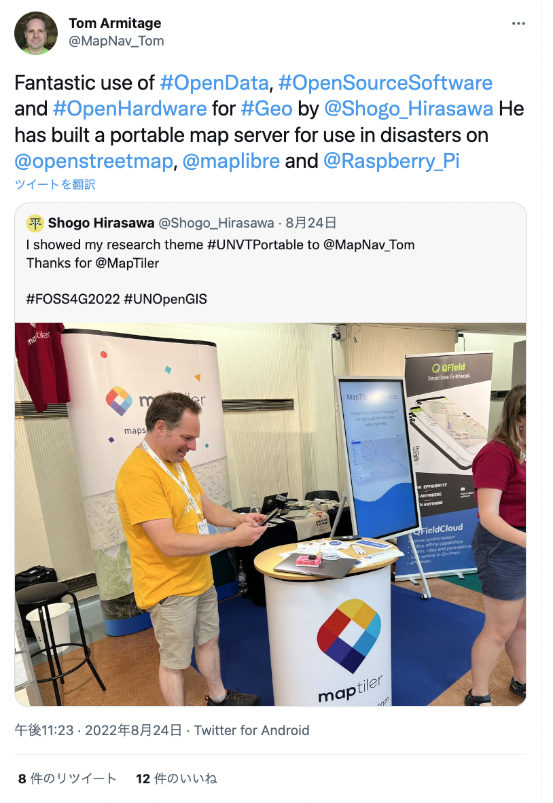
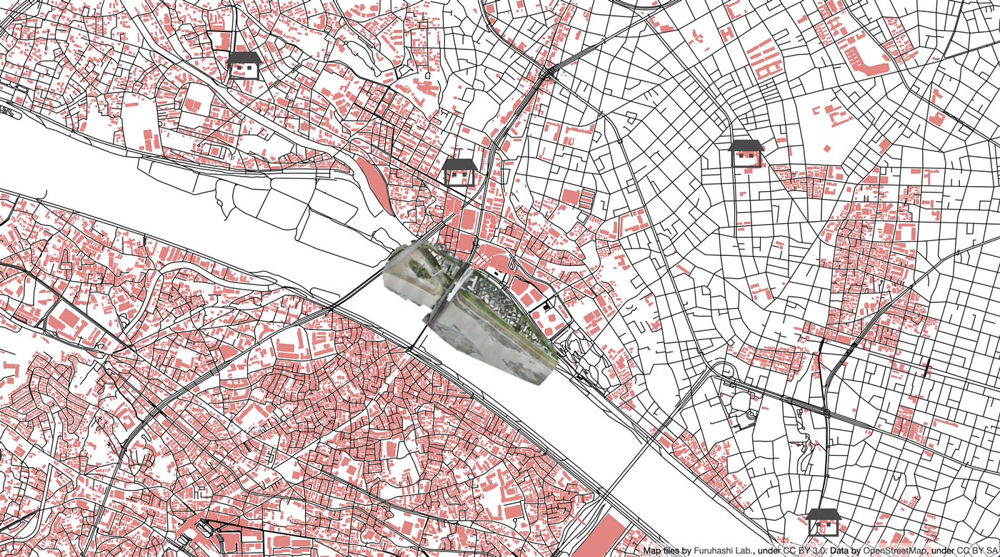
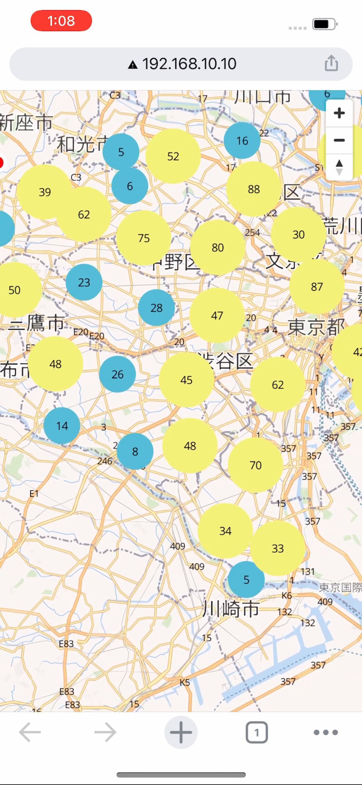
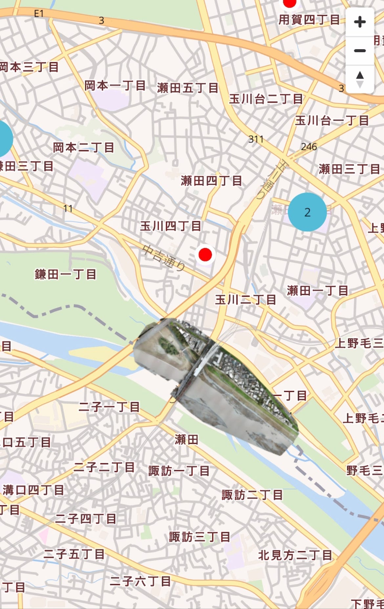

東京大学大学院 [平澤彰悟](https://www.facebook.com/ShogoHirasawaa/)です

2022年夏にイタリアで開催された国際会議 [State of the Map2022](https://2022.stateofthemap.org/) と [FOSS4G2022](https://2022.foss4g.org/)に現地参加し、[UNVT Portable](https://github.com/unvt/portable)の開発状況を国連を始め様々な方にアピールしてきました。

**## 何をアピールしてきたのか**

[United Nations Vector Tile Toolkit](https://github.com/un-vector-tile-toolkit)（UNVT）のコンセプトを説明しつつ、その中に位置するUNVT Portableがどのように活用されるのか / どのような開発状態なのかをポスターセッションやデモの実演を通してアピールしてきました。

UNVT Portableで活用する技術の一つである[MapLibre](https://maplibre.org/)。その開発に携わる[maptiler](https://www.maptiler.com/)社の社員に実際にデモを行い、興味を持ってもらうこともできました。

maptiler社以外にも国連メンバーや他国の大学院生などに実際にデモを見せて多くの人が興味を持ってくれました。

UNVT Portableの持ち運びのしやすさが功を奏し、どこでも手軽にデモができたのはかなり大きかったです。

**“百聞は一見にしかず” **とはまさにこういうことだなと思いました。

カンファレンスに参加する学生は常に自分の成果物やポートフォリオを出せる状態にしておくことで、自身のプレゼンスを大きく上げることができると思います。

**## アップデートの内容**

平澤が2022年の3月に発表した学部の卒論時点ではUNVT Portableで表示できるマップは以下の通りでした。

二子玉川付近の道路と建物と避難所データ（ベクトルタイル）。それに加え空撮写真（ラスタータイル）を組み合わせたものです。

普段、一般的に使われているモダンなWebマップと比べると掲載されている情報が圧倒的に少なく、見にくい地図となっていました。

今回はこれをアップデートさせ以下の通りの地図に作り変えました。

ベースマップにOpenStreetMapを使ったことによって、モダンなWeb地図として成立させることができました。

また、避難所の場所も一つ一つ表示するのではなくズームレベルが低いときはまとめて表示し、ズームアップしたときに細かく表示するようにして、地図の視認性を向上させました。

デモ動画：

[UNVT portable demo
Edit descriptionyoutube.com](https://youtube.com/shorts/_ZqT9D-Pfos?feature=share)

**## 今後の開発計画**

現在のUNVT Portableは以下の3点が実装可能となっています

> - OpenStreetMapをベースマップとして表示する

> - ドローンによる空撮画像の表示

> - ポイントデータの表示

今後は以下の4点を実装しようと考えています

> - 地形ラスタタイルの表示

> - 衛星画像ラスタタイルの表示

> - ハザードマップをベクトルタイルとして表示

> - 行政界データの表示

開発状況は随時以下のGitHubリポジトリで更新していきます！

[GitHub - unvt/portable: UNVT Portable
"UNVT Portable" is a package for RaspberryPi that functions as a map hosting server and can be freely accessed from a…github.com](https://github.com/unvt/portable)
