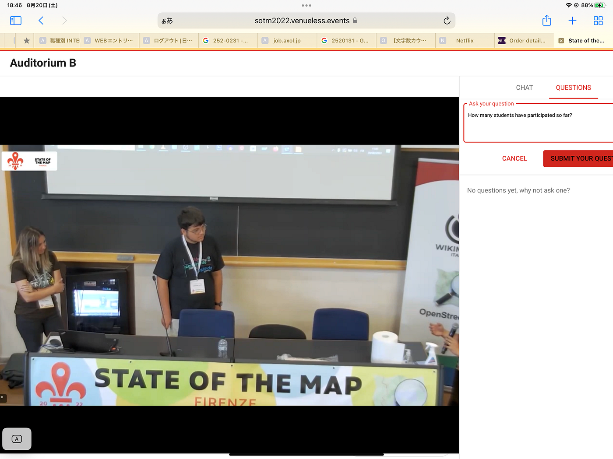
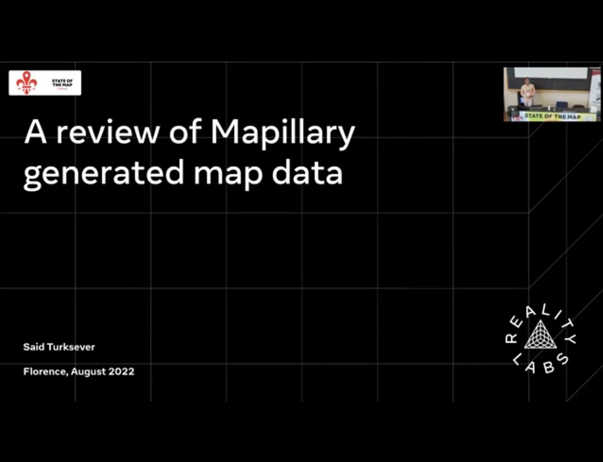
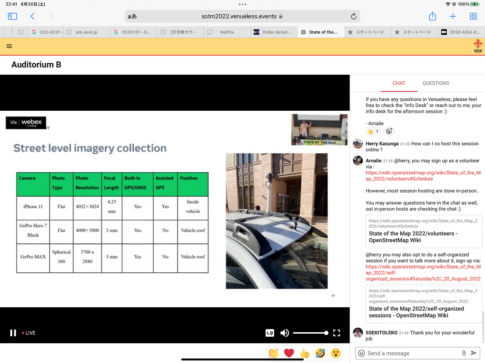
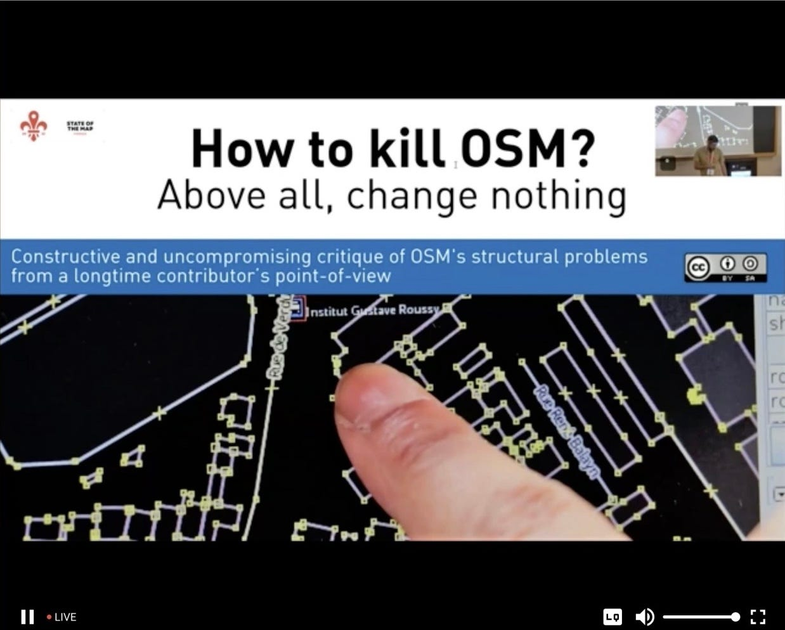
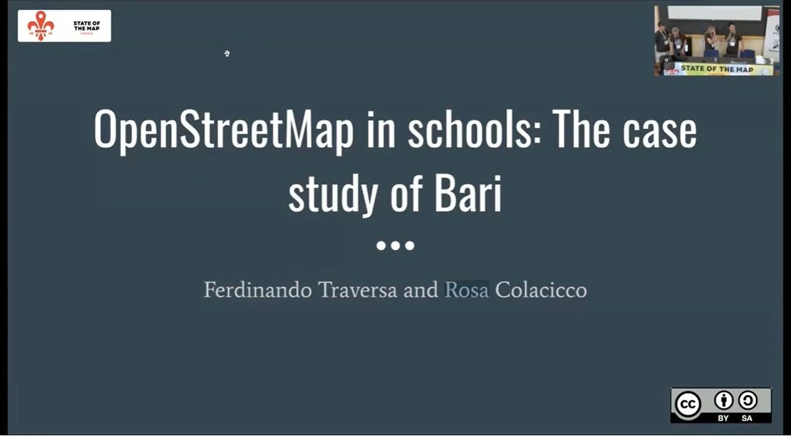
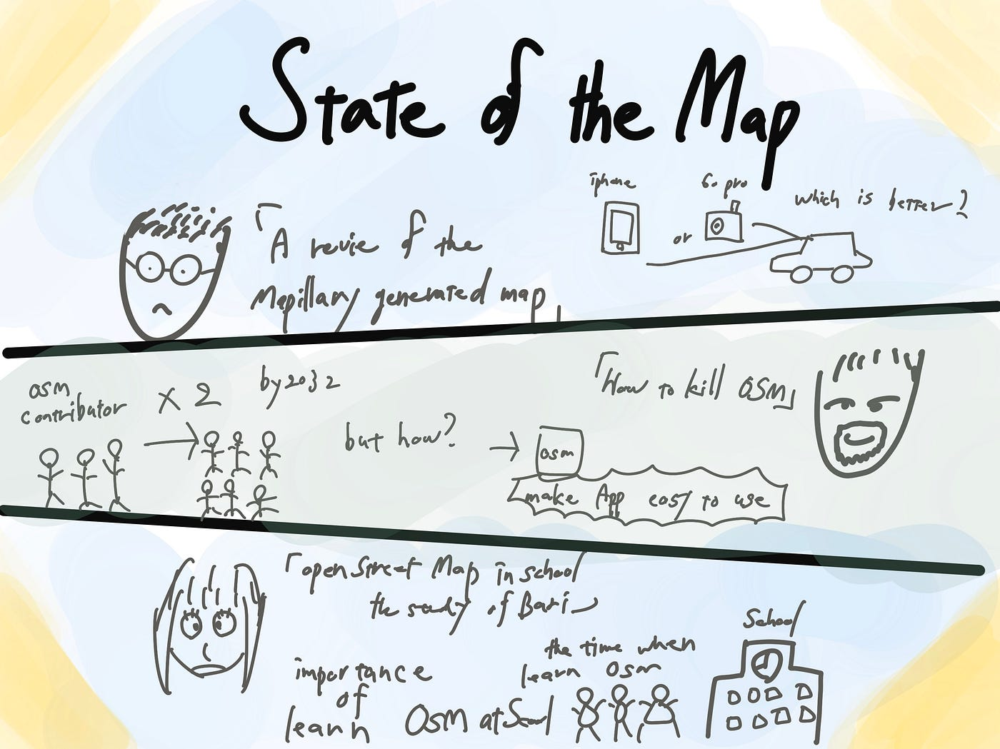

### **State of the Map 2022**

こんにちは。3年植松です。今回はイタリアのフィレンツェで行われたState of the Map 2022にオンラインで参加しました。初の英語で行われる国際会議ということで同ゼミから参加した三年の川野、小澤と言語面でのサポートをお互いに行いながら無事公演を聴き終えることができました。

質問シーン

**これから自分が試聴した3つのトークを紹介していきます。**

> 1つ目

Said Turkseverさんによる「A review of Mapillary generated map Data」

この公演は主にMapillaryの問題点や活用方法、ベンチマークの実装についてでした。私的に興味深かったのはどのようにMapillaryのデータを豊富に、正確にOpenStreetMap用に落とし込むことができるかという点での提案です。Said Turkseverさんはデータを集めるカメラとしてiPhon11、GoPro Hero7、GoPro MAXという3つのディバイスを用い、どれが1番データ収集に最適かといことプレゼンしていました。

これからのMapillaryの可能性がたくさん詰まったとても面白い公演でした。

> 2つ目

2つ目はHow to kill OSM?という公演です。公演名が特徴的だったので試聴することを決めました。内容としてはOSMの構造的な問題点を、長年の貢献者の視点から構造的かつ妥協のない批評を行うというものでした。また登壇者の目標としてはOSMを活用することができる人口をできるかぎり増やすということでした。どのように5年以内にマッパーの数を2倍にするという目標を掲げており、そのためには使いやすいモバイルアプリと地方コミニティの支援が必要であると述べていました。

またOSMは2032年には、世界中のクラウドソーシングとデータ消費のための、無料で誰でも使えるユニバーサルな、地図製作プラットフォームとなると明言していました。

この公演を通じて現在ではあまり世間には知られていないOSMですが、きちんと活用できるようになることはこの先大きな自分の力になると感じました。

> 3つ目

3つ目はOpenStreetMap in schools The case study of Bariという公演です。この公演はYouthMappers@UniBAがバリ島でOSMを教育の一環として、23の高校で行ったマッピング方法を伝えるという活動の報告でした。We don’t just make maps. We build mappersという信念のもと、マッピングを通じて、デジタルスキルの向上、パソコンの使い方、文化理解、そして国の問題を再確認することを目的としているそうです。そしてSDGsにもマッピングを通じて貢献していくということを強く主張していました。驚きだったのは教えていた高校生のほとんどが女性だったということです。女性人口が比較的に少ないこの業界では面白い取り組みであると感じました。

> **最後に**

国際会議ではさまざまな国の人が英語で発表しており、聞き取れない場面もありましがコロナウイルスの影響で国際交流が少なくなり、忘れかけていた第二言語を学ぶ大切さを再確認しました。また世界にはこんなにも多くの人がOSMを使い、独自の活動しているということを知り、感動しました。私自身これからもOSMに関わり続け、世界中のマッパーたちと共に誰もが住みやすい未来づくりに向けて貢献していきたいと考えるようになりました。

グラレコ

