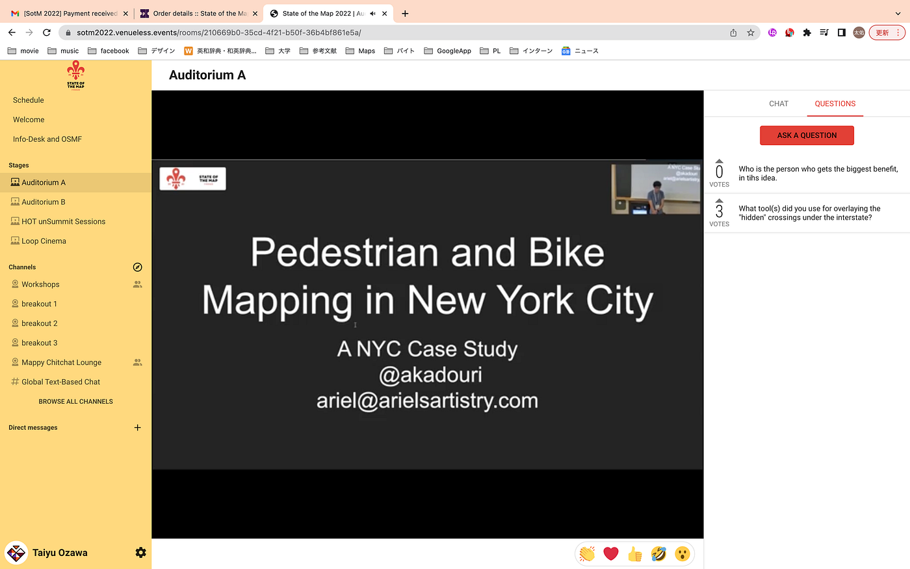
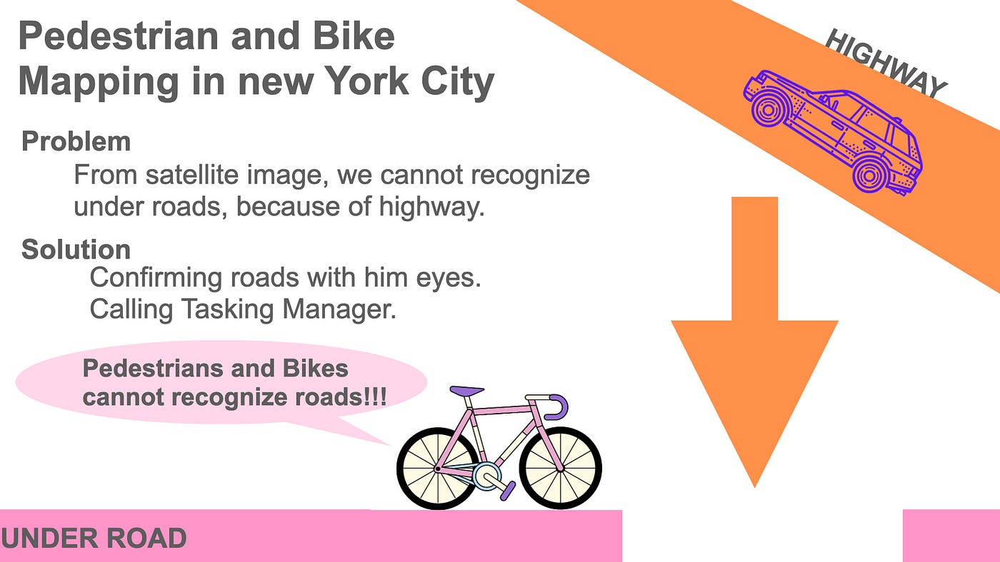
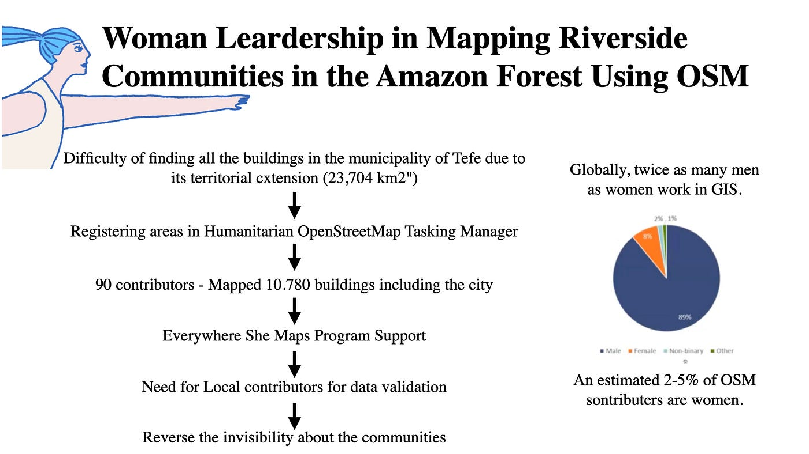
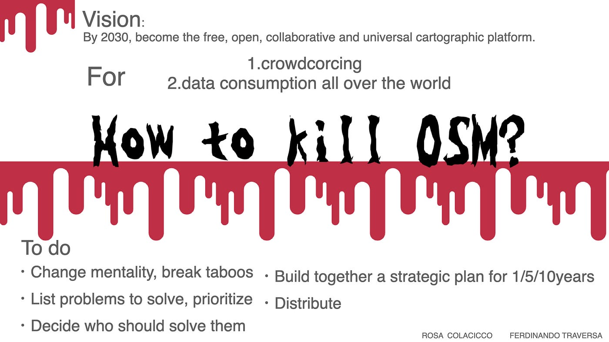

### State of the Map 2022 報告

こんにちは、小澤です！State of the Map 2022 報告をさせて頂きます。英語が大苦手な自分ですが、なんとかできる限りの理解をしました😅
何より各グラレコを作るのが難しく、まだ納得できていないので、取り合いず提出した後にアップデートしていきたいと思います！

始めに、「Pedestrian and Bike Mapping in new York City」について紹介します。

こちらの講演は、高速道路やバイパスなど、橋？の上にある道路と下の道路が重なりあってしまう部分の道路を可視化させるというプロジェクトでした。徒歩で確認して、細かい入力をしたり、HOTにも入れて入力してもらったとも説明していました。

個人的には、ニューヨークという世界的に考えても非常に発展している地域だからこその問題に取り組んでいて非常に興味深いと思いました。また、視点を変えて考えてみる、もしくは体験してみるからこその新しい問題の発見に繋がるというのは非常に面白い発見でした。

最も恩恵を受ける人は誰かを聞いたところ、恐らく歩行者の為に最適化されているよと答えてくれました。

こちらがグラレコになります！

次に、「Woman Leardership in Mapping Riverside Communities in the Amazon Forest Using OSM」という講義についてです！

彼女たちはブラジルのユースマッパーズで、南米は非常に土地が広大で、それに伴い地図作成には非常に多大な費用がかかると述べていました。また、GIS分野に関して、およそ全体の2–5%しか女性の貢献者がいないことに対して問題定義を行なっていました。

そうした南米の現状について、例としてテフェの自治体の全ての建物を見つけることは、その領域の広さから困難であったため、オープンストリートマップに登録した所、90人がマッピングを行なってくれて、約10780の建物をマッピングにつながったとのことでした。しかし、そのデータの検証のためにはローカルの人々の協力が必要なため、彼女たちは自分達の足を使い、これまで見えていなかったコニュニティの可視化に貢献したとのことでした。

この講義では、まず初めに女性のGIS分野に対する人口の少なさに非常に驚きました。その一方、彼女たちの圧倒的な行動力と貢献度には感服しました。また、国土の広さという日本に住んでいてはあまり考えられない問題に触れる機会にもなり、非常に楽しかったです。

最後に、「How to kill OSM?」という講義についてです。

非常にインパクトのある題名で、恐る恐る聞きましたが、そこのところは安心できました。タイトルに書かれている内容とは全く異なり、OSMを非常に愛している内容でした。

現在のOSMの内容を分析し、よりOSMが使い易くなるような改善に関して述べていました。明確な目標としては、2032年までに、フリーで、オープンで、協力しやすく、普遍的な地図作成プラットフォームにしたいとのことでした。

また、やるべきこととして、これまでの考え方を変え、タブーを破ることとも話していました。さらに、解決しなければならない問題をリスト化したり、それを誰がやらなければならないかを決め、共に1,5,10年と、戦略をたてる必要があるとのことでした。

恐ろしい題名でしたが、本当にOSMの将来のことを考えていた講義でした。

