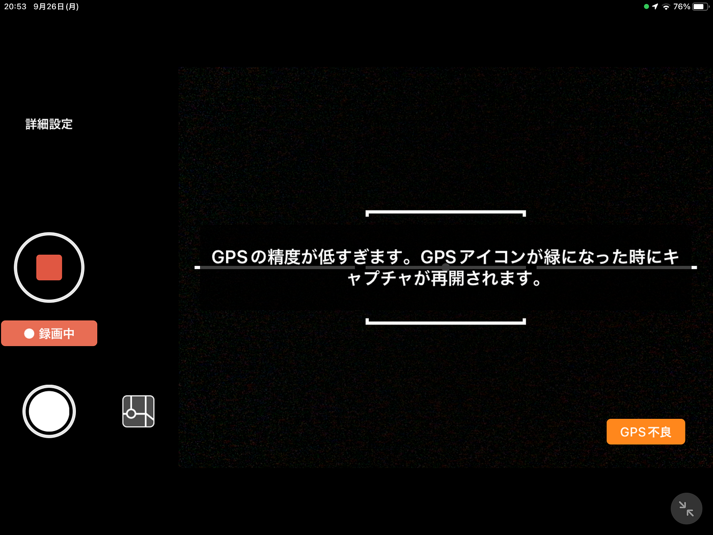
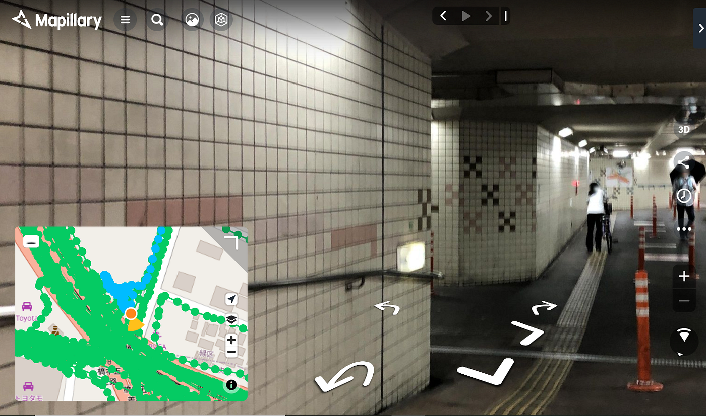

### Android ユーザーの Mapillary Missions Challenge 2022 Japan 振り返り

こんにちは。4年の柴山です！

今回は古橋ゼミの夏休み課題の [Mapillary Missions Challenge 2022 Japan](https://blog.mapillary.com/update/2022/08/06/mapillary-missions-japan-launch.html?fbclid=IwAR0I2pGKUusj58ZKl9acjPDmtO-rh0AqOIiZFk6Q4SyviY_GwFrU7QQ2xGE) 参加レポートをお送りします。

> _**iPadではキャプチャができない？_**

タイトルの通り Androidユーザーの私は、 iOS端末を確保することから始める必要がありました笑

まず、自前のiPadでミッションを実行できるか試してみました。ミッションタイルとリストの表示は確認できましたが、GPSエラーの表示が消えず、写真撮影することができませんでした。

iPadの位置情報設定も有効で、マップ上で現在地が正しく表示されているにもかかわらず、エラーが消えることはありませんでした。この問題は今回のMissionに限った内容ではないのですが、気になったので報告しました！

> _**iPhoneでキャプチャに成功_**

[SOTA SUZUKI](None) に iPhone を借りて、自転車に固定しながら**[橋本五差路付近**](https://www.mapillary.com/app/?pKey=463571798965673)のミッションタイルを攻略しました。

住宅地の狭い道路を中心にまわり、歩行者・自転車用の地下通路もGPSの通信がつながるギリギリのエリアまでキャプチャできました。

4つのタイルが隣接しているエリアだったのですが、キャプチャ中に隣のタイルに侵入すると**自動でミッションを切り替えてくれる機能が良かった**と感じました！

> _**別端末でステータスが確認できなかった_**

9月13日の Meetup でも指摘されていましたが、**同アカウントのミッション進捗状況が別の端末で同期できない点**が問題だと感じました。

今回の私のケースでは、借りたiPhoneでキャプチャ・アップロードしてから返却し、後から自前のiPadでステータスを確認することができませんでした。

今後の Mission Challenge では、端末間のミッションの同期、他ユーザーとのステータス共有、そしてAndroidへの実装に期待したいです！

> _**戦績_**

今回は4タイルクリアで国内19位でした！

[Facebook
Edit descriptionwww.facebook.com](https://www.facebook.com/photo/?fbid=5891801507520669&set=gm.2273435526165620&idorvanity=473530376156153)
