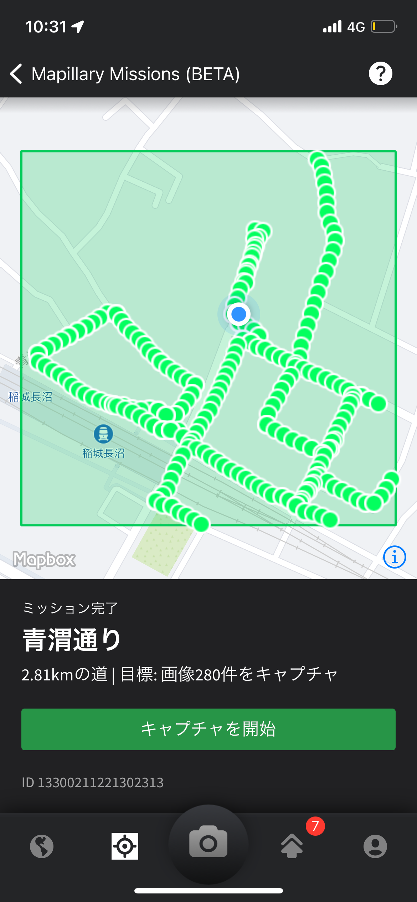

### Mapillary Missions

こんにちは！3年の吉田です！

今回はMapillary Missionsを行いました！

渋谷、立川、地元周辺で行いました。

歩きながら、なるべく水平にぶれないように撮ることに苦戦しました。

(アップロードされた写真を見てみると半分くらいぶれていたものもありました)

よく行く場所でも、自分が普段通らない道を行ってみたり遠回りしてみたりと新しい風景があり、新鮮に感じました。

また一気に画像を投稿したためか、プロフィールに「画像がアップロードされました」と出るところが、アップロードした当日中はずっと「処理中」となってしまっていました。

今後も、旅行に行った際や空いている時間でMissionをこなしていきたいと思います！
