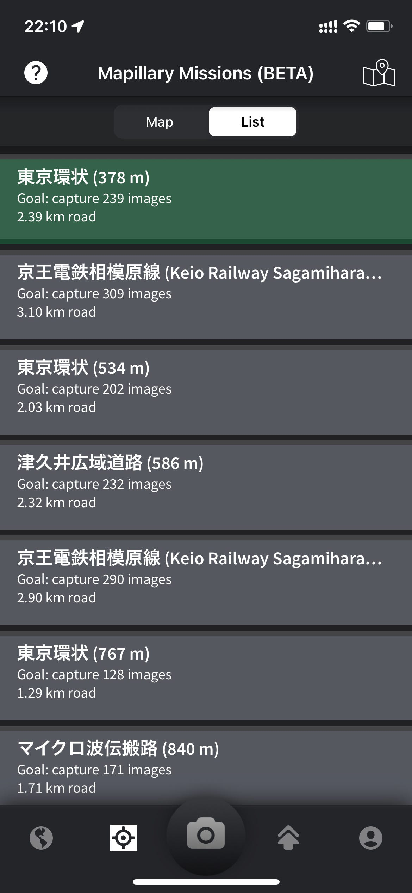
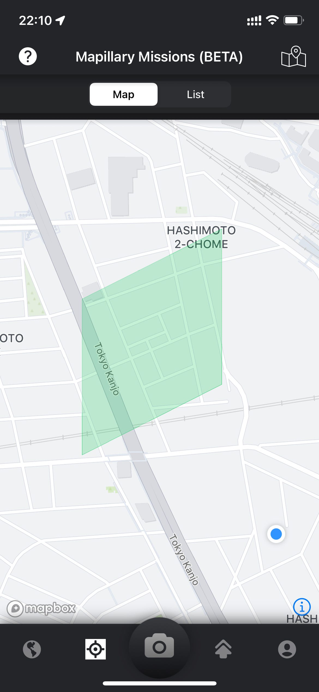

### Mapillary Missions Challenge 2022 Japan 報告

いつもお世話になっております。古橋研4年の鈴木です。

今日は古橋研の2022年度夏休み課題だった、[Mapillary Missions Challenge 2022 Japan](https://blog.mapillary.com/update/2022/08/06/mapillary-missions-japan-launch.html?fbclid=IwAR0I2pGKUusj58ZKl9acjPDmtO-rh0AqOIiZFk6Q4SyviY_GwFrU7QQ2xGE)に参加しました報告をさせていただきます。

> _**iPhoneでキャプチャ_**

私は今回のミッションに参加するにあたって、以前からMapillaryでキャプチャする際に使用していた[iPhone12 Pro](https://support.apple.com/kb/SP831?locale=ja_JP)を自転車のスマホホルダーにつけて使用しました。

> _**ミッションの選択_**

まずは家の近くのミッションを探して、一番最寄りのものをやることにしました。自転車を使用したため10分ほどで指定の区画のミッションを完了できました。道路の関係でミッション区画を一時的に離れた際に自動的にキャプチャが停止する機能があり、画期的だと感じた。

> _**結果情報の確認_**

[Ibuki Shibayama](None)がiPhoneを持っていないため、私の以前使用していたiPhone8を貸し出したが、サインインやログアウトをするとその端末で確認できたはずのミッション履歴が確認できなくなる現象に遭遇した。

上の記録はサインアウトする前にスクリーンショットしていたため、確保できたが、再ログイン後には二度とこの写真を見ることはなかった。

今後開催されるMapillary Missionでは同アカウントでの別端末でミッションの進行状況を確認できるようにすることや、アンドロイド端末でのミッション参加ができるようになると、より多くの人がミッションに参加できるほか、普段からのMapillaryの貢献者も増えるのではないかと感じた。
