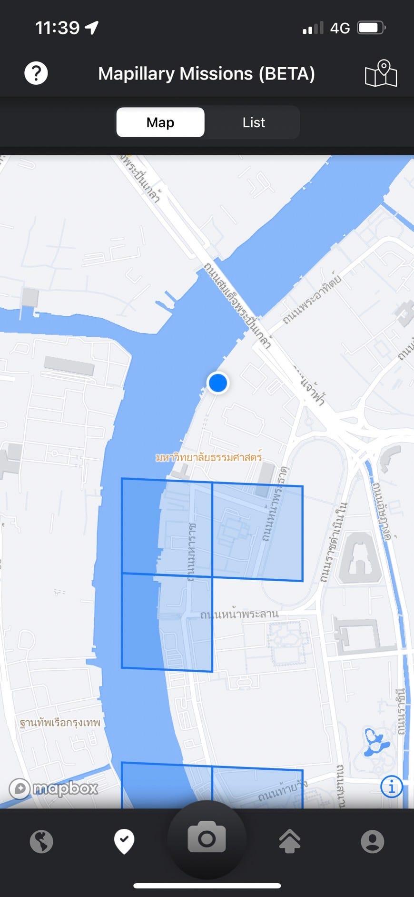
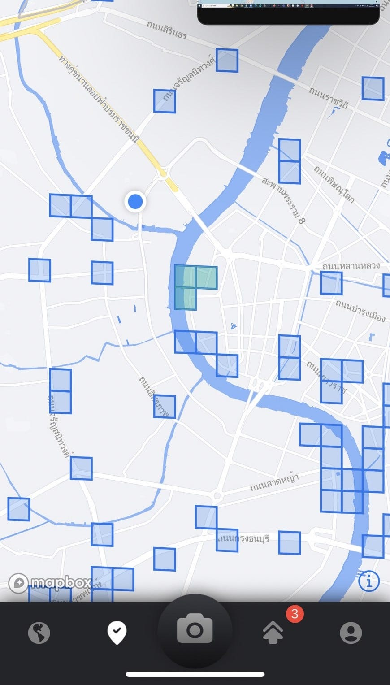
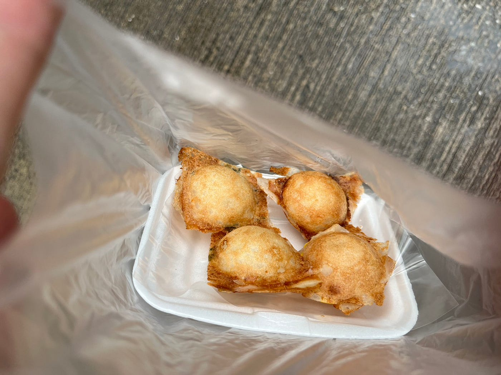
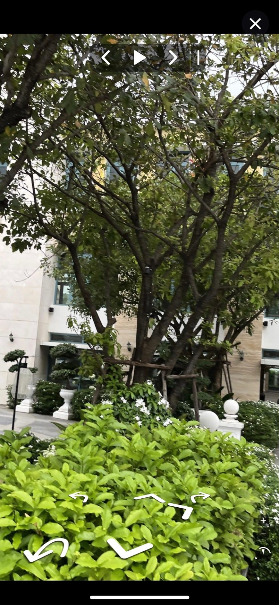
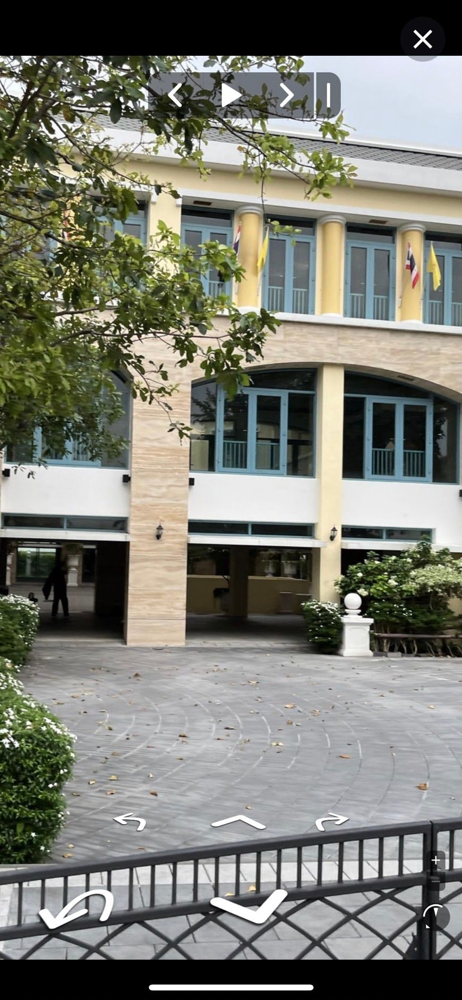
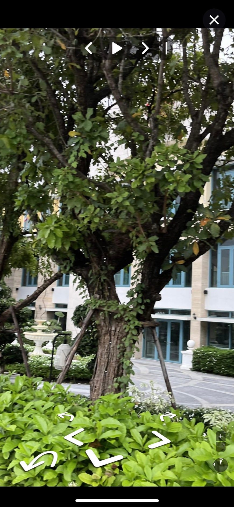
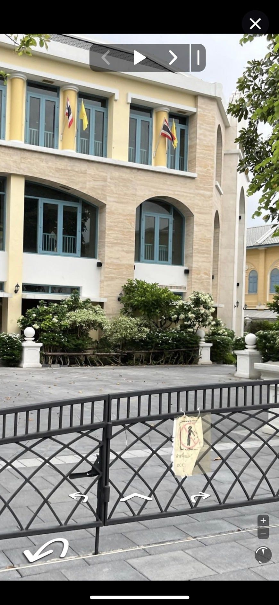
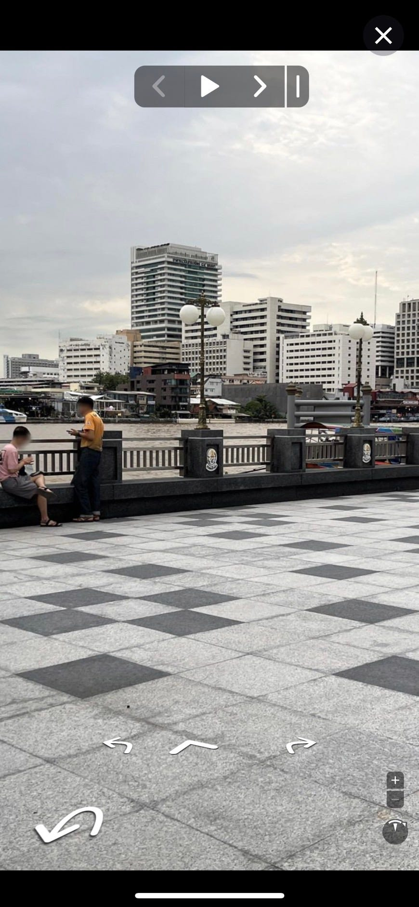

### Mapillary Missions 成果発表！

こんにちは、モトヤです！！

今回はMapillary Missions についての個人成果を発表です！タイにいるというのもあり、思うように参加が出来なかったのですが、Mapillary をして気づいたことや新しい発見などを記載しようと思います！！また、この時間にテストを行っているため発表はできません、申し訳ございません。

まずは、大学近くにちょうどブロックがあったのでチャレンジしました！

まずは大学周辺にミッションがあったのでチャレンジしてみました！見たことのない道や食べ物にも遭遇することが出来たので、すごく楽しかったです！下の写真はココナッツミルクを固めて焼いたお菓子となります。

また、川沿いを中心に写真を撮っていたのですが今まで通らなかった道や船乗り場などを見つける事が出来ました！ここでも多くの屋台が見受けられました。さすがタイです。

チャレンジ内容としては緑の正方形の枠の中を自由に散策し、２００枚から３００枚ほどの写真を撮る事が課せられました。その間、ケータイを外に出さなければならず、盗られてしまうのではないかと不安でした。なので大学周辺といった比較的知っている場所での撮影を試みました。特にタイ人を怒らせたり、なにか盗られる事もなく無事に終える事が出来たのでよかったです。

また、「Meta/Mapillary にフィードバックするふりかえりイベント」にも参加しました！ただ一人で撮影を続けるのではなく、誰かと競争やミッションという形で行う事で楽しく参加できたと思います。

