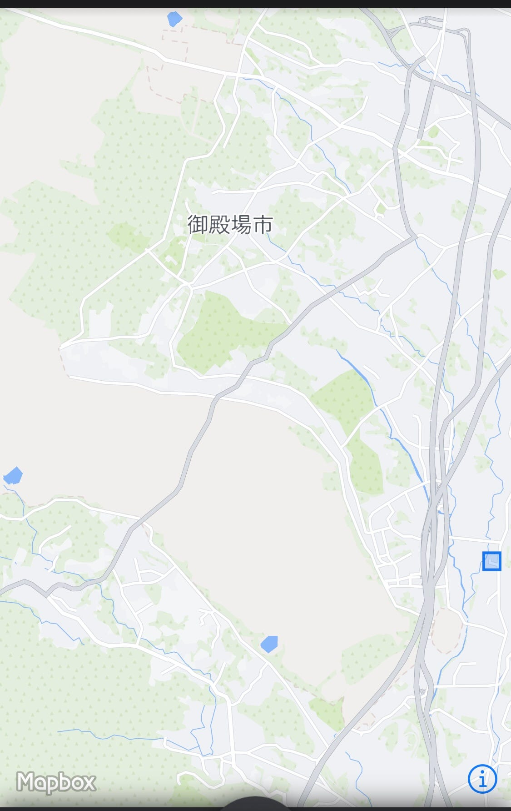
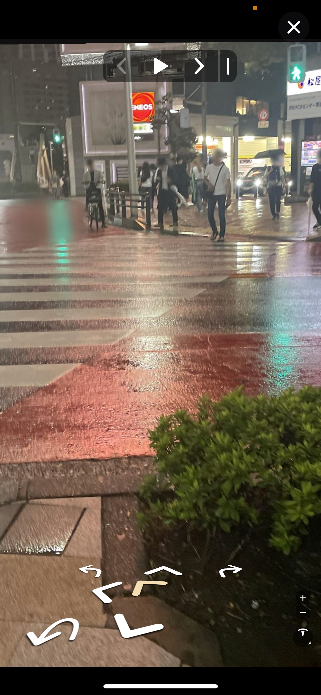
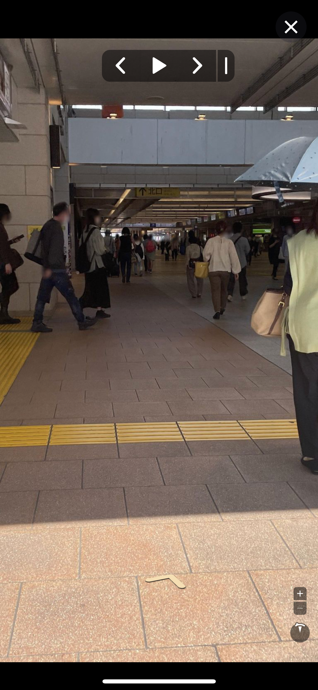

### Mapillary Missions

こんにちは。三年植松です。古橋ゼミでは夏休み夏休みにMapillary Missionsに参加しました。

ミッション期間中、地元の御殿場市に帰省していたため、発現しているミッションが少なく、一個一個の距離が遠いため、あまり貢献することができませんでした。

気づいた問題点としては沼津市の千本港の海岸にミッションが出現していたのですが千本港は漁業関係者以外出入り禁止のところが多いこと、危険な道が多いという点で問題を感じました。

P.S. 夏休みということで活用できる時間が多くあったことに加え、御殿場はイングレスを行っている人口がとても少ないため一気にレベルを上げることができました。

