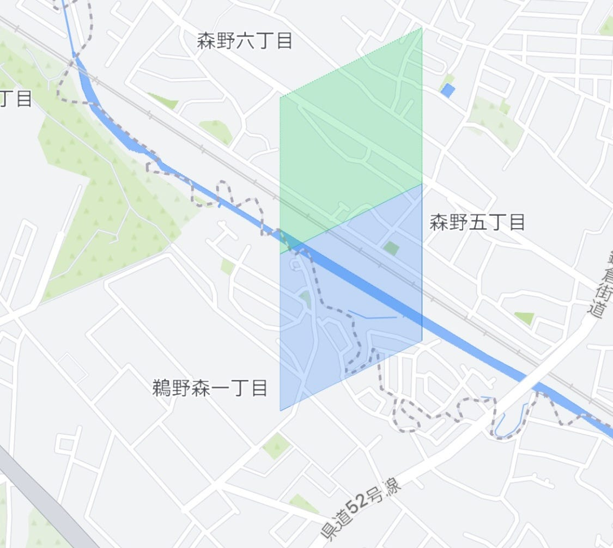
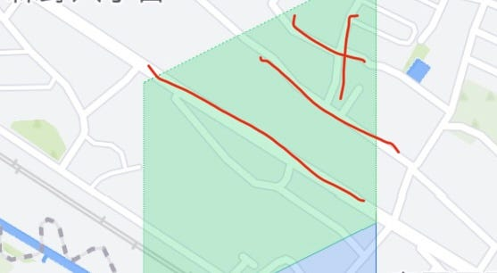
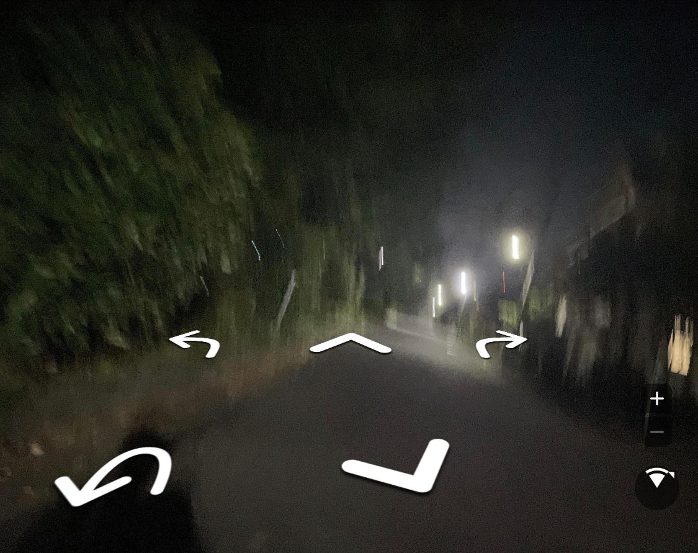
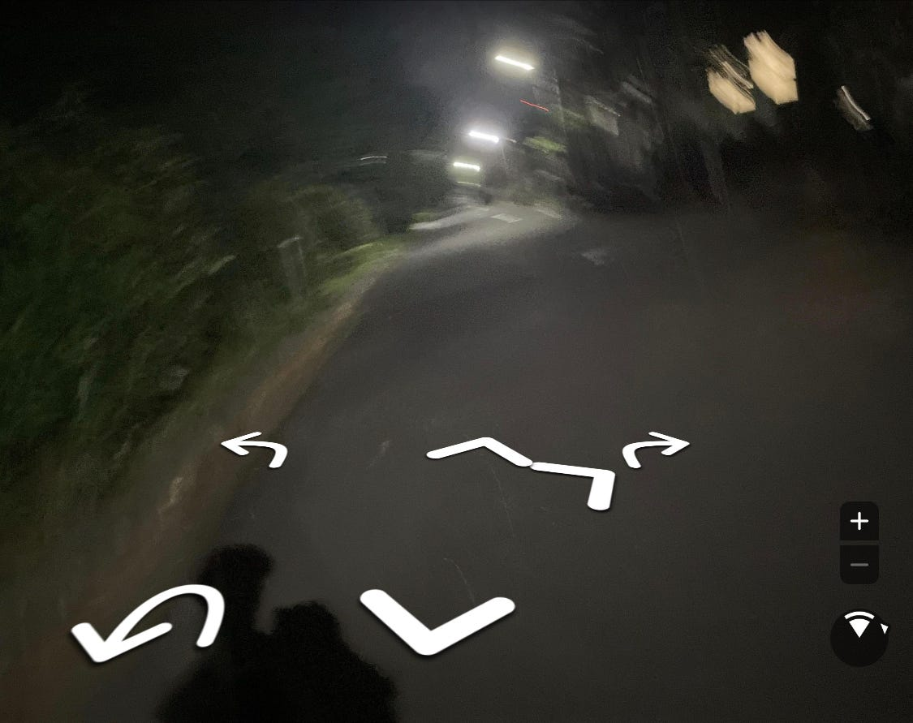

### Mapillary Missionsについて

3年の小澤です！Mapillary Missionsの感想や改善点について、こちらの記事で書きたいと思います！

始めに、自分が挑戦した場所は、今住んでいる町田で行いました。駅周辺にいくつかMissionポイントがあったのですが、人が多いところでやるには少し恥ずかしいので、少し外れのところに撮りにいきました。

これは改善のしようがないかもしれませんが、やっぱり人前でずっと写真を撮り続けるのは、周りの人からしたらかなり不審に思われるなと思いました。

赤線が自分の撮った場所ですが、この道だけだと枚数が足りませんでした。他の道は物理的に行くことができなかったので、仕方なく写真が被ってしまいました。

また、写真を撮っている際に、ただカメラを持っているだけではなく、左右に向きを変えて撮ると、真ん中になったときに写真が撮られ、効率よくシャッターを押してくれることに気がつきました。しかし、これはシステム上の問題なのか、やってはいけないことだったのか分かりません、、。

一時的にMissionが表示されないバグがあったのですが、いま確認したら直っていたので、気が向いた時にまた試してみようと思います！

ありがとうございました。
