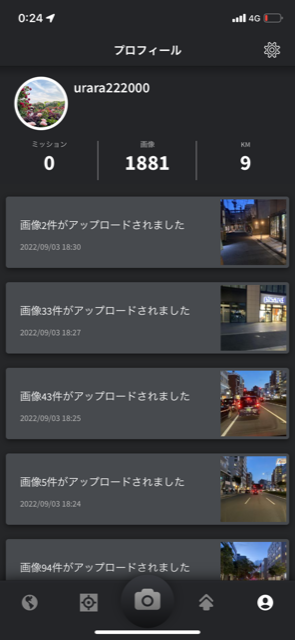
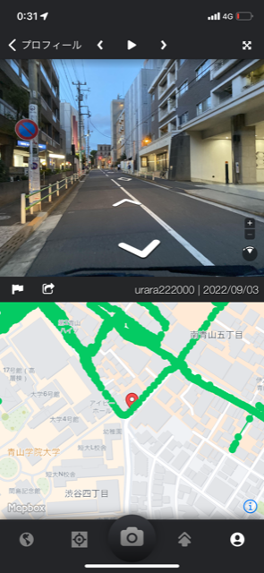
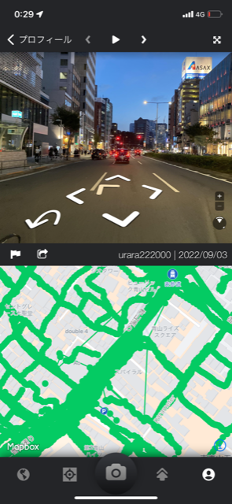
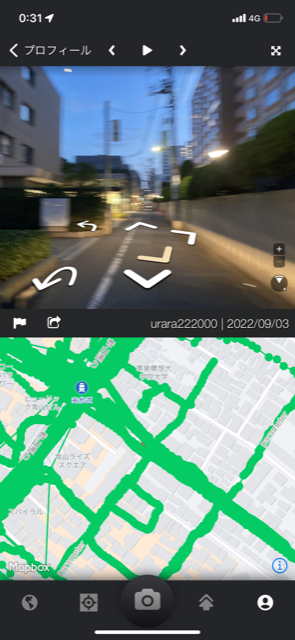

### Mapillary Missions成果報告

こんにちは！うららです。

夏休みに[Mapillary Missionsチャレンジ](https://blog.mapillary.com/update/2022/08/06/mapillary-missions-japan-launch.html?fbclid=IwAR0I2pGKUusj58ZKl9acjPDmtO-rh0AqOIiZFk6Q4SyviY_GwFrU7QQ2xGE)に参加しました。

夏休みは週5日～6日部活があったため、部活の帰りに父に車に乗せてもらい、青山学院大学青山キャンパス周辺の写真を撮影しました。

> やはり車だと気が楽！

最初は学校から徒歩で青山通りの写真を撮影していました。土日だったこともあり人がたくさん歩いていました。私の隣に友達がいたのですが、「ちょっと恥ずかしい」「あと何枚撮るの？」といわれてしまいました。（笑）

「あと何百枚だよ」とは言えず…

他のゼミ生のメディウムにも書いてありましたが、徒歩でiPhoneを持って連写していると、他の人の目が気になるということがあります。父の車に乗って写真を撮る方が気が楽だと感じました。父に感謝です。

青山キャンパス所属の部活動に入っていますが、キャンパス周辺を実は歩いたことがなかったため、（青学4年目にして）かなり新鮮でした。途中で素敵な喫茶店を見つけてしまい、ミッション終了後に父と来店しました。

見返すと車の揺れがある中、手で持って撮影したわりに上手く取れていましたが、どうしてもぶれてしまった写真が多くありました。

先生が車の中に取り付けている専用のスタンドがすごく欲しくなりました。また、撮影する機会は幾らでもあるので、せめてそれまでに携帯スタンドでも父の車に取り付けようかと考えました。

皆さん、ミッションお疲れ様でした。

> 戦績

22位でした。いぶきに負けて悔しい！次は勝ちます(´;ω;｀)
