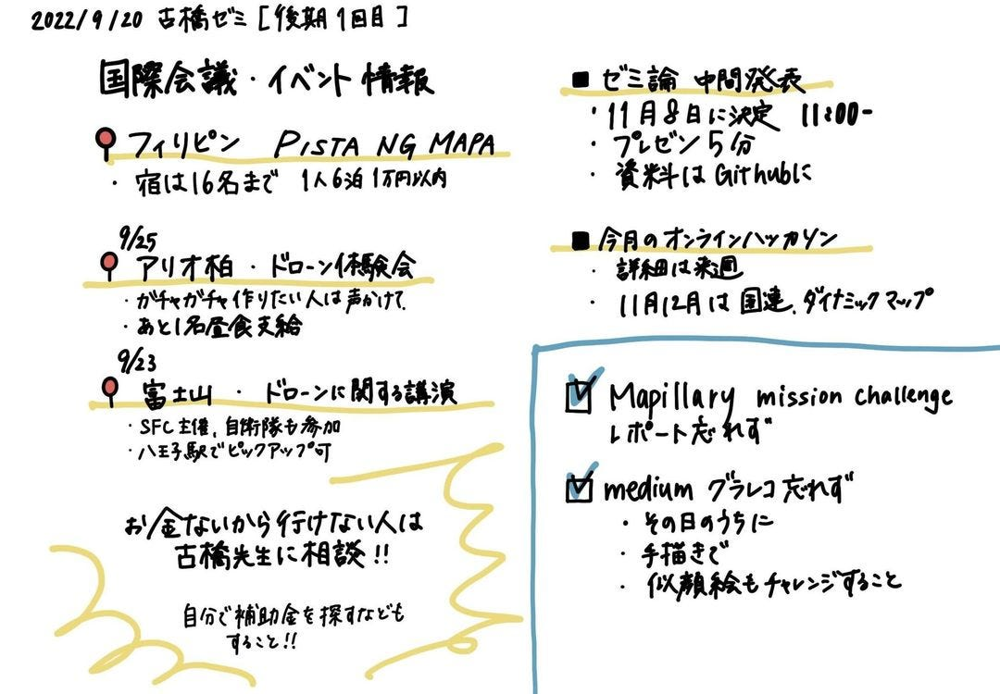
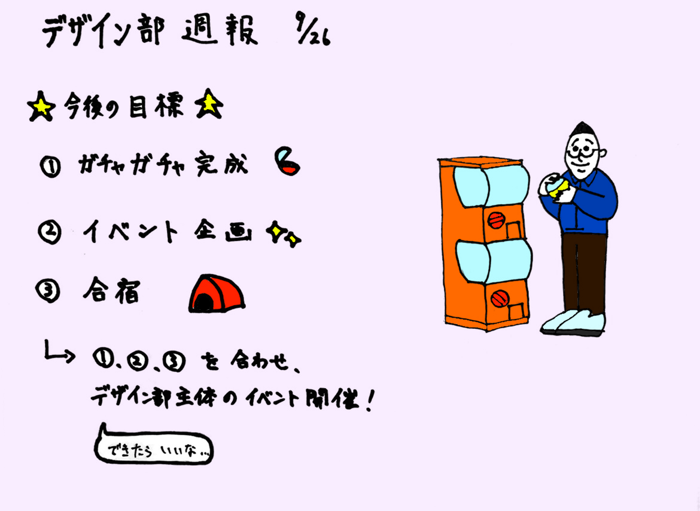

### デザイン部週報

こんにちは～！デザイン部です。

夏休みも終わり、デザイン部の活動が戻ってきました。

デザイン部は後期も、デザインもしつつ過去にあった「ものづくり部」のような活動を多くしていきたいと考えています。（私がゼミに入ったころには廃部していたのでこのようなイメージなのかわかりませんが…）

遥さんが休学していましたが、後期にデザイン部に参加してくださるとのことです！また、よろしくお願いします。

今後のイベントを遥さんがまとめてくださいました。

皆さん、参加予定・未定・不参加の旨をFacebookの古橋ゼミグループ「イベント」にて意思表示していきましょう。

> アイデア募集♪

デザイン部としてもガチャガチャ制作など挑戦していきたいと考えています。デザイン部以外の方もこんなガチャガチャが欲しい、など中身のアイデアがありましたら意見をお願いします。募集中です！

### グラレコ

