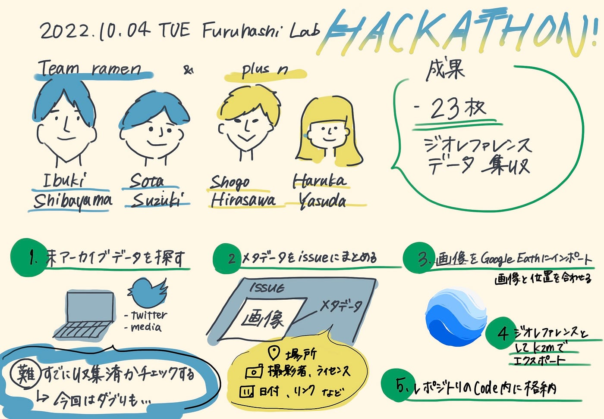

### 10月ウクライナハッカソンteam ramen&team +n

Ramenと＋ｎチームの報告をします。

本チームはデータ収集班で以下のことを行いました。

### やったこと

1. 未アーカイブデータをTwitter、webで探す

1. 画像のメタデータ（場所、日付、撮影者、ライセンス、リンクなど）をissueにまとめておく

1. 画像を Google Earth Pro などにインポートして対象の位置に合わせる

1. ジオリファレンスとして.kmzでエクスポートする

1. レポジトリのcode内に格納

以上です。

作業をすすめる中で次のようなトラブルも有りました。

### トラブル

・そもそもデータの所在を検索するのが難しい

すでに作業をしたことのある人と協力したほうが効率がいいと判断し、team ramen とteam +nが合併し、ramenの未ジオレファレンスデータを＋nが作業していくことに。

・未アーカイブデータを探す際、すでにジオレファレンス済みかどうかチェックするのが難しい
→現状データと日付、場所を照らし合わせて手動でチェック

実際今回、すでにジオレファレンスしてあるデータを再度作業してしまった。しっかりチェックできないと同じデータを2度ジオreferenceすることになり無駄な作業になる。

・KZMが重すぎて、githubにアップロードできない
解決策としては、web版のgithubだけでなく、デスクトップアプリを使いプッシュすると今回のデータはアップロード可能。

### 結果

結果として、23枚のジオレファレンスデータを収集することができました。

### 利用したメディア

- **Twitter
**maxarなどの公式アカウントのツイートを探せた。

- **Maxar
**TwitterやWeb記事などで利用されている場合が多かった。

- **planet
**CC BY 2.0 の衛星画像が豊富。衛星名も表示されている。

- **European Space Imaging
**コピーライト表示が必要なので注意。

- **OpenAerialMap
**個人によるドローンの空撮データをCC BY 4.0で利用できる。ウクライナの2022年のデータは3つしか確認できなかった。

▶[発表スライド](https://docs.google.com/presentation/d/1lIXh3Wy2VHAlM39Q4hprr1f95Q2jFRS3i_SBozyf4k4/edit#slide=id.g15c80476adc_0_2)

▶[Githubレポジトリ](https://github.com/furuhashilab/furulab2022hackathon_ramen)
