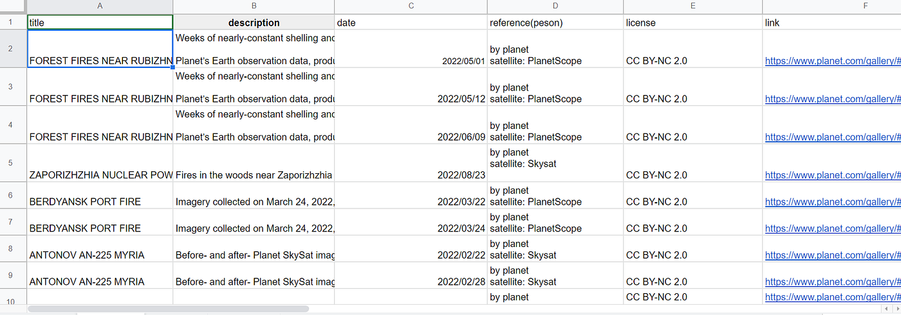
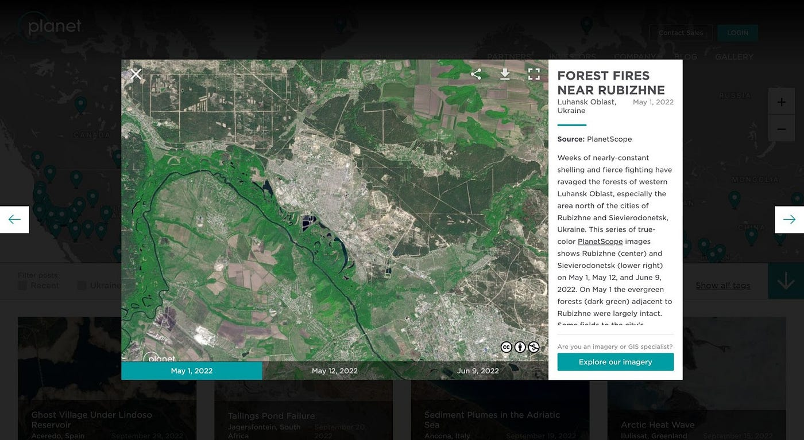
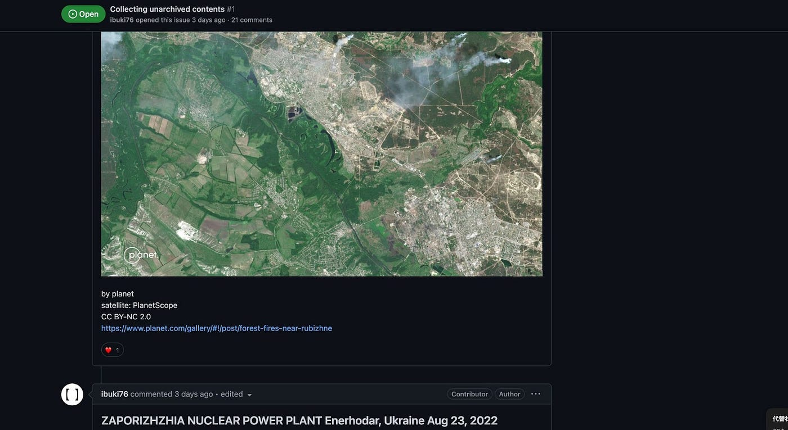
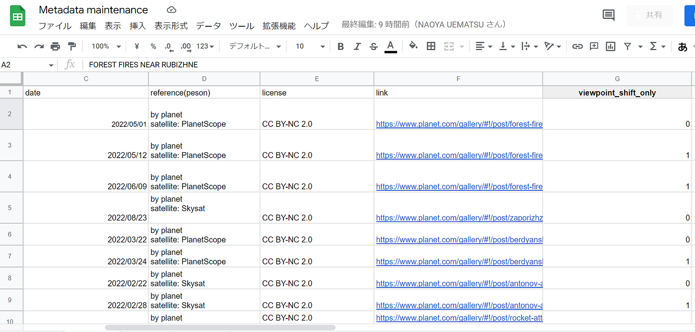
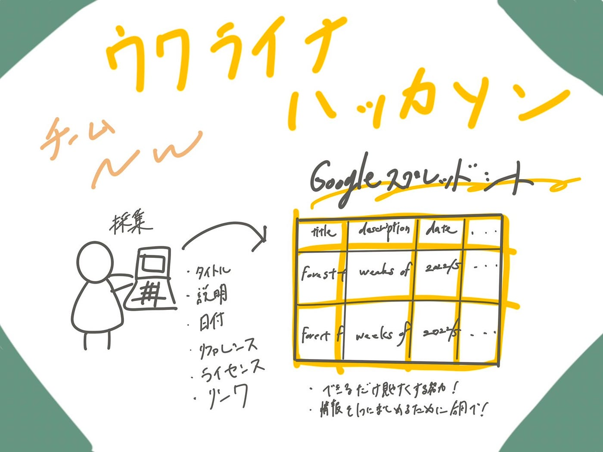

### ウクライナハッカソン Team NW

こんにちは！3年の吉田です。

今月9月のハッカソンは「ウクライナハッカソン」でした！

僕となおやでチームを組み、データ収集班が収集した[未アーカイブのコンテンツ](https://github.com/furuhashilab/furulab2022hackathon_ramen/issues/1)のメタデータをGoogleスプレッドシートに整理する「メタデータ整備」の作業を行いました。

> _**メタデータ整備_**

スプレッドシートは効率化、また見やすさも考慮して「Team Kitten」とスプレッドシートを共有し、協同で作業を行いました。

[Metadata maintenance — Google スプレッドシート](https://docs.google.com/spreadsheets/d/1zZuaiRNXYX1onp3-dPjoYrhQy6Qd0072-fQ8OwN72j0/edit#gid=0)

属性は、順に

「Title」、「Description」、「Date」、「Reference(Person)」、「License」、「Link」、「Viewpoint_shift_only」

としました。

「title」、「description」、「date」はplanetの衛星画像が載っているWebページで画像を開くと上のようにタイトルと日付、説明文が出てきます。太字を「title」、下の説明文を「description」としました。

「reference(person)」、「license」、「link」はTeam Ramenと平澤さん、安田さんがGitHubにまとめてくれていたのでそれを参照して記入しました。

最後に「Viewpoint_shift_only」について説明します。

「Viewpoint_shift_only」の列には、画像が1つ前の画像データと同じ視点であった場合は「1」、新しい視点のデータであった場合は「0」とし、このメタデータが1つ前の画像データと同じデータか違うデータかをわかりやすくしました。

> _**感想_**

今回のハッカソンはメタデータ整備という地道な作業でしたが、Team Ramenと平澤さん、安田さんがわかりやすく情報を整理してくださっていたので非常にやりやすかったです。(ありがとうございました！)

参照：[furuhashilab/furulab2022hackathon_ramen (github.com)](https://github.com/furuhashilab/furulab2022hackathon_ramen)

また前期に受けた古橋先生の「空間情報の取得技術」の授業も参考にしました！

Googleスライド

[１０月 ウクライナハッカソン — Google スライド](https://docs.google.com/presentation/d/1m7Dp-vIDOBQPh2whqMY0eTDrsqr0gPvyFjCQXl2Kuzs/edit?pli=1#slide=id.gecd50f47c48633e_10)

グラレコ

