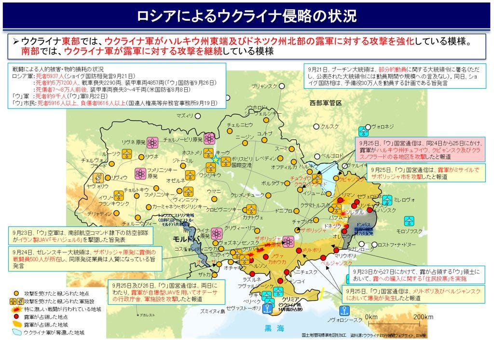
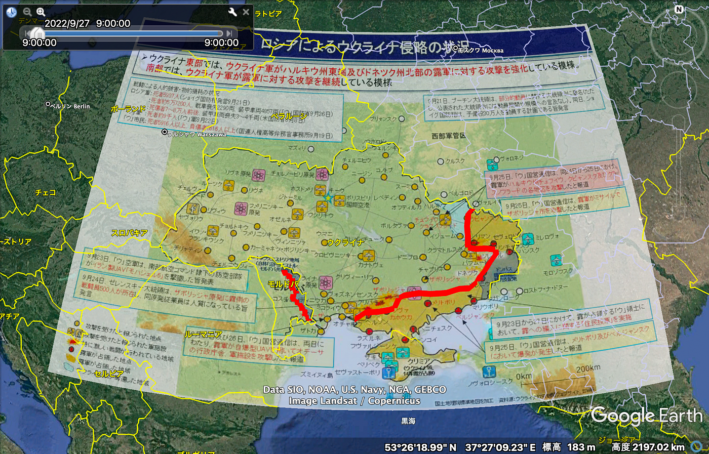
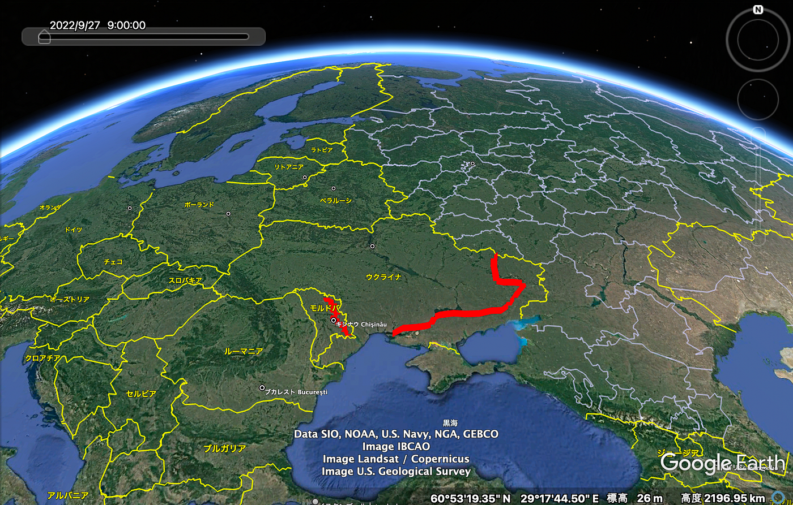
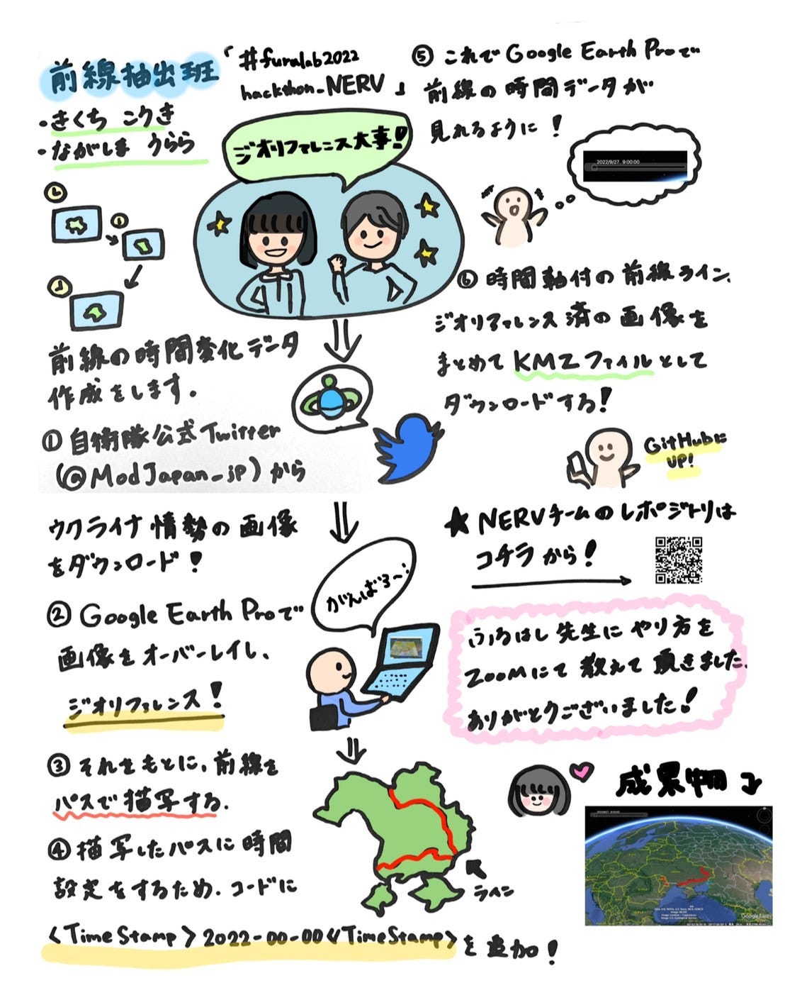
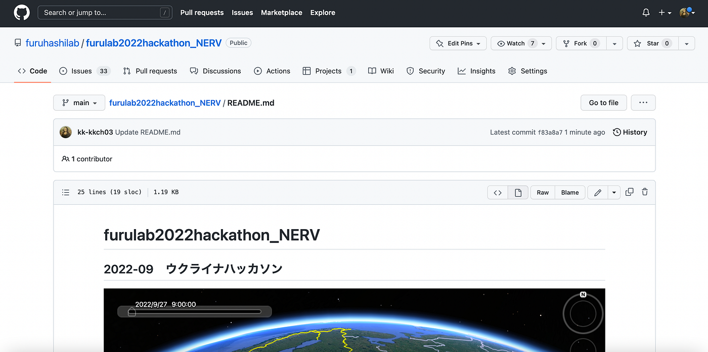

### ウクライナハッカソン活動報告 By NERV

こんにちは！

4年の菊池です。今回、9月のハッカソンは「ウクライナハッカソン」と題し、2人1組チームで参加するルールとなっており、私たちチームNERVは菊池と長嶋で活動しました。

> 前線抽出班

NERVは前線抽出を担当しました。[防衛省・自衛隊の公式Twitter](https://twitter.com/ModJapan_jp)が提供するロシアによるウクライナ侵攻の状況をラインデータ化、時間軸を与えてKMLデータとして公開しました。

> データ作成方法

ここからはデータ作成の方法について解説していきます。

1. 防衛省・自衛隊の公式Twitterから侵攻状況の画像をダウンロードします。

1. その画像をGoogle Earth Proにイメージオーバーレイで取り込み、ジオリファレンスします。

1. その画像をもとに、前線に沿ったパスを作成し、コードをコピー。

1. コードに**<TimeStamp>0000–00–00</TimeStamp>**を追加したものをGoogle Earth Proに貼り付けます。

1. 時間軸付きのラインデータ、画像を含めたデータをKML形式で保存。

今回作成したデータは全て[NERVのGithub](https://github.com/furuhashilab/furulab2022hackathon_NERV)にまとめています。

> グラレコ

> Github

