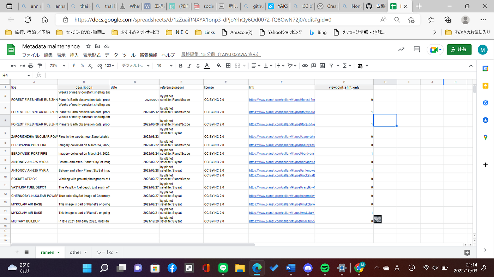
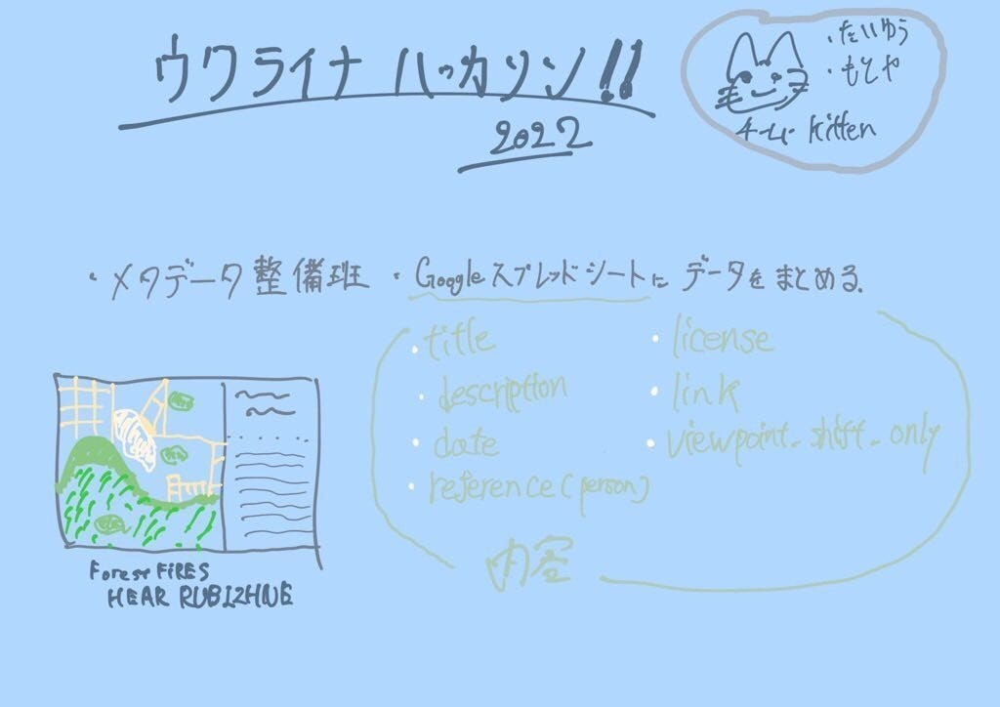

### ウクライナ・９月ハッカソン

おはようございます！モトヤです！！ 今回のハッカソンは「ウクライナハッカソン」という事で、二人一組で参加しました。私たちはメタデータ整備班として、データ収集班が集めたデータをまとめる作業を行いました。

**メタデータ整備班**

私たちの班はメタデータ整備班としてスプレッドシートにまとめていきました。スプレッドシートは「ワタル・ナオヤ」と共に作成もしました。理由としてはそれぞれのチームが別の場所でデータ管理を行うと、今後データを活用したい人にとって不便だと思ったからです。

それぞれの属性は順に、

「title」「description」「date」「reference (person)」「license」

「link」「viewpoint_shift_only」

です。

**グラレコ**

**Googleスライド**

[https://docs.google.com/presentation/d/1m7Dp-vIDOBQPh2whqMY0eTDrsqr0gPvyFjCQXl2Kuzs/edit#slide=id.gecd50f47c48633e_39](https://docs.google.com/presentation/d/1m7Dp-vIDOBQPh2whqMY0eTDrsqr0gPvyFjCQXl2Kuzs/edit#slide=id.gecd50f47c48633e_39)

**Googleスプレッドシート**

[Metadata maintenance — Google スプレッドシート](https://docs.google.com/spreadsheets/d/1zZuaiRNXYX1onp3-dPjoYrhQy6Qd0072-fQ8OwN72j0/edit#gid=0)
