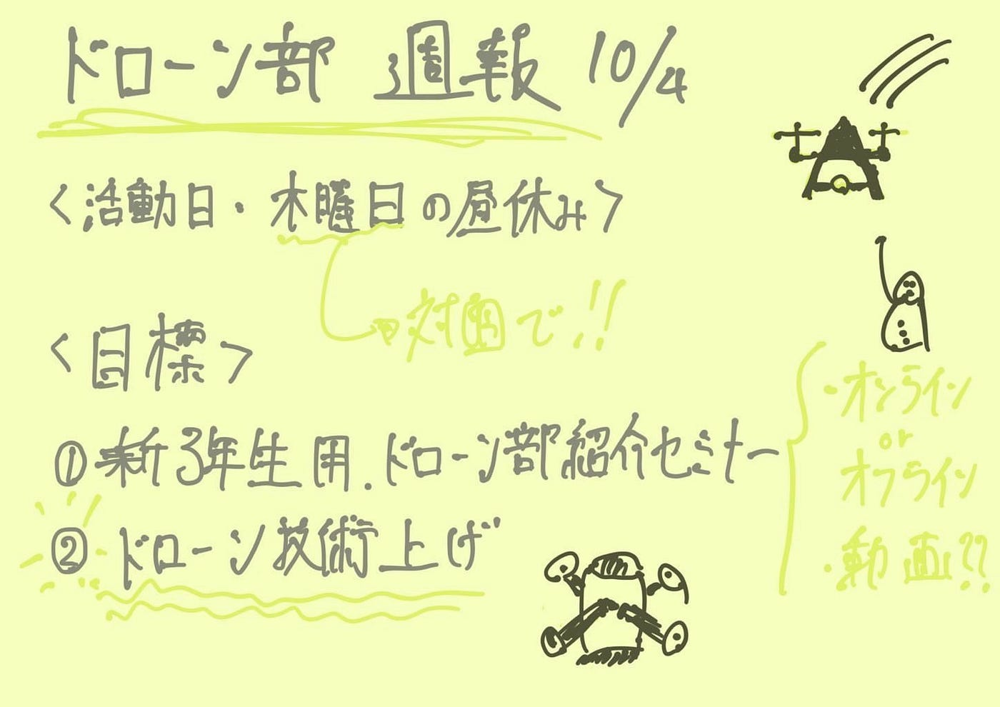

### ドローン部 後期スタート！

こんにちは！モトヤです。ドローン部としての活動は、これが後期初めてとなります。今回は主に

１、活動日程

２、後期の目標

この２つについて話し合いを進めていきました。

**活動日程**

活動日程はまず、「木曜日の昼休み」の時間になりました。その時間で、週の活動内容などを話し合う予定です。また、３人とも学校にいる時間などが揃わなかったので、ドローンの訓練は基本的に各自で行う形となりました。それでも何回か集まって、訓練を行うつもりです。

**後期の長期的な目標**

まず、新三年生向けにドローン部の紹介イベントを企画したいと思います。ドローンを飛ばす楽しさなどが伝えられたらいいと思います。ドローン部存続のためにも頑張ります！

またドローンの技術がまだまだ足りません。いつドローン部の取材？が来てもいいように習慣付けて飛ばそうと思います！

グラレコ

