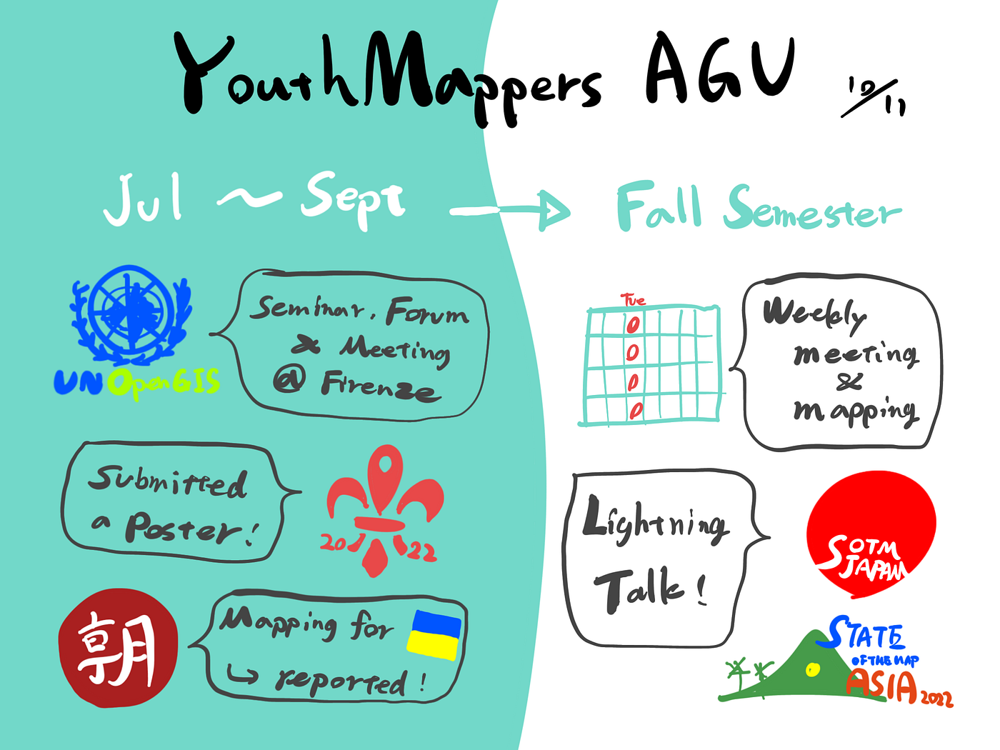

### YouthMappers AGU の夏とこれから

2022/10/11週報

こんにちは。4年の柴山です！

後期最初の週報をお送りします。今回は夏休み～現在までの期間の報告と今後の方針についてです。

> _**UN Open GIS Initiative Seminar, Tech Forum & Meetings in conjunction with FOSS4G 2022 参加_**

8月23日にフィレンツェで行われた **[国連 Open GIS Initiative](http://unopengis.org/unopengis/main/main.php) **主催の国際会議には、YouthMappers AGU のメンバーとして私 [Ibuki Shibayama](None) と [SOTA SUZUKI](None) がオンラインで参加しました。

共同議長の **[Ki-Joune Li**](http://lik.pusan.ac.kr/) 氏や、UNVT 共同主任の**[藤村**](https://github.com/hfu/profile/blob/master/profile_ja.md)さんの講演を視聴し、UN Open GIS Initiatives のこれまでの歩みや体制について理解が深まったと同時に、いかに UNVT が注目されているのかを実感することができました。

詳しくは参加レポート記事をご覧ください！

[国連オフィシャルイベントに潜入してきました。2022/8/23
UN Open GIS Initiative Seminar, Tech Forum & Meetings in conjunction with FOSS4G 2022 参加レポートmedium.com](https://medium.com/furuhashilab/%E5%9B%BD%E9%80%A3%E3%82%AA%E3%83%95%E3%82%A3%E3%82%B7%E3%83%A3%E3%83%AB%E3%82%A4%E3%83%99%E3%83%B3%E3%83%88%E3%81%AB%E6%BD%9C%E5%85%A5%E3%81%97%E3%81%A6%E3%81%8D%E3%81%BE%E3%81%97%E3%81%9F-2022-8-23-14798816b722)

3年生のメンバーも **[SotM 2022**](https://2022.stateofthemap.org/) を視聴してレポートを公開しているのでそちらも是非ご覧ください！

> _**SotM 2022 Posters の掲載_**

古橋先生に協力していただきながら SotM 運営側に交渉を行ってきた結果、ついにYouthMappers AGU のポスターを公式 Web サイトに掲載してもらえました！

我々が今年の2月下旬から行っているウクライナ支援マッピングについて報告するこのポスターは、3年生の [motoyaaa](None)、 [NAOYA UEMATSU](None)、 [吉田航](None) に加え、デザイン部の [Taiyu Ozawa](None) にも協力してもらいながら制作していただきました！

[State of the Map 2022
The global OpenStreetMap conference. August 19 - 21, 2022 in Florence, Italy & online.2022.stateofthemap.org](https://2022.stateofthemap.org/posters/#:~:text=Communities%20Women%20Mappers-,Clear%20around%20Ukraine%20and%20Utilize%20support,-Call%20for%20Participation)

SotM の開催時期から遅れての掲載になりましたので、実績として認知してもらえるように YouthMappers コミュニティや、SotM Asia 、 SotM Japan といった場での報告を行っていきます。

> _**朝日新聞による記事掲載_**

9月15日には、ウクライナ支援マッピングについて朝日新聞のオンライン取材を受けました！ 記事は9月26日に公開されました。

[（ひらく 日本の大学）ウクライナを思い、動き出す学生 朝日新聞・河合塾共同調査：朝日新聞デジタル
メニューをとばして、記事の本文エリアへ ロシアが ウクライナに侵攻を始めて７カ月。このウクライナ危機を受け、少なくとも１８６大学が、避難者支援などの取り組みをおこなっていることが、朝日新聞と 河合塾 の共同調査「ひらく…www.asahi.com](https://www.asahi.com/articles/DA3S15426994.html)

ウクライナ侵攻に対してアクションをとっている大学の統計結果に加えて、代表例として我々のマッピング支援が取り上げられています。今後も YouthMappers の活動を多くの人に知ってもらえるように、 Facebook 、 Instagram 、YouTube などでの情報発信にも注力していきたいです。

> _**後期の YouthMappers AGU_**

後期は火曜の午後（3~4限）の間に1時間程度、対面＆オンラインでミーティングとマッピングを行う予定です。

マッピングに加え、Weekly OSM の翻訳や YouTube 動画作成をレギュラーの活動として行っていきたいです。

また、**SotM Asia 2022 や SotM Japan で行う予定の LT の準備**もチームを組んで始めていきます。

> _**グラレコ_**

