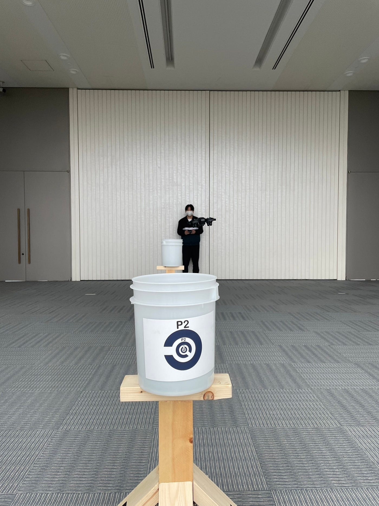
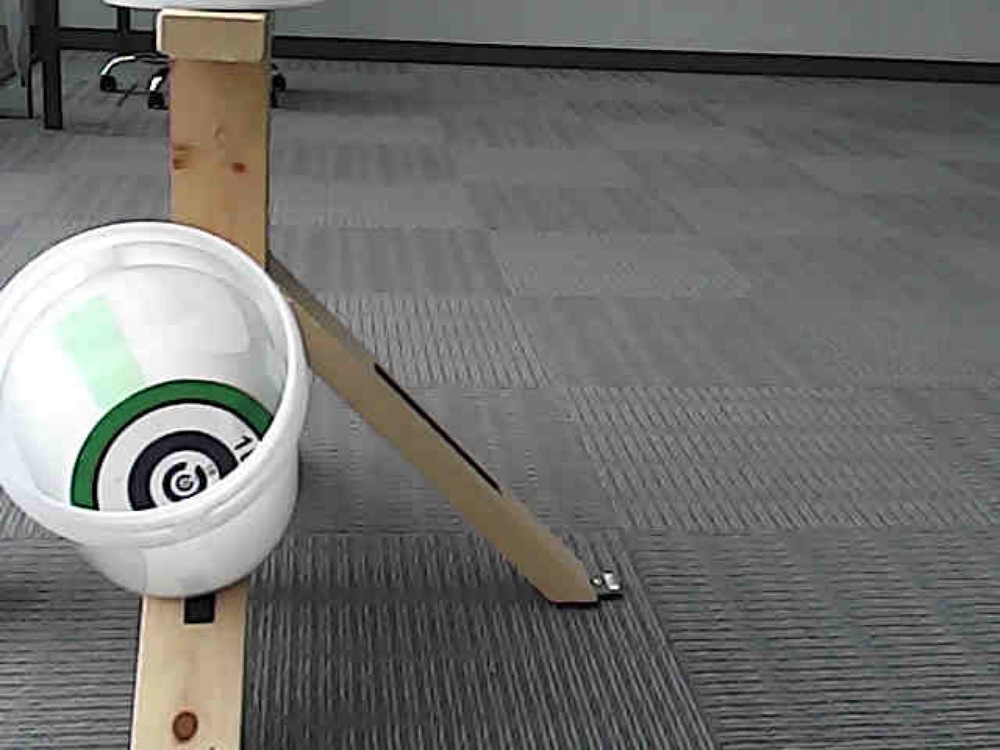
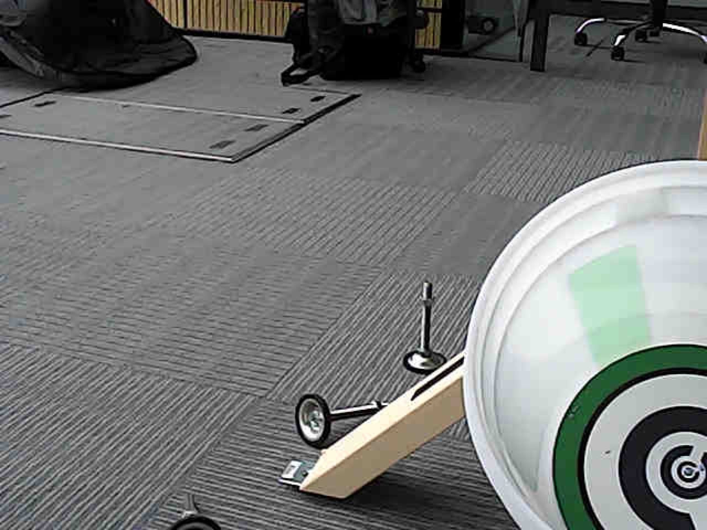
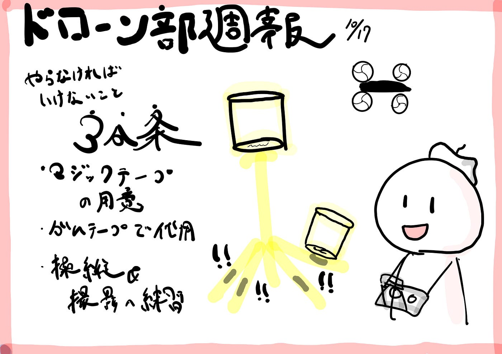

### ドローン部週報

こんにちは、ドローン部の小澤です！
今週は、今年の代で初めてSTM練習キットを広げ、練習を行いました。

こちらわたるが実際にドローン操縦している様子です。
お気づきかと思いますが、バケツが立っているのは上だけで、足に斜めについているはずのバケツは、バケツ側にマジックテープが貼っておらず、付けることができませんでした😢

ただ、一つのバケツだけテープが貼ってあったので、テープで固定という方法もあるのでしょうか？
とりあえず、本格的な練習のためにはマジックテープORテープが必要ということが分かりました。

次に、上記二つの写真が自分が実際にドローンを操縦して撮影訓練を行なってみた結果です。トイドローンは大型のドローンと異なり安定性が低いため、撮るのが非常に難しかったです。
何よりこの数字が見て取れる写真を取れるまでに物凄く時間がかかってしまったので、どうにか短い時間で撮影できるよう、訓練を重ねる必要性を感じました。

まずは環境を整えながら、ドローン技術も上達させていきます！

グラレコ

