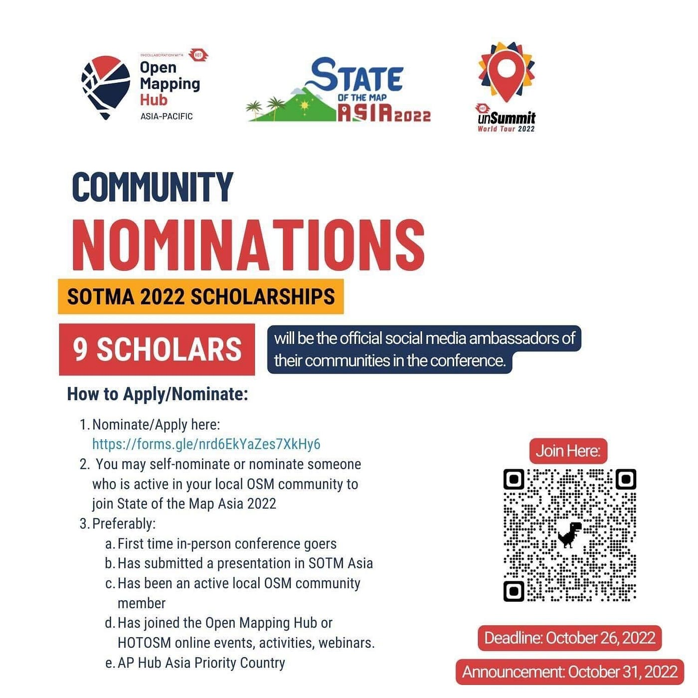
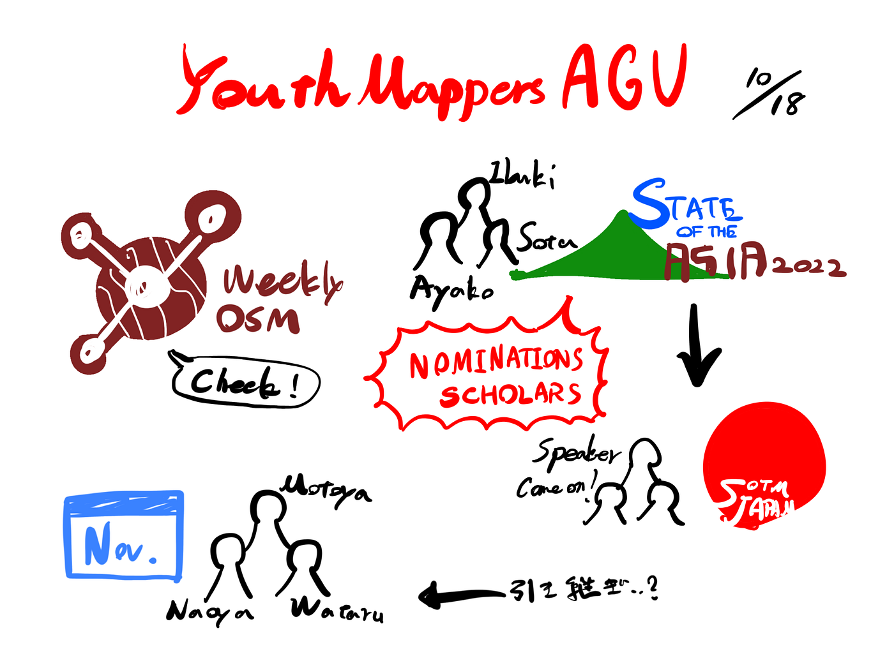

### 10/18 YouthMappers週報

こんにちは、ユースの鈴木です。今回は主に10/11に行ったミーティングとSoTM Asia Philippines scholarshipついてお伝えします。

### 10/11の議題、活動

- [Weekly OSM](https://weeklyosm.eu/ja/) 翻訳活動参加 → 古橋先生にムラモトさんに連絡してもらっているところ → _**※各自たまに目を通すこと_**

- 代表の3年への_**引き継ぎ_**。11ごろには移行したい（就活とか忙しいとは思うけど…）

> _**SotM Asia LT チーム_**

→柴山、鈴木、高橋 その他の希望者も歓迎です。

→韓国ビザ延長がない場合の対応を決めておく。

→最悪の場合、KIWI保証をアップグレード（2000~3000円）すれば返金される。

- SoTM Japan LT → 話す内容は SoTM Asia のものを使用、_**発表者募集！_**

- ソロカ、バングラデシュと南アフリカの洪水支援マッピングを行った。

### **SoTM ASIA 2022 Philippines Scholarship**

#### **State of The Maps Asia scholarshipの好まれる条件**

・初めて対面会議に参加をする者であること

・SoTM Asiaにてプレゼンテーションを提出していること

・activeな現地OSM community memberであること

・これまでにHotOSMのイベントなどに参加したことがある者

・_**Asia Pacific Hubの優先国であること _**→日本は…？？

自推、他推が可能であるが、最後のpriority countryの条件次第で不利になってしまうかも…？

[Ibuki Shibayama](None)の推薦内容をfacebookチャットに送信してありますので、推薦をしてくださる方はよろしくお願いいたします。

#### グラレコ

