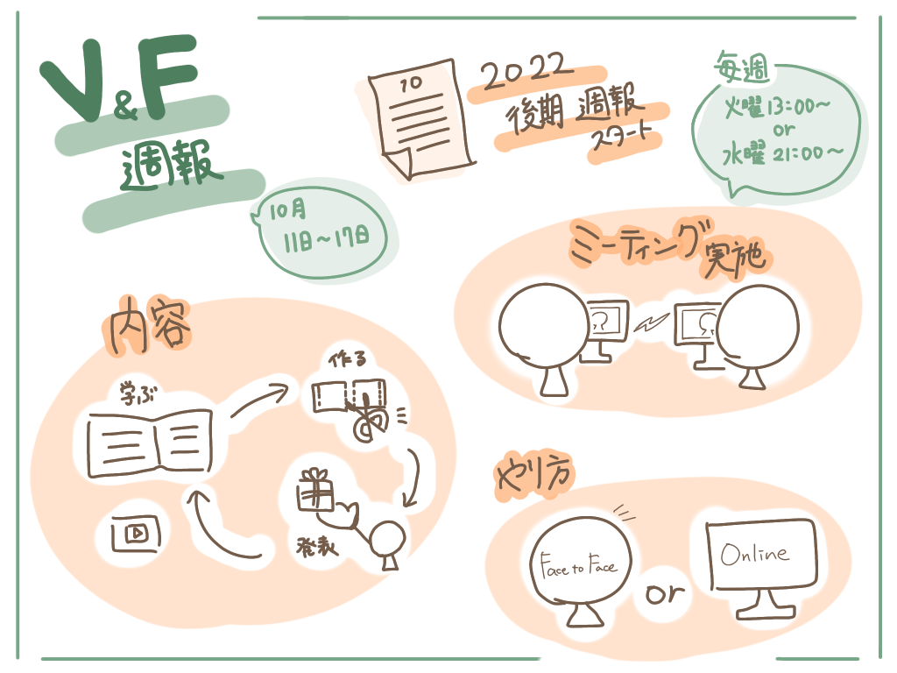

### V&F週報

こんにちは。４年葉賀なつみです。

今週のV&Fの週報を担当します。

メンバーそれぞれがバタバタしていた先週でしたが、土曜にミーティングを行い互いの近況等を話し、やっと今週後期の活動が始動したように思います。

ミーティングでは、後期の活動の仕方なども決めました。

まず、毎週のミーティング日程を設定しました。

> **・火曜13:00~**

> ・水曜21:00~(OL)

基本は火曜日に行います。候補日が２日あるのは、どちらの日程で行うかをメンバーのスケジュールを考慮し毎回柔軟に対応するためです。

それに応じて、対面でやるかオンラインでやるかも変えていきます。

活動内容はもちろん動画編集となります。

> ・学ぶ → 制作 → 共有(発表)

上記のような流れで、各自作業をしていきます。前期で動画を分担で作る大変さを思い知ったので、後期はこのような形にしたいと思います。

最後に、

個人的なニュースですが携帯を新しくしてiPhone13を買いました。iPhone8sからの買い替えだったので、広角カメラのすごさに感嘆する日々です。写メ魔が加速すると周囲に心配されました。

いいカメラで撮る写真や動画を編集するのが楽しみです。

＜グラレコ＞

