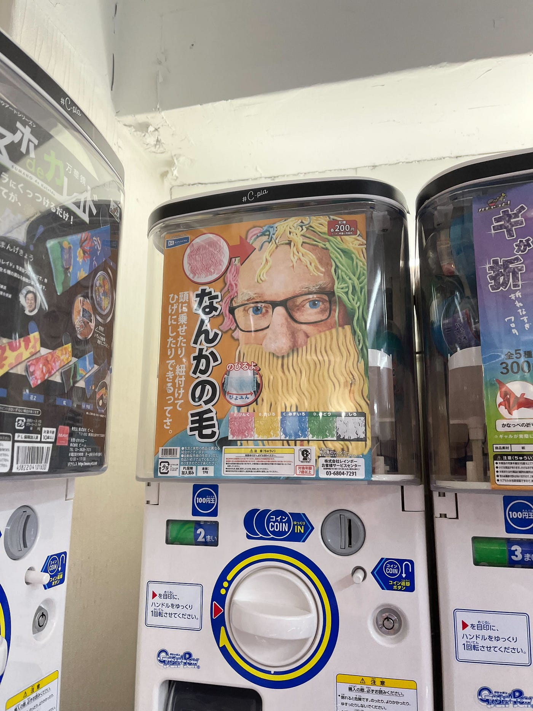
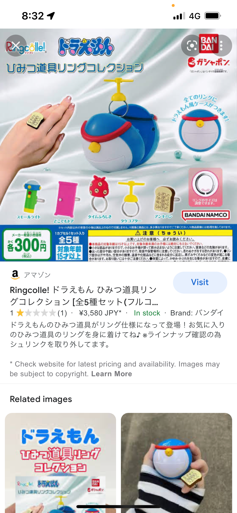
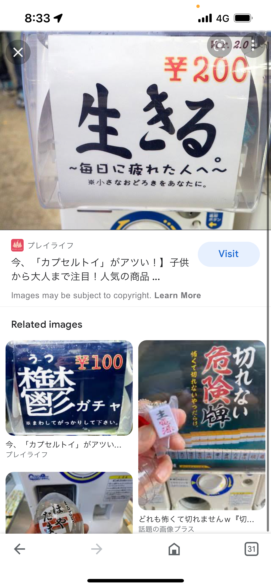
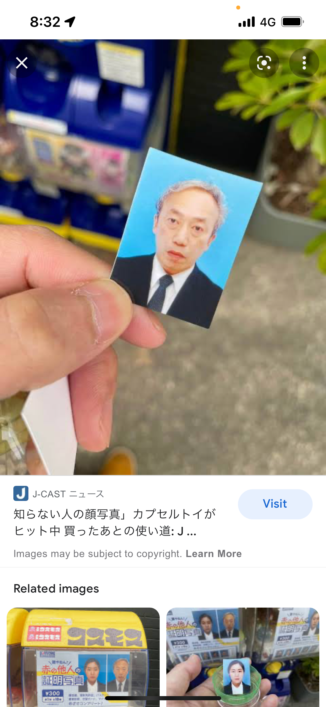
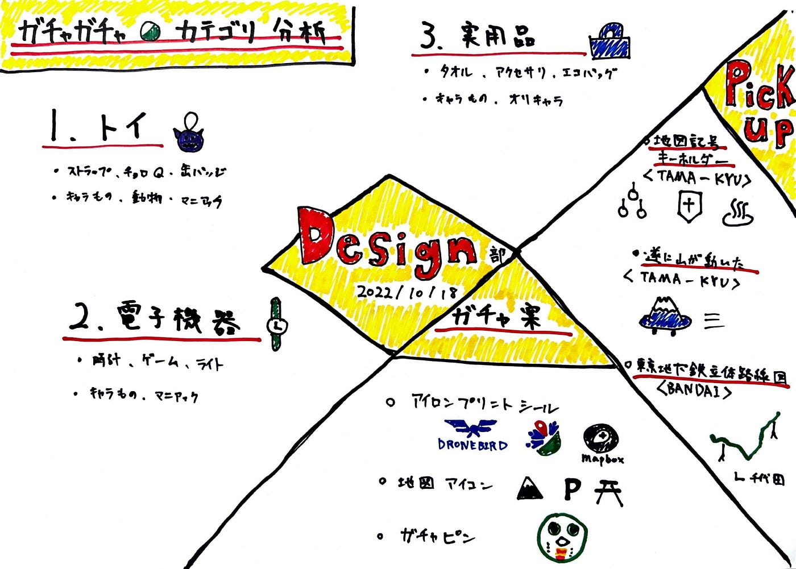

### デザイン部週報

こんばんは！モトヤです。今週はガチャガチャのリサーチ・案だしを各自で行いました。これらを用いて今後のガチャガチャ作りに役立てたいと思います。

・ハルカさん

たくさんのガチャガチャを載せてくれました。特に面白かったのは「なんかの毛」です。こんなの買う人いるの？？と思ってしまうものでも商品化できるという事でなかなかガチャガチャ面白いな！と思いました。

（いつかは忘れました）ウララさんも言っていたのですが、ガチャガチャをするという行為、その「わくわく」に対してみんなはお金を払っているのかな？と思います。（体験型ってやつですね）

・モトヤ

まず、ケースから変えて行くのも面白いかなと思いました。開ける前から楽しい〜ってなる事ができればよりワクワクするのかな？と思ったからです。また、中身のモノが目当てのものでなくても、カプセルがかわいいのでOK!!となるのでこの案は好きです。

（アマゾン評価★１を見たときびっくりしました（笑））

二つめは、中身が必ずしも、キャラクターでなくても、言葉や写真などでもいいのかと思います。古橋ゼミを表すものであれば、ガチャガチャとして成功するのかな？と思ったからです。

最後のやつは証明写真のやつなのですが、個人的にやりたいな〜って思ってたので載せました！！！

みんなの顔写真を景品にするのも面白いなとおもいます。（笑）

グラレコ

