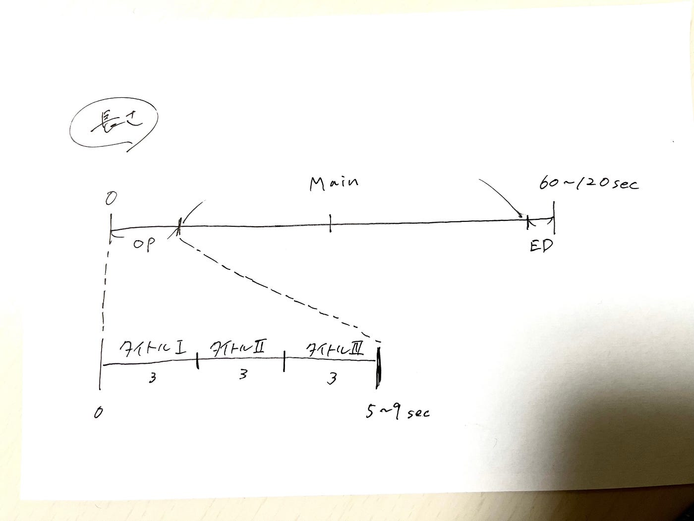
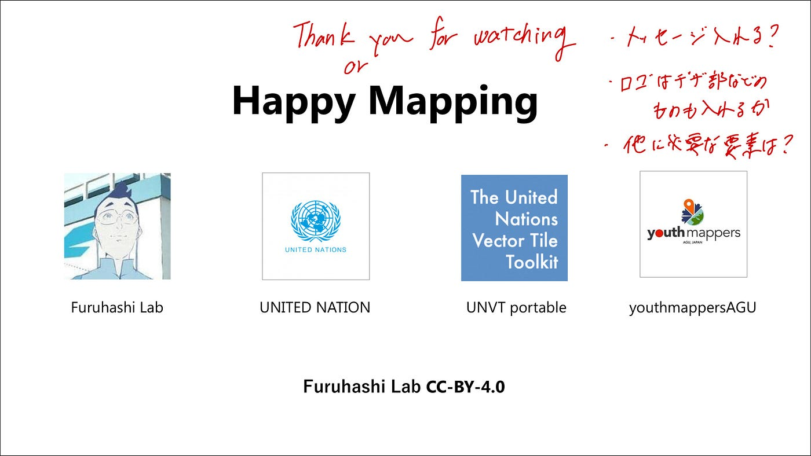
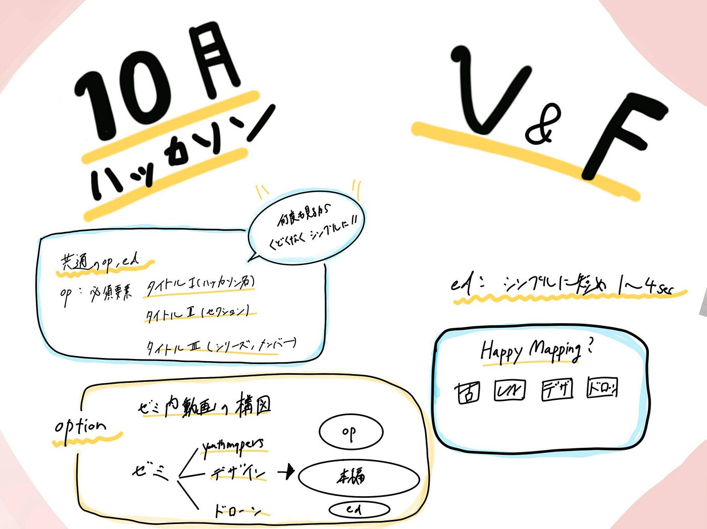

### OSS4SDG Hackathon V&F中間発表

こんにちは。V＆F(動画編集部)です。

先週からスタートした10月のOSS4SDGハッカソンの中間発表をしたいと思います。

_**◯概要_**

・[https://github.com/furuhashilab/README/issues/33#issuecomment-1281762516](https://github.com/furuhashilab/README/issues/33#issuecomment-1281762516)

_**◯メンバー_**

・葉賀なつみ(4年)

・植松尚哉(3年)

_**◯テーマ_**

・YouthMappersAGU部、デザイン部、ドローン部のチームの動画コンテンツを制作する。

→具体的には1~2分程度のわかりやすい動画を英語(日本語字幕)で作る。

テーマの特性上、各チームの後手にまわって動くため、ここまでは動画のBodyとなるメイン部分を除いた全体共通のOP/ED、また動画の大まかな構成を決める作業を優先して進めました。

**◯共通のOP/ED**

今回のハッカソンでは短めの動画を複数製作します。それらの統一感をあげるため、また見る人にわかりやすく伝えるために全ての動画に共通のOP/EDが必要だと考えました。

**・OP(オープニング)**

ここで必須の要素は、まずは何と言っても「タイトル」です。動画を見た人が一目で何の動画であるのかわかるようにしたいと思いました。

タイトルといっても、ハッカソン名・セクション(どのテーマ、どのチームのものか)・シリーズがあります。

これらをまとめて組み込んでいきます。

全体が最大2分の動画なのでOPはEDと合わせて約10秒に収まるようにします。その中でOPは5~9秒を目安に作っていきました。

これは例えば上記した必須のタイトルが最大で3種類×3秒ずつという計算です。

また、意識しなければならない重要なポイントとして「くどくない映像」ということがあります。先述した通り、複数の動画に分けて目に入るOP部分ですので、何度も見てもくどくない動画を目指します。

試作動画(Youth用)：[https://github.com/furuhashilab/VF_UN-EC_OSS4SDG_hachathon2022/issues/5#issuecomment-1289388565https://github.com/furuhashilab/VF_UN-EC_OSS4SDG_hachathon2022/issues/5#issuecomment-1289388565](https://github.com/furuhashilab/VF_UN-EC_OSS4SDG_hachathon2022/issues/5#issuecomment-1289388565)

**・ED(エンディング)**

EDに必要なのは、提供した動画主や制作者、関連するもののリンクなどが挙げられます。

さらに全体のメッセージなどを入れるのもまとまっていて良いですね。

載せなくてはいけない情報が多いため、なるべくシンプル且つ動きの少ない動画が最適だと考えました。

ここ部分の秒数は大体1~4秒にまとめます。OPとの兼ね合いを見つつ、調節します。

試作品

**・Body**

メインとなるBody部分は他チームの意見や進捗が非常に重要になってくるので、それを聞いた上で作業していきます。

現在V&Fが考えている動画テーマは以下の通りです。

YouthMappersAGU部

> 「PLATEAUデータのインポートとは何か・どのようなことができるのか」

> 「インポートのマニュアルについて」

デザイン部

> 「作成したUNVT portableに関する資料の映像化」

> 「グラレコ集」

ドローン部

> 「UNVT portableにドローンの空撮画像をインポートするとはどういう子kとか・どのようなことができるのか」

> 「手順マニュアルについて」

また、各チーム余裕があれば作業風景や感想などを「メイキング」として動画１本にまとめたいですね。

以上がこれまでのV&Fの進捗です。今後は各チームと連携して動画制作を進めていきます。また動画の説明に英語＋日本語字幕のスクリプトの用意もいるのでそちらも合わせて頑張っていきたいと思います。

＜グラレコ＞

＜GitHubリポジトリ＞

[VF_UN-EC_OSS4SDG_hachathon2022](https://github.com/furuhashilab/VF_UN-EC_OSS4SDG_hachathon2022)
